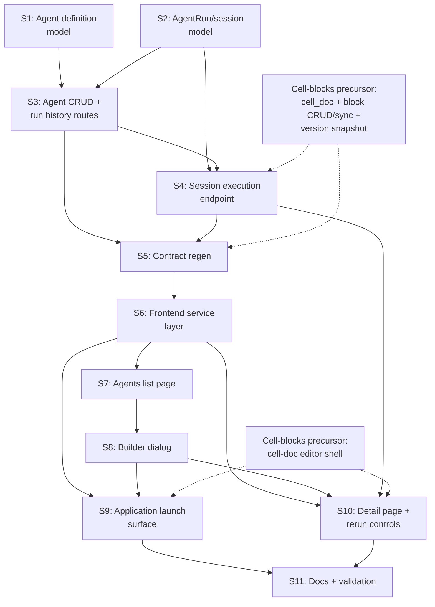

# Epic: Agents on Cell Docs (Structured AI Sessions)

## 1. Epic Title

**Agents - Structured AI Sessions on Versioned Cell Docs**

## 2. Problem Statement

Baldin already has a one-shot document generation path and a placeholder `/network/agents` route, but that is not the same product as the cell-doc direction established by the cell-blocks epic. Today the system can return a flat draft. It cannot open a persistent AI workspace where context, tables, generated sections, and follow-up tasks live together inside a versioned document that the user can keep editing.

The agents epic should therefore treat agents as structured collaborators that create and revise `cell_doc` documents through the block CRUD and sync APIs. Agents are not just saved prompts wrapped around `POST /documents/generate`. They are programmatic writers to versioned cell-doc sessions, with tables and blocks acting as structured input/output surfaces.

**Primary persona:** Job-seeker using Baldin's workspace to compare roles, draft tailored materials, and coordinate follow-ups with AI assistance.

**Job-to-be-done:** Launch an agent from application or lead context, receive a structured cell-doc workspace with context, drafts, and next steps, then iterate with the agent and manual edits inside the same versioned document.

## 3. Current State Summary

### What exists today

| Surface | State | Key details |
| --- | --- | --- |
| **Agents route** | Placeholder | `/network/agents` renders an empty state with network/outreach-oriented placeholder copy |
| **Navigation** | Live | Sidebar link already exists under the Network group |
| **Document generation** | Live | `POST /documents/generate` and `generateDocument()` create flat `resume` and `cover_letter` drafts |
| **Application launch surface** | Live | Application detail already has a generate action that uses the flat document generation path |
| **Document system** | Live | `Document` and `DocumentVersion` provide versioning, Yjs collaboration, sharing, and document/application attachment |
| **Agent persistence** | Missing | No `Agent` or `AgentRun` models, schemas, or routes |
| **Contracts** | Missing | No agent endpoints or generated frontend agent types |
| **Docs** | Placeholder acknowledged | Networking docs still describe `/network/agents` as a reserved future assistant surface |

### What the cell-blocks precursor must provide first

This epic assumes the cell-blocks epic lands first and establishes the product boundary agents will use:

- `cell_doc` as a first-class document kind
- `document_blocks` with stable block UUIDs
- Block CRUD, reorder, and sync routes
- `DocumentVersion.block_snapshot` for lossless restore and block identity stability
- Version save that syncs live blocks and preserves block UUIDs where possible
- Table blocks validated for collaborative editing
- Pass-through preservation of unknown block `properties` keys so agents can annotate blocks without schema churn

### What is net-new in this epic

- Agent definition and run persistence
- Agent execution that creates or updates `cell_doc` sessions programmatically
- Session launch surfaces from application context
- Frontend management UI, run history, and rerun controls
- Contracts and docs that describe agents as cell-doc session creators rather than flat draft generators

## 4. System Boundaries Involved

| Boundary | Impact |
| --- | --- |
| **Backend models** | New `Agent` and `AgentRun` models; no new agent-specific content tables |
| **Backend execution** | Context assembly, LLM call, TipTap JSON or structured block assembly, cell-doc creation/update, version save |
| **Existing block APIs** | Consumed by agent execution; not redefined by this epic |
| **Frontend management UI** | Agents list, builder, detail page, run history |
| **Frontend launch surfaces** | Application detail trigger and session rerun controls |
| **Document editor** | Existing cell-doc editor becomes the session surface agents write into |
| **Contracts** | openapi.json and `schema.d.ts` gain agent definitions, run types, and run endpoints |
| **Docs** | Networking and product/workflow docs must stop framing agents as network-only helpers |

### Constraints

- The cell-blocks precursor is a hard prerequisite. Do not invent a second agent-specific persistence model for generated content.
- Phase 1 agent output is the `cell_doc` session itself. Creating a separate flat `cover_letter` document is a follow-on decision, not the default architecture.
- Agent execution is API-driven. It must not depend on a browser editor session or Yjs presence.
- Keep the feature within Baldin's developer-preview scope. Synchronous execution is acceptable at first if validation shows it is responsive enough.
- `/network/agents` can remain the route for now, but the product language must describe a workspace-wide AI session surface rather than a narrow networking helper.

## 5. User Stories

### Story 1: Agent definition model and migration

**As a** developer, **I want** a persistent `Agent` model with reusable workflow configuration, **so that** users can create and store structured AI session definitions.

**Acceptance criteria:**

- [ ] `Agent` SQLAlchemy model with: `id`, `user_id` FK, `name`, `description`, `kind`, `instructions`, `configuration`, `is_enabled`, timestamps
- [ ] `kind` is a string-backed field with `ck_agents_kind` CHECK constraint covering the initial workflow families: `cover_letter`, `follow_up`, `outreach`, `custom`
- [ ] `configuration` is JSONB `NOT NULL DEFAULT '{}'` for workflow-specific options without per-kind schema churn
- [ ] All FKs use explicit `ondelete`; timestamps inherit `DateTime(timezone=True)` from `Base`
- [ ] Pydantic schemas: `AgentRead`, `AgentCreate`, `AgentUpdate`, `AgentSummaryRead`
- [ ] The epic does not add an output-kind column in Phase 1; agent runs produce `cell_doc` sessions by default
- [ ] Alembic migration follows the schema-v2 pattern: string-backed enums plus CHECK constraints, not Postgres enum types

**Surfaces:** backend
**Dependencies:** none
**Estimated complexity:** M
**Owner recommendation:** Baldin Backend Agent

---

### Story 2: Agent run/session model and migration

**As a** developer, **I want** a persistent `AgentRun` model linked to the session document it created or revised, **so that** agent work is auditable as a versioned cell-doc session history.

**Acceptance criteria:**

- [ ] `AgentRun` model with: `id`, `agent_id` FK, `user_id` FK, `application_id` FK nullable, `parent_run_id` self-FK nullable, `trigger_kind`, `status`, `input_context`, `session_document_id` FK nullable, `error_summary`, `created_at`, `completed_at`
- [ ] `trigger_kind` is string-backed with `ck_agent_runs_trigger_kind` covering `manual` and `event`
- [ ] `status` is string-backed with `ck_agent_runs_status` covering `pending`, `running`, `completed`, `failed`
- [ ] `session_document_id` points to the `cell_doc` session produced or updated by the run, not a separate flat output artifact
- [ ] `parent_run_id` links reruns or revisions inside the same session when applicable
- [ ] Pydantic schemas: `AgentRunRead`, `AgentRunSummaryRead`, `AgentRunCreate` (internal)
- [ ] Relationships wired with `Agent.runs` and `AgentRun.agent`

**Surfaces:** backend
**Dependencies:** Story 1
**Estimated complexity:** M
**Owner recommendation:** Baldin Backend Agent

---

### Story 3: Agent CRUD and run history API routes

**As a** developer, **I want** CRUD endpoints for agent definitions plus a run-history endpoint, **so that** the frontend can manage agents and inspect session history.

**Acceptance criteria:**

- [ ] `GET /agents` lists the current user's agents with optional `kind` filter
- [ ] `POST /agents` creates an agent definition
- [ ] `GET /agents/{id}` returns agent detail scoped to the current user
- [ ] `PATCH /agents/{id}` partially updates name, description, instructions, configuration, and `is_enabled`
- [ ] `DELETE /agents/{id}` hard-deletes an agent when safe for the current phase's data model
- [ ] `GET /agents/{id}/runs` returns paginated `AgentRunSummaryRead[]`
- [ ] All endpoints are scoped to the authenticated user with no cross-user access
- [ ] Route tests cover ownership, filtering, and run-history pagination

**Surfaces:** backend
**Dependencies:** Stories 1, 2
**Estimated complexity:** M
**Owner recommendation:** Baldin Backend Agent

---

### Story 4: Agent session execution endpoint

**As a** user, **I want** to run an agent against an application and land in a structured cell-doc session, **so that** I can review and iterate on agent output inside a persistent workspace rather than receiving a one-shot flat draft.

**Acceptance criteria:**

- [ ] `POST /agents/{id}/run` accepts `{ application_id, session_document_id? }`
- [ ] Endpoint validates agent ownership, enabled state, and supported workflow kind
- [ ] Context assembly includes user profile, pinned resume, application details, lead details, and prior session context when `session_document_id` is supplied
- [ ] Agent execution produces structured output that is converted into TipTap JSON or block payloads suitable for the cell-doc sync path
- [ ] When `session_document_id` is omitted, backend creates a new `Document` with `kind='cell_doc'`, `content_format='tiptap_json'`, and a session-oriented title
- [ ] When `session_document_id` is provided, backend creates a new version inside the existing session and uses the identity-preserving sync path where possible
- [ ] Execution writes through the cell-doc block sync and version-save path; it does not call `POST /documents/generate` to create the session
- [ ] Initial session structure includes at minimum: heading/title block, compact application context section or table, generated draft section, and next-step checklist
- [ ] Agent-authored blocks may annotate `properties` with metadata such as `agent_run_id` or `agent_section`; the design assumes the cell-doc precursor preserves unknown keys
- [ ] Completed runs persist `session_document_id`; failures persist `AgentRun` with `status='failed'` and `error_summary` without returning a 500 for expected model/output failures
- [ ] If launched from an application, the resulting session document is attached through the existing document/application link so the workspace remains discoverable from that origin surface
- [ ] Tests cover: new-session run, rerun into existing session, block-metadata preservation expectations, and failure path

**Surfaces:** backend
**Dependencies:** Stories 2, 3, and the cell-blocks backend foundation (cell-doc kind, block APIs, version save)
**Estimated complexity:** L
**Owner recommendation:** Baldin Backend Agent

---

### Story 5: Contract regeneration for agent definitions and runs

**As a** developer, **I want** the generated contract to reflect agent definitions, runs, and session launch endpoints, **so that** frontend work consumes the same API shape the backend ships.

**Acceptance criteria:**

- [ ] `SCHEMA_UPDATE_FORCE=1 ./scripts/update_frontend_schemas.sh` succeeds
- [ ] openapi.json includes `/agents`, `/agents/{id}`, `/agents/{id}/runs`, and `/agents/{id}/run`
- [ ] openapi.json and `schema.d.ts` include `AgentRead`, `AgentCreate`, `AgentUpdate`, `AgentRunRead`, and `AgentRunSummaryRead`
- [ ] Contract regen confirms the cell-doc-related document schemas remain compatible with the precursor epic's API surface
- [ ] Frontend `tsc --noEmit` passes after regen

**Surfaces:** contracts
**Dependencies:** Stories 3, 4
**Estimated complexity:** S
**Owner recommendation:** Baldin Lead Full-Stack Architect

---

### Story 6: Frontend agent service layer

**As a** frontend developer, **I want** typed agent services for CRUD, run history, and execution, **so that** UI surfaces can launch and inspect agent sessions through the standard client pattern.

**Acceptance criteria:**

- [ ] `frontend/src/service/agents.tsx` exports `getAgents()`, `getAgent()`, `createAgent()`, `updateAgent()`, `deleteAgent()`, `getAgentRuns()`, and `runAgent()`
- [ ] Types re-export from generated schema types rather than hand-written duplicates
- [ ] Uses existing `createApiClient(token)` and `unwrap()` conventions
- [ ] `runAgent()` accepts `application_id` and optional `session_document_id`

**Surfaces:** frontend
**Dependencies:** Story 5
**Estimated complexity:** S
**Owner recommendation:** Baldin Frontend Agent

---

### Story 7: Agents list page

**As a** user, **I want** the Agents page to show reusable AI session definitions, **so that** I can manage the workspaces I can launch from application and document context.

**Acceptance criteria:**

- [ ] Replace the placeholder empty state with a list or card grid of agent definitions
- [ ] Page copy no longer describes agents as future network/outreach assistants only
- [ ] Primary action button creates a new agent
- [ ] Empty state copy reflects the new product language, for example: `Create your first agent to open a reusable AI workspace for job-search tasks`
- [ ] Each item shows name, kind label, description preview, enabled state, edit action, delete action, and link to detail/history
- [ ] Enable or disable toggle updates immediately through `updateAgent()`

**Surfaces:** frontend
**Dependencies:** Story 6
**Estimated complexity:** M
**Owner recommendation:** Baldin Frontend Agent

---

### Story 8: Agent builder dialog

**As a** user, **I want** to create and edit agents through a focused form, **so that** I can control how an agent shapes the session workspace it generates.

**Acceptance criteria:**

- [ ] Modal dialog or page form for create and edit flows
- [ ] Fields: name, kind, description, instructions, enabled state
- [ ] Kind labels use workflow/session language such as `Cover Letter Workspace`, `Follow-Up Planner`, `Outreach Tracker`, `Custom`
- [ ] Instructions helper text explains that instructions guide the structure, tone, and priorities of the generated session document rather than a single immutable output
- [ ] Create and edit flows reuse the same validation and save through the typed agent service layer
- [ ] Validation keeps required fields minimal: name and kind required; description and instructions optional

**Surfaces:** frontend
**Dependencies:** Story 7
**Estimated complexity:** M
**Owner recommendation:** Baldin Frontend Agent

---

### Story 9: Application-detail launch surface and session routing

**As a** user viewing an application, **I want** to launch an agent workspace from that application, **so that** I can move directly from application context into a structured AI drafting session.

**Acceptance criteria:**

- [ ] Application detail gains a `Run Agent` action near the existing generate controls
- [ ] Action lists enabled agents that are valid for application context
- [ ] Selecting an agent calls `runAgent()` with `{ application_id }`
- [ ] UI shows loading and failure states for execution
- [ ] On success, UI navigates directly to the created or updated `cell_doc` session
- [ ] If the session is attached to the application, the application document surface reflects that session document after refresh
- [ ] If no eligible agents exist, the action communicates the setup requirement clearly

**Surfaces:** frontend
**Dependencies:** Stories 6, 8, and the cell-doc editor shell from the precursor epic
**Estimated complexity:** M
**Owner recommendation:** Baldin Frontend Agent

---

### Story 10: Agent detail page and in-session rerun controls

**As a** user, **I want** to inspect an agent's past sessions and rerun it inside the same workspace, **so that** agent work behaves like an iterative session history rather than isolated one-off runs.

**Acceptance criteria:**

- [ ] Route `/network/agents/:agentId` shows agent configuration and run history
- [ ] Run history shows timestamp, status, originating application when present, and link to the associated `cell_doc` session
- [ ] Empty state communicates that the agent has not created a session yet
- [ ] Agent-created session documents expose a `Rerun Agent` action that passes `session_document_id` back to `runAgent()`
- [ ] Rerun creates a new version in the same session rather than a brand new document by default
- [ ] UI refreshes run history and session state after rerun completes

**Surfaces:** frontend
**Dependencies:** Stories 6, 8, 9, and Story 4's rerun-capable backend path
**Estimated complexity:** M
**Owner recommendation:** Baldin Lead Full-Stack Architect

---

### Story 11: Documentation and validation

**As a** developer, **I want** docs and validation to reflect the cell-doc session model for agents, **so that** the repo does not keep describing agents as flat draft generators or network-only helpers.

**Acceptance criteria:**

- [ ] Networking docs stop describing `/network/agents` as a reserved future placeholder once the feature ships
- [ ] Product and workflow docs describe agents as creators of versioned `cell_doc` sessions via the block APIs
- [ ] Docs explicitly state that Phase 1 output is the session document itself; promotion to a separate flat artifact is either documented as deferred or implemented in a follow-on slice
- [ ] `cd docs && npm run build` passes if docs source is updated
- [ ] `cd frontend && VITE_API_URL=https://api.example.com npm run build` passes for the shipped frontend surfaces

**Surfaces:** docs | frontend
**Dependencies:** Stories 9, 10
**Estimated complexity:** S
**Owner recommendation:** Baldin Lead Full-Stack Architect

## 6. Dependency Graph

**Critical path:** Cell-blocks precursor backend foundation -> S1/S2 -> S3 -> S4 -> S5 -> S6 -> S9/S10 -> S11.

## 7. Phased Delivery Plan

### Phase 0 - External prerequisite

**Goal:** Land the cell-blocks precursor surfaces the agents epic depends on.

**Blocking prerequisites:**

- `cell_doc` kind and block persistence exist
- Block CRUD and sync endpoints exist
- Version save preserves block identity through `block_snapshot`
- Cell-doc editor shell exists for session viewing and editing

This phase is owned by the cell-blocks epic, not by the agents epic, but the dependency must be explicit in sequencing and handoffs.

---

### Phase 1 - Backend agent session foundation (Stories 1, 2, 3, 4, 5)

**Goal:** Agent definitions, run history, and execution exist end to end at the API layer, and agent execution creates or updates `cell_doc` sessions rather than flat generated documents.

**Sequence:** S1 + S2 -> S3 -> S4 -> S5

**Phase exit criteria:** A backend-only smoke run can create an agent, execute it against an application, produce a `cell_doc` session, rerun into the same session, and expose the full shape through the generated contract.

---

### Phase 2 - Frontend management and launch (Stories 6, 7, 8, 9)

**Goal:** Users can define agents, manage them from the Agents page, and launch a session directly from application context.

**Sequence:** S6 -> S7 + S8 -> S9

**Phase exit criteria:** User can create an agent from `/network/agents`, launch it from an application, and land in a `cell_doc` session created by that run.

---

### Phase 3 - Iteration and docs (Stories 10, 11)

**Goal:** Session reruns feel like iterative workspace revisions, and docs describe the shipped model accurately.

**Sequence:** S10 -> S11

**Phase exit criteria:** User can inspect run history, rerun inside the same session, and the repo docs no longer describe agents as a future placeholder or a flat draft wrapper.

## 8. Risk Register

| # | Risk | Likelihood | Impact | Mitigation |
| --- | --- | --- | --- | --- |
| 1 | **Architecture drift back to flat generation.** Teams may be tempted to reuse `POST /documents/generate` and call that "agents." | Medium | High | Make `cell_doc` session creation via block sync a phase-1 acceptance criterion and explicitly forbid the flat-generation shortcut for session creation. |
| 2 | **Session-vs-final-artifact confusion.** Users may expect a finished cover letter file rather than a workspace session. | Medium | Medium | Keep UI copy explicit: the run opens a workspace session. Decide separately whether one-click promotion to a flat artifact is needed later. |
| 3 | **Rerun identity instability.** If block IDs are not preserved on rerun, the session history loses its value. | Medium | High | Require rerun tests against the identity-preserving sync path and rely on the cell-blocks precursor's `block_snapshot` guarantees. |
| 4 | **Table collaboration remains fragile.** Agent workflows that rely on table blocks are only credible if table editing is stable. | Low-Medium | High | Treat the precursor's table-collaboration validation as a gating dependency before shipping any table-heavy workflow. |
| 5 | **LLM latency makes synchronous run UX sluggish.** | Medium | Medium | Start sync for the first workflow. If run time is routinely too slow, reuse the queue as a follow-on without changing the session document architecture. |
| 6 | **Current IA narrows perception.** Keeping agents under `/network/agents` can incorrectly frame them as outreach-only. | Medium | Low | Preserve route if needed, but change copy and docs so agents are described as workspace-level session tools. |
| 7 | **Overfitting block metadata too early.** Hard-coding agent-specific columns would fight the precursor's extensibility contract. | Low | Medium | Store agent annotations in block `properties` and run/session models first. Add schema only after repeated evidence. |

## 9. Out of Scope

- **Event-driven or autonomous triggers** beyond the initial manual launch flow
- **Multi-agent chaining** or long-running orchestration graphs
- **Agent-specific content tables** separate from `cell_doc` and `document_blocks`
- **Browser-dependent execution** that requires an editor or live Yjs session to be present
- **Marketplace, sharing, or multi-user ownership of agent definitions**
- **Chat-style agent conversation UI** as the primary interface
- **Relocating `/network/agents` to a different IA slot** in the same slice as core execution
- **A mandatory promotion flow from session doc to a separate flat `cover_letter` document** unless product feedback proves it is required for the first release
- **Broad workflow family rollout** beyond the first validated agent path if scope must tighten

## 10. Validation Plan by Phase

| Phase | Check | Command / Method | Pass criteria |
| --- | --- | --- | --- |
| **0** | Cell-blocks dependency | Predecessor validation evidence | Required cell-doc, block API, and editor shell surfaces are available |
| **1** | Backend migrations | `cd backend && alembic upgrade head` | Agent and run tables migrate cleanly |
| **1** | Backend tests | `cd backend && python -m pytest` against focused agent scopes | CRUD, run history, new-session run, rerun, and failure paths pass |
| **1** | Contract regen | `SCHEMA_UPDATE_FORCE=1 ./scripts/update_frontend_schemas.sh` | openapi.json and `schema.d.ts` include agent and run/session shapes |
| **2** | TypeScript | `cd frontend && npx tsc --noEmit` | Zero errors on the new agent surfaces |
| **2** | Frontend tests | Focused component or page tests | Agents list, builder, and application launch surface behave correctly |
| **2** | Frontend build | `cd frontend && VITE_API_URL=https://api.example.com npm run build` | Clean production build |
| **3** | Manual workflow smoke | Create agent -> launch from application -> land in cell-doc -> rerun in same session | Session creation, navigation, rerun, and run history all behave coherently |
| **3** | Docs build | `cd docs && npm run build` | Clean docs build if source docs changed |

## 11. Open Questions

1. **First shipped workflow boundary** - Should the first runnable agent remain strictly `cover_letter`, or should the first slice also include a second structured workflow such as application comparison or outreach tracking? Recommendation: ship one validated workflow first and keep the architecture ready for the rest.
2. **Session-to-final-artifact promotion** - Does the first release need a one-click action that turns a session into a separate flat `cover_letter` document, or is the `cell_doc` session itself sufficient as the primary artifact? Recommendation: defer unless user testing shows the session model alone is not enough.
3. **Agent-managed block labeling** - Which block metadata keys should be standardized first, for example `agent_run_id`, `agent_section`, or `agent_locked`? Recommendation: start with the narrowest useful metadata set and keep it in block `properties` rather than schema columns.
