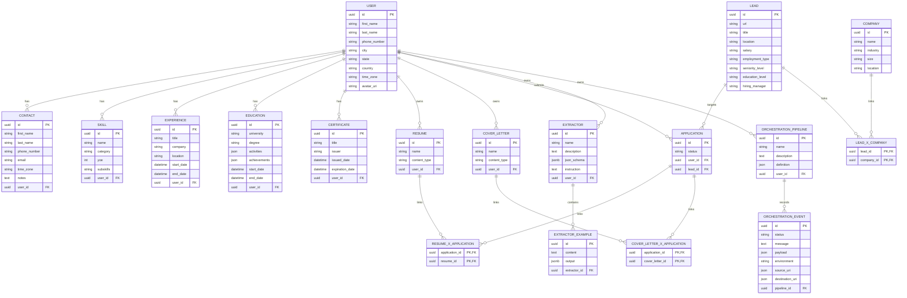

# Backend

The backend defines the Baldin API and the data ETL pipelines that power the API.


## Getting Started

To get started, create a `baldin/backend/.env` file for local development using the
`baldin/backend/.env.example` file with your `OPENAI_API_KEY` if you want to use
the extraction and automation features.


### API

The Baldin API is a restful JSON API that performs CRUD operations on the applications data model. The API is built with FastAPI and is powered by a PostgreSQL database.

TODO: Add a brief description of the API and how to run it


### Data Model

The API data model is centered on a `User` record and three related domains:

- candidate profile data such as contacts, skills, experience, education, resumes, and cover letters
- job search data such as companies, leads, applications, and their join tables
- automation data such as extractors, extractor examples, orchestration pipelines, and orchestration events

All entities inherit `id`, `created_at`, and `updated_at` from the shared `Base`
model in `app/models.py`. The `User` table also inherits authentication fields
from `SQLAlchemyBaseUserTableUUID`.



When making changes to the data model, you can generate a new migration by running the following command:

```bash
alembic revision --autogenerate -m "Your migration message here"
```

After generating the migration, you can apply the migration to the database by running the following command:

```bash
alembic upgrade head
```


### Tests

The backend test suite stills needs to be built out. To run the tests, use the following command:

```bash
pipenv run test # or testv for verbose output
```

### ETL

The ETL is a collection of scripts that are used to extract data from various sources, transform the data into a common format, and load the data into the Application's datalake.


### Development Notes

TODO: Add development notes

Things to consider:
- [ ] Add a section on how to run the ETL scripts
- [ ] Add a section on how to run the API
- [ ] Add a section on how to run the tests


#### Ref:

There are a bunch of stealth playwriters in the world, all appearing to be unmaintained.

This is the latest attempt https://github.com/QIN2DIM/undetected-playwright
which references the one I am using


GlassDoor Scrapping:
https://iproyal.com/blog/scrape-data-from-glassdoor/

LinkedIn Scrapping:
https://www.scrapingbee.com/blog/scrape-linkedin/

Indeed Scapping:
https://iproyal.com/blog/scrape-data-from-glassdoor/
