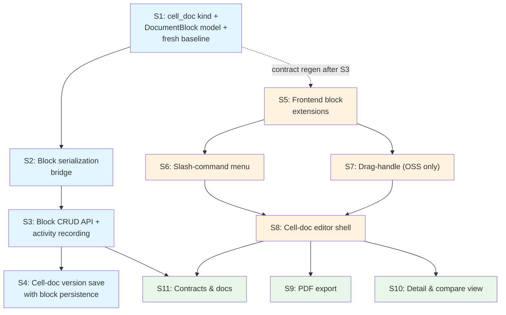

# Epic: Notion-Inspired Cell Documents (Database-Backed Blocks)

## 1. Epic Title

**Cell Documents — Block-Structured Authoring with Database-Backed Block Identity**

## 2. Problem Statement

Baldin's document editor stores content as a single flat rich-text blob (`DocumentVersion.content`) per version. Users cannot independently address, reorder, convert, or slash-command discrete content blocks. This limits composability — drag-reordering, inline task checkboxes, callout insertion, table cell editing, and block-level activity recording are all impossible with the flat model. A new `cell_doc` document kind backed by a `document_blocks` table gives every block a stable UUID and first-class entity status. This unblocks the current Notion-style editing experience and positions the data model for the planned Agents Epic, where agents will write structured output to cell-doc blocks via the API.

**Primary persona:** Job-seeker using Baldin's workspace to compose, iterate, and collaborate on structured professional documents.

**Job-to-be-done:** Author rich, block-structured documents (with headings, task lists, callouts, tables, toggles) where each block is independently identifiable, reorderable, and addressable by the system.

## 3. Current State Summary

### What exists today

| Surface | State | Key Details |
|---------|-------|-------------|
| **Document model** | Live | 5 kinds (`resume`, `cover_letter`, `follow_up`, `reference_sheet`, `freeform`), `DocumentVersion.content` as flat `Text`, `yjs_state` binary for collab |
| **TipTap editor** | Live (v3.22.2) | StarterKit + Link, Underline, TextAlign, Placeholder, Collaboration, CollaborationCursor. Toolbar: bold/italic/underline/strikethrough, H1-3, bullet/ordered lists, blockquote, code block, horizontal rule, alignment, link, undo/redo |
| **Collaboration** | Live | Yjs + WebSocket via bootstrap claim protocol (`CONNECT`/`PENDING`/`SEED`). Awareness with cursor colors. No protocol changes needed for cell docs |
| **Version history** | Live | Immutable `document_versions` with `version_number`, `content`, `content_format`. `head_version_id` pointer on Document |
| **Activity tracking** | Live | `DocumentActivity` with 10 activity types. String column (no DB CHECK constraint). Pydantic `DocumentActivityType` enum validation |
| **PDF export** | Live | `_tiptap_to_flowables()` in documents.py converts TipTap JSON to reportlab flowables |
| **Sharing & auth** | Live | `DocumentShare` with viewer/editor roles. `_require_role()` guard on all endpoints |
| **Schema-v2 branch** | Active | 15 Alembic migrations (0001–0015). Conventions: `DateTime(timezone=True)` via Base, explicit `ondelete` on every FK, CHECK constraints on string-backed enums (`ck_{table}_{column}`), `passive_deletes=True` on cascade rels |
| **Frontend kind picker** | Live | `KIND_OPTIONS` array in document-editor.tsx with icons per kind. Content format toggle (Rich Text / Plain Text) |
| **Frontend service layer** | Live | Full typed CRUD in documents.tsx consuming generated `schema.d.ts` types |
| **Contract pipeline** | Live | `SCHEMA_UPDATE_FORCE=1 ./scripts/update_frontend_schemas.sh` → openapi.json → `schema.d.ts` |

### What is net-new

- `DocumentBlock` model (adjacency list with JSONB content + properties)
- `cell_doc` kind discriminator
- `DocumentVersion.block_snapshot` column for lossless version restore
- `DocumentActivity.block_id` FK + 5 new block activity types
- Block CRUD routes (`GET`/`POST`/`PATCH`/`DELETE`/reorder/sync)
- Serialization bridge (`blocks ↔ TipTap JSON`)
- CellDocEditor component (distinct from existing `RichTextEditor`)
- TipTap extensions: task list, task item, callout (custom), toggle (custom), table suite
- Slash-command menu
- Block drag handles (open-source only)
- PDF export for new node types
- Read-only/compare views for cell docs

### What is partially built

Nothing relevant to cell docs. All work is additive on top of existing document infrastructure.

## 4. System Boundaries Involved

| Boundary | Impact |
|----------|--------|
| **Backend models** | New `DocumentBlock` model, column additions to `DocumentVersion` and `DocumentActivity`, enum extensions |
| **Backend routes** | New block CRUD router, modifications to document create/version-save/generate routes |
| **Backend serialization** | New `blocks_to_tiptap_json()` and `tiptap_json_to_blocks()` bridge |
| **Backend PDF export** | Extended `_tiptap_to_flowables()` for task lists, callouts, toggles, tables |
| **Alembic migrations** | All 15 existing migrations deleted, fresh 0001 baseline generated |
| **Frontend editor** | New `CellDocEditor` component, 4+ TipTap extensions, slash-command, drag handles |
| **Frontend routing** | Kind-based editor discriminator (`cell_doc` → `CellDocEditor`, others → `RichTextEditor`) |
| **Frontend kind picker** | New `cell_doc` option in KIND_OPTIONS |
| **Contracts** | openapi.json and `schema.d.ts` regeneration after block routes land |
| **Docs** | `data-model.md`, `document-collaboration.md` updates |
| **Local infrastructure** | `reset_local_db.sh` for clean rebuild after migration reset |

### Constraints

- **Local-first developer-preview monorepo** — no enterprise-scale, HA, or cloud-mature patterns.
- **Dev-only environment** — database can be rebuilt. No deployed data at risk.
- **schema-v2 branch pre-merge** — migration history deletion is safe.
- **Open-source only** — No TipTap Pro dependency (affects drag handles).
- **Agents Epic is out of scope** — cell docs provides the data model and API surface. Agent execution logic is a separate epic.

## 5. User Stories

### Story 1: `cell_doc` kind + `DocumentBlock` model + fresh baseline

**As a** developer, **I want** the backend to support `cell_doc` documents with a `document_blocks` table and a fresh database baseline, **so that** the data model is ready for block-based editing and the Agents Epic.

**Acceptance criteria:**
- [ ] `DocumentBlock` model added to `models.py` with: `document_id` FK (CASCADE), `parent_block_id` self-FK (CASCADE), `block_type` String (NOT NULL), `content` JSONB (nullable), `properties` JSONB (NOT NULL, default `{}`), `position` Integer (NOT NULL, default 0)
- [ ] All FKs have explicit `ondelete`. `passive_deletes=True` on parent relationship. `DateTime(timezone=True)` timestamps inherited from `Base`
- [ ] `ck_document_blocks_block_type` CHECK constraint covering: `paragraph`, `heading`, `bullet_list`, `ordered_list`, `list_item`, `task_list`, `task_item`, `blockquote`, `code_block`, `callout`, `toggle`, `table`, `table_row`, `table_cell`, `divider`
- [ ] Indexes: `ix_document_blocks_document_id`, `ix_document_blocks_parent`, `ix_document_blocks_doc_parent_pos`
- [ ] `DocumentVersion.block_snapshot` JSONB nullable column added
- [ ] `DocumentActivity.block_id` UUID FK → `document_blocks.id` (ON DELETE SET NULL, nullable) added
- [ ] `ck_document_activities_activity_type` CHECK constraint added covering all existing + new block activity types
- [ ] `DocumentKind` Pydantic enum includes `cell_doc`; `ck_documents_kind` CHECK updated
- [ ] New `DocumentActivityType` values: `block_created`, `block_updated`, `block_deleted`, `block_reordered`, `block_type_changed`
- [ ] All 15 existing Alembic migrations deleted; single fresh `0001_baseline` generated and verified with `alembic upgrade head`
- [ ] `reset_local_db.sh` produces a clean database
- [ ] Existing document CRUD routes accept `cell_doc` kind
- [ ] Cell-doc create initializes with a default paragraph block
- [ ] Existing tests pass after schema rebuild

**Surfaces:** backend
**Dependencies:** none
**Estimated complexity:** M
**Owner recommendation:** Baldin Backend Agent

---

### Story 2: Block serialization bridge

**As a** developer, **I want** lossless bidirectional conversion between block rows and TipTap JSON, **so that** the editor and collaboration layer work with TipTap JSON while the database stores structured blocks.

**Acceptance criteria:**
- [ ] `blocks_to_tiptap_json(blocks) → dict` assembles all 15 block types into valid TipTap document JSON
- [ ] `tiptap_json_to_blocks(document_id, tiptap_json, preserve_ids?) → list[DocumentBlock]` decomposes TipTap JSON into block instances with correct tree structure
- [ ] Round-trip fidelity: `blocks → tiptap_json → blocks` preserves types, content, properties, nesting, ordering for all block types
- [ ] Block identity preservation: sync with `preserve_ids` mapping reuses existing UUIDs for matched blocks
- [ ] Unknown property keys pass through round-trips without loss (extensibility contract for Agents Epic)
- [ ] Unit tests cover all 15 block types including deeply nested structures: table with rows/cells, toggle with children, nested lists, callout with children
- [ ] Unit test covers the no-editor agent path: `tiptap_json_to_blocks()` called without `preserve_ids` produces valid blocks with fresh UUIDs

**Surfaces:** backend
**Dependencies:** Story 1
**Estimated complexity:** M
**Owner recommendation:** Baldin Backend Agent

---

### Story 3: Block CRUD API routes + activity recording

**As a** developer, **I want** a full block CRUD API that also records block-level activities, **so that** blocks are first-class entities with an audit trail.

**Acceptance criteria:**
- [ ] `GET /documents/{id}/blocks` — returns recursive tree (children nested, ordered by position)
- [ ] `POST /documents/{id}/blocks` — creates block at position under parent; records `block_created` activity with `{"block_type": ..., "position": N}`
- [ ] `PATCH /documents/{id}/blocks/{block_id}` — updates content/properties/type; records `block_updated` and optionally `block_type_changed` activities
- [ ] `DELETE /documents/{id}/blocks/{block_id}` — cascades to children; records `block_deleted` activity with `{"block_type": ..., "children_deleted": N}`
- [ ] `PATCH /documents/{id}/blocks/reorder` — batch reorder; records `block_reordered` activity
- [ ] `POST /documents/{id}/blocks/sync` — bulk replace all blocks from TipTap JSON (used by version save and agent write path)
- [ ] All write endpoints require owner or shared-editor role; viewer role gets read-only GET; unauthorized returns 403
- [ ] Pydantic schemas: `DocumentBlockRead`, `DocumentBlockCreate`, `DocumentBlockUpdate`, `DocumentBlockReorderItem`, `DocumentBlockReorderRequest`, `DocumentBlockSyncRequest`
- [ ] Route tests cover CRUD, auth guards, reorder, sync, and activity recording
- [ ] `POST /documents/generate` returns 501 for `cell_doc` kind

**Surfaces:** backend | contracts
**Dependencies:** Story 2
**Estimated complexity:** L
**Owner recommendation:** Baldin Backend Agent

---

### Story 4: Cell-doc version save with block persistence

**As a** user saving a cell doc version, **I want** the version to capture TipTap JSON, the structured block snapshot, and synced live blocks, **so that** versions render immediately and restore losslessly.

**Acceptance criteria:**
- [ ] `POST /documents/{id}/versions` for `cell_doc`: `content` stores TipTap JSON, `block_snapshot` stores recursive block tree JSONB with block UUIDs
- [ ] Live `document_blocks` rows synced from the submitted TipTap JSON via `tiptap_json_to_blocks()` with `preserve_ids`
- [ ] Restoring a version replaces live blocks from `block_snapshot` (preserving UUIDs), clears `Document.yjs_state`, updates `head_version_id`
- [ ] Existing flat-doc version save is unaffected
- [ ] Version detail endpoint includes `block_snapshot` for cell-doc versions
- [ ] Tests cover: save → snapshot present, restore from snapshot → blocks match, restore → yjs_state cleared, flat-doc save → no block_snapshot

**Surfaces:** backend
**Dependencies:** Stories 2, 3
**Estimated complexity:** M
**Owner recommendation:** Baldin Backend Agent

---

### Story 5: Frontend block extensions (task list, callout, toggle, table)

**As a** user editing a cell doc, **I want** task lists, callouts, collapsible toggles, and tables as block types, **so that** I can create structured, rich content.

**Acceptance criteria:**
- [ ] TipTap extensions installed: `@tiptap/extension-task-list`, `@tiptap/extension-task-item`, custom `Callout` node extension, custom `Toggle`/`Details` node extension, `@tiptap/extension-table` + `@tiptap/extension-table-row` + `@tiptap/extension-table-cell` + `@tiptap/extension-table-header`
- [ ] Each block type renders with interactive behavior: checkbox toggle on task items, callout type selector (`info`/`warning`/`tip`/`danger`), toggle collapse/expand, table row/column add/remove
- [ ] All block types serialize correctly to TipTap JSON
- [ ] Table blocks collaborate correctly via Yjs — verified with a two-session concurrent editing test (mandatory per Q4 decision)
- [ ] Callout type stored in TipTap node `attrs.callout_type`
- [ ] Extensions isolated in reusable modules (not inlined in editor component)

**Surfaces:** frontend
**Dependencies:** Story 1 (kind discriminator in frontend types — requires contract regen from Story 3)
**Estimated complexity:** M
**Owner recommendation:** Baldin Frontend Agent

---

### Story 6: Slash-command menu

**As a** user editing a cell doc, **I want** a "/" command palette for inserting block types, **so that** I can quickly add any block type without toolbar hunting.

**Acceptance criteria:**
- [ ] Typing "/" at start of an empty block opens a floating command menu
- [ ] Menu includes: Text, Heading 1–3, Bullet List, Numbered List, Task List, Blockquote, Code Block, Callout (info/warning/tip/danger), Toggle, Divider, Table
- [ ] Menu filters by typing after "/"
- [ ] Selecting an item inserts or converts the current block
- [ ] Dismisses on Escape, click-away, or selection
- [ ] Only appears in the cell-doc editor, not in `RichTextEditor`
- [ ] Component test covers open, filter, select, and dismiss paths

**Surfaces:** frontend
**Dependencies:** Story 5
**Estimated complexity:** M
**Owner recommendation:** Baldin Frontend Agent

---

### Story 7: Block drag-handle and reorder (open-source only)

**As a** user editing a cell doc, **I want** block drag handles or keyboard shortcuts for reordering content, **so that** I can reorganize my document without cut-and-paste.

**Acceptance criteria:**
- [ ] Drag handle visible on block hover (left gutter) OR keyboard alternative (Ctrl+Shift+Up/Down) — at least one must ship
- [ ] Reorder propagates through Yjs in collaborative mode
- [ ] **Open-source implementation only** — evaluate `tiptap-extension-global-drag-handle` first; if it conflicts with collaboration or custom nodes, fall back to keyboard-only reorder (per Q9 decision)
- [ ] Component test covers reorder behavior

**Surfaces:** frontend
**Dependencies:** Story 5
**Estimated complexity:** M
**Owner recommendation:** Baldin Frontend Agent

---

### Story 8: Cell-doc editor shell (Notion-like UI)

**As a** user editing a cell doc, **I want** a minimal Notion-like editor with inline block interactions, **so that** I get a modern authoring experience distinct from the flat rich-text editor.

**Acceptance criteria:**
- [ ] `kind === 'cell_doc'` in the document editor routes to `CellDocEditor` component, not `RichTextEditor`
- [ ] No fixed toolbar — inline floating menu on text selection (bold/italic/link/code)
- [ ] Block-level "⋮" menu: Turn into…, Duplicate, Delete, Move up/down
- [ ] Empty-state placeholder: "Type '/' for commands"
- [ ] Document title editable inline at top
- [ ] Stores content as `tiptap_json` content format
- [ ] On save, version create triggers block sync (backend handles block persistence)
- [ ] Cell-doc is a **peer option** in the "New Document" kind picker (not the default)
- [ ] `cell_doc` entry added to `KIND_OPTIONS` with icon
- [ ] Collaboration works: bootstrap protocol, cursor awareness, multi-user editing all function within `CellDocEditor`

**Surfaces:** frontend
**Dependencies:** Stories 5, 6, 7, and contract regen from Story 3
**Estimated complexity:** L
**Owner recommendation:** Baldin Frontend Agent

---

### Story 9: Cell-doc PDF export

**As a** user, **I want** to download a cell doc as a PDF, **so that** I can share my structured document outside the platform.

**Acceptance criteria:**
- [ ] `_tiptap_to_flowables()` extended to handle: `taskList`/`taskItem` (☐/☑ prefixes), `callout` (indented block with type label), `details`/`detailsSummary` (expanded in PDF), `table`/`tableRow`/`tableCell`/`tableHeader` (reportlab `Table` objects)
- [ ] Existing flat-doc export unaffected
- [ ] Tests cover PDF generation for each new node type
- [ ] Toggle blocks render fully expanded (no collapse in PDF)

**Surfaces:** backend
**Dependencies:** Story 8 (node type names finalized in frontend)
**Estimated complexity:** M
**Owner recommendation:** Baldin Backend Agent

---

### Story 10: Cell-doc detail, compare, and read-only view

**As a** user viewing a cell doc, **I want** all block types to render correctly in read-only mode, **so that** shared and historical cell docs display as intended.

**Acceptance criteria:**
- [ ] Detail page renders cell docs with a read-only `CellDocEditor` instance (no edit controls)
- [ ] Compare page handles cell-doc versions (text-level diff acceptable for POC)
- [ ] Shared-with-me cell docs render correctly for viewer and editor roles
- [ ] Component test covers read-only rendering with representative block types

**Surfaces:** frontend
**Dependencies:** Story 8
**Estimated complexity:** S
**Owner recommendation:** Baldin Frontend Agent

---

### Story 11: Contract regeneration and documentation

**As a** developer, **I want** contracts and docs to reflect the cell-doc kind, block model, and block API, **so that** the repo stays coherent and the frontend contract is current.

**Acceptance criteria:**
- [ ] `SCHEMA_UPDATE_FORCE=1 ./scripts/update_frontend_schemas.sh` succeeds; openapi.json and `schema.d.ts` reflect: new `cell_doc` kind, block schemas, block routes, new activity types
- [ ] document-collaboration.md updated: cell-doc block persistence note, collaboration compatibility confirmation, Agents Epic readiness note
- [ ] data-model.md updated: `cell_doc` kind, `document_blocks` entity, updated ER diagram
- [ ] Docs build passes (`cd docs && npm run build`)
- [ ] Frontend build passes (`VITE_API_URL=https://api.example.com npm run build`)

**Surfaces:** docs | contracts
**Dependencies:** Stories 3, 8 (both backend routes and frontend node names finalized)
**Estimated complexity:** S
**Owner recommendation:** Baldin Lead Full-Stack Architect

---

## 6. Dependency Graph

**Critical path:** S1 → S2 → S3 → S4 (backend) and S1 → S3 (contract regen) → S5 → S6/S7 → S8 (frontend), converging at S11.

Backend and frontend tracks run **in parallel** after S3's contract regeneration obligation is met.

## 7. Phased Delivery Plan

### Phase 1 — Backend Foundation (Stories 1, 2, 3, 4)

**Goal:** Block model exists, serialization bridge is tested, block CRUD API with activity recording is live, version save captures block snapshots. Database rebuilt from fresh baseline.

**Sequence:** S1 → S2 → S3 → S4 (serial — each depends on the prior)

**Contract obligation:** Run `SCHEMA_UPDATE_FORCE=1 ./scripts/update_frontend_schemas.sh` after S3 completes. Confirm openapi.json and `schema.d.ts` include block schemas and routes. This unblocks Phase 2.

**Convention obligations:**
- Fresh baseline migration must include ALL CHECK constraints from the schema-v2 pass: `ck_documents_kind` widened to include `cell_doc`, `ck_document_blocks_block_type`, `ck_document_activities_activity_type`, plus every existing constraint from migration 0005
- Alembic autogenerate does **not** emit CHECK constraints — the migration must be hand-reviewed (Step 6 in the spike's §8 reset plan)

**Validation:**
- `reset_local_db.sh` boots cleanly
- `alembic upgrade head` on fresh database succeeds
- `pytest` passes: serialization round-trips, block CRUD, activity recording, version save with block snapshot
- openapi.json and `schema.d.ts` reflect block schemas and block routes
- All existing tests pass after schema rebuild

**Owner:** Baldin Backend Agent for all four stories

---

### Phase 2 — Frontend Block Editor (Stories 5, 6, 7, 8)

**Goal:** Notion-like cell-doc editor with all block types, slash commands, open-source drag handles (or keyboard fallback), inline floating menu, and collaborative table editing.

**Sequence:** S5 first (extensions), then S6 + S7 in parallel (slash command + drag handle), then S8 (shell that integrates everything).

**Prerequisite:** Phase 1's contract regeneration must be complete so frontend types include `cell_doc` kind and block schemas.

**Mandatory validation (Q4 decision):** Two-session concurrent table editing integration test must pass before Phase 2 is considered complete. This is non-negotiable given the Agents Epic dependency on table blocks.

**Validation:**
- `tsc --noEmit` clean
- Component tests for each extension, slash-command, drag handle/keyboard reorder
- Table collaboration integration test (two concurrent sessions editing table cells)
- `VITE_API_URL=https://api.example.com npm run build` succeeds

**Owner:** Baldin Frontend Agent for all four stories

---

### Phase 3 — Integration & Polish (Stories 9, 10, 11)

**Goal:** PDF export covers new node types, read-only views work for all roles, contracts and docs finalized.

**Sequence:** S9 and S10 can run in parallel. S11 runs last as the convergence point.

**Validation:**
- Backend: `pytest` for PDF export with new node types (taskList, callout, toggle, table)
- Frontend: detail/compare component tests, `npm run test`, `npm run build`
- Docs: `cd docs && npm run build`
- Contract: final regen confirms stable spec matches shipped routes
- E2E manual smoke: create cell doc → edit with slash commands → collaborate (including table) → save version → restore version → export PDF → detail view → compare view

**Owners:** S9 → Backend Agent, S10 → Frontend Agent, S11 → Lead Architect

---

## 8. Risk Register

| # | Risk | Likelihood | Impact | Mitigation |
|---|---|---|---|---|
| 1 | **Serialization round-trip fidelity** — edge-case formatting or nesting loss in `blocks ↔ TipTap JSON` for complex nested structures (table in toggle, nested lists in callout) | Medium | High | Comprehensive unit tests per block type. `block_snapshot` JSONB provides lossless fallback for version restore even if sync drifts. |
| 2 | **Slash-command extension complexity** — TipTap's `@tiptap/suggestion` API has known rough edges with positioning, filtering, and keyboard navigation | Medium | Medium | Spike S6 as soon as S5 lands. Evaluate `@tiptap/suggestion` vs. custom ProseMirror plugin. Fall back to a block-type inserter button if suggestion UX is inadequate. |
| 3 | **Open-source drag-handle quality** — `tiptap-extension-global-drag-handle` may conflict with collaboration mode or custom nodes (callout, toggle) | Medium | Medium | Per Q9 decision: evaluate the library first, fall back to keyboard-only reorder (Ctrl+Shift+Up/Down) if it conflicts. Keyboard-only is an acceptable Phase 2 outcome. |
| 4 | **Table + Yjs concurrent editing** — historically fragile, main crash fixed in `y-tiptap@3.0.2` but edge cases may remain | Low–Medium | **High** (Agents Epic blocker) | Mandatory two-session integration test. Pin TipTap version after validation. If concurrent editing produces data corruption (not just visual artifacts), escalate as epic blocker. |
| 5 | **Alembic autogenerate gaps** — autogenerate does not emit CHECK constraints, may miss `server_default` values or composite indexes | Low | Medium | §8 Step 6 explicitly requires manual review of generated migration. Include a CI-style pre-test verification step (attempt `alembic upgrade head` on a clean database in the test phase). |
| 6 | **Story 8 scope creep** — "Notion feel" is subjective and could expand indefinitely | Medium | High | Timebox strictly to acceptance criteria. Defer: animations, block colors, @-mentions, nested page links, database views. Done = acceptance criteria met. |
| 7 | **Custom TipTap node development** — callout and toggle require ProseMirror schema knowledge beyond StarterKit patterns | Medium | Low | Well-documented community pattern. TipTap's custom node API is stable. Budget 1–2 iteration cycles per custom node. |
| 8 | **Migration history reset one-time risk** — deleting 15 migrations is safe on the pre-merge schema-v2 branch but cannot be undone after merge | Low | Low | Branch has not merged to `main`. Dev-only environment. `reset_local_db.sh` available for clean rebuild. Document the decision and don't merge the baseline until it passes `alembic upgrade head` + full pytest. |
| 9 | **Frontend routing complexity** — kind-based editor discriminator introduces a branching path in `document-editor.tsx` | Low | Low | Clean conditional: `kind === 'cell_doc'` renders `CellDocEditor`, else `RichTextEditor`. No shared-state coupling needed between the two editors. |
| 10 | **Block activity volume** — recording per-block CRUD activities could produce many rows for active editors | Low | Low | Activities are append-only audit records. Block counts per document are small (tens to low hundreds). Pruning/archival is a follow-up concern if data volume becomes real. |

## 9. Out of Scope

- **Block-level comments / discussions** — data model is ready (`block_id` FK on `DocumentActivity`), but comment UI and API are a separate epic
- **Block references / transclusion** — embedding blocks across documents
- **Notion "database views"** — relational database blocks with views, sorts, filters
- **Image / file embed blocks** — upload-to-block pipeline
- **@-mention blocks** — user/document reference resolution
- **Block-level permissions** — sharing stays document-level
- **Block-level version diff** — text-level compare is acceptable for POC
- **Mobile-optimized block editor** — responsive but not mobile-first
- **AI block generation** — `generate` returns 501 for `cell_doc`; the Agents Epic owns programmatic cell-doc creation via block CRUD/sync API
- **Diff-based block sync** — full-replace sync is sufficient for POC block volumes
- **Migrating existing documents** — users create new cell docs; existing flat docs are unchanged
- **Custom callout types** — fixed set: `info`, `warning`, `tip`, `danger`
- **Block analytics / metrics** — no tracking beyond the activity log

## 10. Validation Plan by Phase

| Phase | Check | Command / Method | Pass Criteria |
|-------|-------|-----------------|---------------|
| **1** | DB bootstrap | reset_local_db.sh | Clean exit, no errors |
| **1** | Migration | `cd backend && alembic upgrade head` | All CHECK constraints present, all indexes created |
| **1** | Backend tests | `cd backend && python -m pytest` | All existing + new tests pass |
| **1** | Contract regen | `SCHEMA_UPDATE_FORCE=1 ./scripts/update_frontend_schemas.sh` | openapi.json and `schema.d.ts` include block schemas, block routes, `cell_doc` kind |
| **2** | TypeScript | `cd frontend && npx tsc --noEmit` | Zero errors |
| **2** | Frontend tests | `cd frontend && npm run test` | All component tests pass |
| **2** | Table collab | Manual or automated: two Yjs sessions editing the same table | No data corruption |
| **2** | Frontend build | `cd frontend && VITE_API_URL=https://api.example.com npm run build` | Clean build |
| **3** | PDF export tests | `cd backend && python -m pytest -k pdf` (or relevant scope) | All new node types render |
| **3** | Docs build | `cd docs && npm run build` | Clean build |
| **3** | Final contract | `SCHEMA_UPDATE_FORCE=1 ./scripts/update_frontend_schemas.sh` | No diff vs. Phase 1 output (spec is stable) |
| **3** | E2E smoke | Manual | Create → edit → collaborate → save → restore → export → detail → compare |

## 11. Open Questions

All open questions from the spike v3 have been resolved (Q1–Q9). **No blocking open questions remain.**

One advisory item for the executing agents:

| # | Item | Context | Action |
|---|---|---|---|
| A1 | **TipTap version pin strategy** | The spike relies on `y-tiptap@3.0.2` (ships with `@tiptap/react ^3.22.2`) for the table+Yjs crash fix. After Phase 2's table collaboration test passes, the frontend should pin to the validated TipTap version range to prevent regressions. | Frontend Agent should document the validated version in a `package.json` comment or README note after Phase 2 validation. |

---

**Story count:** 11 (2S + 7M + 2L)

**Natural epic split point:** Phase 1 (Stories 1–4, backend foundation) vs. Phase 2–3 (Stories 5–11, frontend editor + integration). These are independently shippable: Phase 1 delivers a complete, tested backend API surface that the Agents Epic could consume even without the Notion-style frontend.

**Recommended starting point:** Dispatch S1 to the Baldin Backend Agent. The spike's §4 and §8 provide the complete model specification and migration reset procedure.

Completed: *Risk register & output* (6/6)
