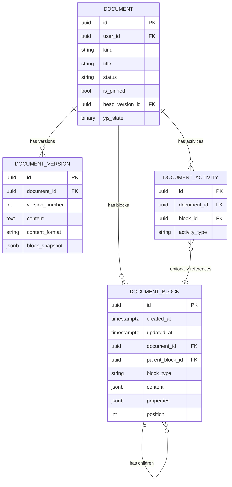
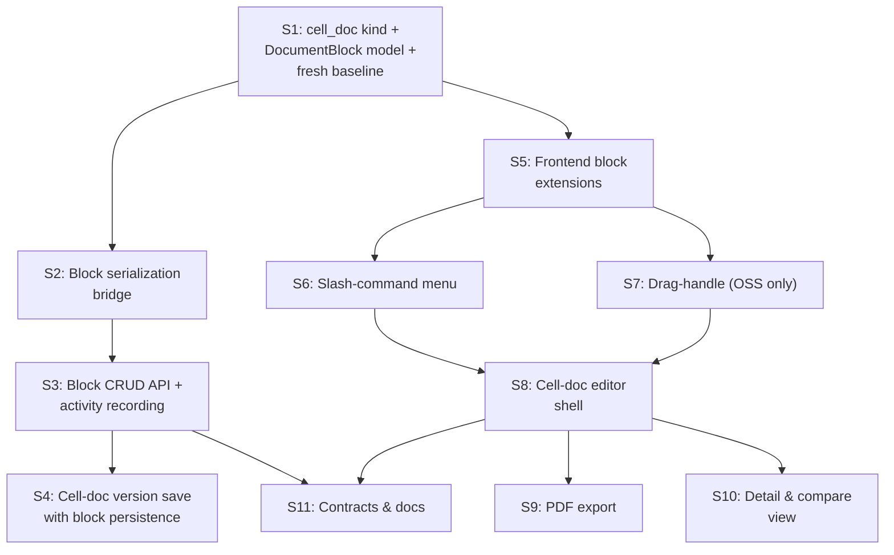

# Spike Report v3: Notion-Inspired Cell Documents — Path B (Database-Backed Blocks)

Baldin's current document editor stores content as a single flat rich-text blob (TipTap JSON or plain text) per version. Users cannot independently address, reorder, convert, or command-insert discrete content blocks the way modern Notion-style editors allow. This limits the composability of document content — users can't drag a heading above a list, slash-command a new callout into position, check off inline tasks, or interact with blocks as first-class objects. A new "cell doc" document type with a Notion-inspired block editor would give users a structured, flexible authoring experience that fits naturally alongside the existing flat rich-text documents.

## Resolved Decisions

| # | Question | Answer | Implication |
|---|---|---|---|
| 1 | Drag-handle licensing | **Open-source only** | Evaluate `tiptap-extension-global-drag-handle` or build custom. No TipTap Pro dependency. |
| 2 | Cell-doc as default? | **Peer option** | `cell_doc` appears alongside existing kinds in the "New Document" picker. No routing or default changes. |
| 3 | Callout type set | **`info`, `warning`, `tip`, `danger`** | Fixed set stored in `properties.callout_type`. |
| 4 | Table collaboration tolerance | **Must be collaborative** — Agents Epic will wire into table blocks. | Table+Yjs crash fix shipped in `y-tiptap@3.0.2` (included in `@tiptap/react ^3.22.2`). Add a mandatory table-collaboration integration test. Table block identity is agent-addressable (see §4.2 design consideration). |
| 5 | Block sync trigger | **On every save (version create)** | Version creation for cell docs calls `tiptap_json_to_blocks()` to persist blocks alongside `content` and `block_snapshot`. No debounced auto-sync. |
| 6 | Block-level activity recording | **Include in POC, do not defer** | Block CRUD routes write to `document_activities` with the new `block_id` FK. Activity types: `block_created`, `block_updated`, `block_deleted`, `block_reordered`, `block_type_changed`. |
| 7 | Agents Epic table schema foresight | **Agents Epic defines its own conventions** | `properties` JSONB is extensible without schema changes. No pre-allocated agent fields in Phase 1. Cell-docs validation must pass through unknown property keys (see §4.2 extensibility contract). |
| 8 | Block CRUD vs. bulk sync write path | **Individual CRUD + sync on save** | Block-menu actions (Delete, Duplicate, etc.) call individual API endpoints. Version save calls the sync endpoint. Activity log records fine-grained block events. |
| 9 | Open-source drag handle fallback | **Keyboard reorder only is acceptable** | S7 evaluates `tiptap-extension-global-drag-handle` first; can close with keyboard-only if the library conflicts. De-risks Phase 2. |

## 1. Problem Statement

Baldin's document editor stores content as a single flat rich-text blob (`DocumentVersion.content`) per version. This prevents block-level identity, block-level API access, and future block-level features (comments, references, agent operations, granular permissions). A new `cell_doc` document kind backed by a `document_blocks` table gives blocks first-class entity status with stable UUIDs — enabling the current Notion-style editing epic and positioning the data model for the planned Agents Epic that will wire into table blocks.

## 2. Architecture Decision: Why Path B

The only active environment is dev. The database will be rebuilt. This epic lands on the `schema-v2` branch after its planned schema-hardening work (15 Alembic migrations, FK/nullability audit, CHECK constraints on string enums, timezone-aware timestamps) has been committed but before the branch merges to `main`. Existing migrations will be deleted and a fresh baseline generated. With migration risk eliminated, Path B is the stronger long-term design:

| Concern | Path A (TipTap-only) | Path B (DB-backed blocks) |
|---|---|---|
| Block-level identity | Ephemeral TipTap nodes, no stable IDs | UUID per block — agent-addressable |
| Agents Epic readiness | Requires Path B retrofit | **Ready** — agents target blocks by UUID |
| Future block comments | Requires schema work | Ready — FK from comment → block |
| Block-level activity audit | Not possible | **Included in POC** (Q6 answer) |
| Schema migration risk | None | **None** — dev-only, DB rebuild |
| Collaboration protocol impact | None | **None** — same Yjs/TipTap path |

## 3. Current State Summary

**Branch context:** `schema-v2` landed a schema-hardening pass with 15 Alembic migrations (0001–0015). The conventions established by that pass — `DateTime(timezone=True)` via `Base`, explicit `ondelete` on every FK, CHECK constraints on string-backed enum columns (`ck_{table}_{column}`), and `passive_deletes=True` on cascade relationships — are now the baseline. Cell-docs work must follow them.

**Key facts:** Document model stores content in `DocumentVersion.content` as Text. `Document.kind` is a bare String column validated by a `ck_documents_kind` CHECK constraint and a `DocumentKind` Pydantic enum in schemas.py. `DocumentActivity.activity_type` is a bare String validated by the `DocumentActivityType` Pydantic enum. TipTap 3 with StarterKit + collab extensions. Yjs bootstrap protocol in document_collaboration.py. reset_local_db.sh available for clean rebuild.

## 4. Data Model Design

### 4.1 `DocumentBlock` — New table

```
document_blocks
├── id               UUID PK  (inherited from Base)
├── created_at       DateTime(timezone=True) server_default=now()  (inherited from Base)
├── updated_at       DateTime(timezone=True) server_default=now()  (inherited from Base)
├── document_id      UUID FK → documents.id  ON DELETE CASCADE  NOT NULL
├── parent_block_id  UUID FK → document_blocks.id  ON DELETE CASCADE  NULLABLE
├── block_type       String  NOT NULL  (CHECK: ck_document_blocks_block_type)
├── content          JSONB  NULLABLE   — TipTap-compatible inline content array
├── properties       JSONB  NOT NULL   DEFAULT '{}'  — type-specific attributes
├── position         Integer NOT NULL  DEFAULT 0     — sort order within parent
└── INDEXES
    ├── ix_document_blocks_document_id  (document_id)
    ├── ix_document_blocks_parent       (parent_block_id)
    └── ix_document_blocks_doc_parent_pos (document_id, parent_block_id, position)
```

**Design rationale:**
- **Adjacency list** for tree structure. Depth is shallow (2–3 levels max for lists, callouts, toggles, table cells). Full-tree loading via `selectinload` is the common path.
- **Integer position** for ordering. Reorder operations rewrite positions within the affected parent scope. Block counts per document are small enough that this is not a performance concern.
- **JSONB content** stores TipTap-compatible inline content arrays (text nodes with marks). Structural blocks like `divider`, `table`, `table_row` have null content.
- **JSONB properties** (`NOT NULL DEFAULT '{}'`) stores type-specific attributes. Avoids per-type columns. `NOT NULL` ensures consistent querying without null-checks — empty objects for blocks with no special attributes.
- **String block_type** (not enum) for extensibility. New block types don't require schema changes. Validation happens at the application layer. A `ck_document_blocks_block_type` CHECK constraint enforces the initial allowed set at the database level (following the `ck_{table}_{column}` convention from migration 0005). Adding a new block type requires a migration to widen the constraint — an acceptable trade-off because new block types are rare and the constraint prevents garbage data.
- **FK ondelete policies** follow the branch convention: `CASCADE` on `document_id` (block dies with its document) and `CASCADE` on `parent_block_id` (child dies with parent). Both FKs must have explicit `ondelete` — bare FKs without a policy are a schema-v2 anti-pattern.
- **Timestamps** inherit `DateTime(timezone=True)` with `server_default=func.now()` from `Base` — the timezone-aware convention established in migration 0012.

### 4.2 Block type reference

| block_type | content | properties | children |
|---|---|---|---|
| `paragraph` | Rich-text inline array | `{}` | — |
| `heading` | Rich-text inline array | `{"level": 1\|2\|3}` | — |
| `bullet_list` | — | `{}` | `list_item` |
| `ordered_list` | — | `{"start": 1}` | `list_item` |
| `list_item` | Rich-text inline array | `{}` | Optional nested list |
| `task_list` | — | `{}` | `task_item` |
| `task_item` | Rich-text inline array | `{"checked": false}` | — |
| `blockquote` | Rich-text inline array | `{}` | Optional block children |
| `code_block` | `[{"type":"text","text":"..."}]` | `{"language": "python"}` | — |
| `callout` | Rich-text inline array | `{"callout_type": "info"\|"warning"\|"tip"\|"danger"}` | Optional block children |
| `toggle` | Rich-text (summary line) | `{}` | Block children (collapse body) |
| `table` | — | `{}` | `table_row` |
| `table_row` | — | `{}` | `table_cell` |
| `table_cell` | Rich-text inline array | `{"header": false, "colspan": 1, "rowspan": 1}` | — |
| `divider` | — | `{}` | — |

**Agents Epic design consideration:** Table blocks create a `table → table_row → table_cell` tree where every cell has a stable UUID and JSONB content. This makes individual cells agent-addressable via `GET /documents/{id}/blocks` + tree traversal, or directly via `PATCH /documents/{id}/blocks/{cell_block_id}`. The `properties` JSONB on `table_cell` blocks is extensible — a future Agents Epic can add column-type metadata, formula definitions, or agent annotations to `properties` without schema changes.

**Properties extensibility contract:** The cell-docs epic must not reject unknown property keys. Validation of `properties` is limited to the type-specific keys listed in §4.2 (e.g., `level` on headings, `checked` on task items). Any key not in the known set is passed through and preserved across round-trips. This guarantees agents can annotate blocks with arbitrary metadata (e.g., `agent_run_id`, `confidence_score`, `column_type`) without cell-docs code changes.

**Agent session as versioned cell doc:** The planned Agents Epic will produce agent output as cell_doc documents, with table blocks serving as structured I/O surfaces for agent workflows (e.g., application comparison matrices, cover letter variations, outreach tracking). The agent write path is programmatic — agents call the block CRUD and sync APIs directly, without a browser or TipTap editor. Each version save captures a `block_snapshot` with stable block UUIDs, giving agents an immutable audit trail of every iteration. The version history doubles as the agent session record: prompt → first draft → revision → final. This use case validates two design decisions: (1) block UUIDs must survive version restore (§4.3 `block_snapshot`), and (2) the sync endpoint must work without editor state (§6.1 `POST .../blocks/sync` accepts raw TipTap JSON, not Yjs state).

### 4.3 `DocumentVersion` — One new column

```
document_versions (existing table — add one column)
└── block_snapshot   JSONB  NULLABLE  — structured block tree for lossless version restore
```

`block_snapshot` stores the recursive block tree with original block UUIDs:
```json
[
  {
    "id": "550e8400-...",
    "block_type": "heading",
    "content": [{"type":"text","text":"My Document"}],
    "properties": {"level": 1},
    "position": 0,
    "children": []
  }
]
```

**Why both `content` (TipTap JSON) and `block_snapshot` (block tree)?**
- `content` preserves backward compatibility — existing version rendering works unchanged.
- `block_snapshot` preserves block identity (UUIDs). Restoring a version to live blocks uses this field to maintain block references. Without it, restoring from TipTap JSON would generate fresh UUIDs, breaking any block-level comments or agent references.
- **Agent UUID stability:** When an agent iterates on a cell doc across multiple versions (draft → revision → final), block UUIDs in `block_snapshot` let the Agents Epic correlate changes to the same logical block across versions. An agent that writes to a specific table cell in version N can verify whether that cell was modified by the user in version N+1 by comparing `block_snapshot` entries. This is the mechanical foundation for multi-turn agent sessions stored as versioned cell documents.

### 4.4 `DocumentActivity` — One new nullable FK + new activity types

```
document_activities (existing table — add one column)
└── block_id   UUID FK → document_blocks.id  ON DELETE SET NULL  NULLABLE
```

**Convention note:** `DocumentActivity.activity_type` is a bare String column today (no DB-level CHECK constraint, validated by the `DocumentActivityType` Pydantic enum). The new block activity types extend that enum. A `ck_document_activities_activity_type` CHECK constraint should be added in the fresh baseline covering all known values (existing + block types) to match the string-enum-CHECK pattern from migration 0005.

New activity types for block-level recording:

| activity_type | Trigger | details JSONB |
|---|---|---|
| `block_created` | Block CRUD create | `{"block_type": "...", "position": N}` |
| `block_updated` | Block CRUD update | `{"block_type": "...", "changed_fields": [...]}` |
| `block_deleted` | Block CRUD delete | `{"block_type": "...", "children_deleted": N}` |
| `block_reordered` | Reorder endpoint | `{"blocks_moved": N}` |
| `block_type_changed` | Update that changes block_type | `{"from_type": "...", "to_type": "..."}` |

These extend the existing `DocumentActivityType` schema enum, which already includes `document_created`, `version_saved`, etc.

### 4.5 `Document` — Relationship only, no column changes

```python
blocks = relationship(
    "DocumentBlock",
    back_populates="document",
    cascade="all, delete-orphan",
    passive_deletes=True,
    order_by="DocumentBlock.position",
)
```

**Convention note:** `passive_deletes=True` is required because `document_id` uses `ondelete="CASCADE"`. This tells SQLAlchemy to trust the database-level cascade rather than issuing per-row DELETEs, matching the pattern used on other cascade relationships in the branch (e.g., `Document.shares`, `Document.activities`).

### 4.6 Entity relationship diagram



## 5. Serialization Bridge

Two backend utility functions bridge between the block table and TipTap JSON.

### 5.1 `blocks_to_tiptap_json(blocks: list[DocumentBlock]) -> dict`

Assembles the flat block list (with parent relationships) into a valid TipTap document JSON tree. Used for:
- Collaboration bootstrap seeding (same path as today — returns TipTap JSON)
- Version save (generate `DocumentVersion.content` from current blocks)
- API response when loading a cell doc for the editor

### 5.2 `tiptap_json_to_blocks(document_id: UUID, tiptap_json: dict, preserve_ids: dict | None) -> list[DocumentBlock]`

Decomposes a TipTap JSON document tree into `DocumentBlock` instances. Used for:
- Version create sync (editor saves → decompose → persist blocks + snapshot)
- Version restore (deserialize `block_snapshot` or fall back to TipTap JSON)
- **Programmatic block creation** (agent or backend service builds TipTap JSON from structured data → decompose → persist)

`preserve_ids` maps TipTap node positions to existing block UUIDs, maintaining identity during syncs. When called without `preserve_ids` (e.g., initial agent output), all blocks receive fresh UUIDs.

### 5.3 Data flow

```
┌─────────────────────────────────────────────────────────┐
│                    CELL DOC LIFECYCLE                    │
├─────────────────────────────────────────────────────────┤
│                                                         │
│  LOAD                                                   │
│  document_blocks → blocks_to_tiptap_json() → TipTap    │
│                                                         │
│  COLLABORATE                                            │
│  TipTap ↔ Yjs ↔ WebSocket ↔ Document.yjs_state        │
│  (unchanged protocol)                                   │
│                                                         │
│  SAVE VERSION (sync trigger: every version create)      │
│  TipTap JSON → tiptap_json_to_blocks() → blocks table  │
│              → DocumentVersion.content (TipTap JSON)    │
│              → DocumentVersion.block_snapshot (JSONB)    │
│              → block-level activities recorded           │
│                                                         │
│  RESTORE VERSION                                        │
│  block_snapshot (preferred) → replace blocks            │
│  OR content (TipTap JSON) → tiptap_json_to_blocks()    │
│                                                         │
│  BOOTSTRAP (no yjs_state on document)                   │
│  blocks → blocks_to_tiptap_json() → seed to editor     │
│  (same CONNECT/PENDING/SEED protocol, no changes)       │
│                                                         │
│  AGENT WRITE (planned — Agents Epic)                    │
│  Agent builds TipTap JSON from structured data          │
│  → POST /documents/{id}/blocks/sync                     │
│  → tiptap_json_to_blocks() → blocks table               │
│  → POST /documents/{id}/versions → block_snapshot       │
│  (no editor, no Yjs — pure API path)                    │
│                                                         │
└─────────────────────────────────────────────────────────┘
```

## 6. API Surface

### 6.1 New routes (`/documents/{document_id}/blocks`)

| Method | Path | Purpose |
|---|---|---|
| `GET` | `/documents/{id}/blocks` | Full block tree (recursive, ordered) |
| `POST` | `/documents/{id}/blocks` | Create a block (at position, under parent). Records `block_created` activity. |
| `PATCH` | `/documents/{id}/blocks/{block_id}` | Update block content, properties, or type. Records `block_updated` and optionally `block_type_changed` activities. |
| `DELETE` | `/documents/{id}/blocks/{block_id}` | Delete block + cascaded children. Records `block_deleted` activity. |
| `PATCH` | `/documents/{id}/blocks/reorder` | Batch reorder. Records `block_reordered` activity. |
| `POST` | `/documents/{id}/blocks/sync` | Bulk replace all blocks from TipTap JSON (called during version save, or by agents writing structured output). |

**Access control:** Owner or shared editor role for all endpoints. Viewer role gets read-only GET.

### 6.2 Pydantic schemas

```
DocumentBlockRead(BaseRead)
  ├── document_id: UUID4
  ├── parent_block_id: UUID4 | None
  ├── block_type: str
  ├── content: list[dict] | None
  ├── properties: dict
  ├── position: int
  └── children: list[DocumentBlockRead]

DocumentBlockCreate(BaseSchema)
  ├── block_type: str
  ├── content: list[dict] | None
  ├── properties: dict = {}
  ├── parent_block_id: UUID4 | None
  └── position: int | None

DocumentBlockUpdate(BaseSchema)
  ├── block_type: str | None
  ├── content: list[dict] | None
  └── properties: dict | None

DocumentBlockReorderItem(BaseSchema)
  ├── block_id: UUID4
  ├── parent_block_id: UUID4 | None
  └── position: int

DocumentBlockReorderRequest(BaseSchema)
  └── blocks: list[DocumentBlockReorderItem]

DocumentBlockSyncRequest(BaseSchema)
  └── tiptap_json: dict

DocumentActivityType (extended enum)
  + block_created
  + block_updated
  + block_deleted
  + block_reordered
  + block_type_changed
```

### 6.3 Existing route changes

| Route | Change |
|---|---|
| `POST /documents/` | Accept `cell_doc` kind. Initialize with a default paragraph block. |
| `GET /documents/{id}` | For `cell_doc`, optionally include block tree in detail response. |
| `POST /documents/{id}/versions` | For `cell_doc`, persist `block_snapshot` and sync blocks from TipTap JSON content. |
| Version restore | For `cell_doc`, restore blocks from `block_snapshot`, clear `yjs_state`. |
| `POST /documents/generate` | Return 501 for `cell_doc`. (Agents Epic will produce cell_doc output via the block CRUD/sync API instead of the generate endpoint.) |

## 7. Collaboration Protocol Compatibility

**No protocol changes required.** The key table+collaboration crash (TipTap issue #6979) was fixed in `y-tiptap@3.0.2`, which ships with `@tiptap/react ^3.22.2` — the version this repo already uses. The root cause was a missing null-check in `createDecorations`, not a fundamental incompatibility.

The collaboration layer operates on `Document.yjs_state` via `DocumentCollaborationServer` / `DocumentYStore`. It does not know about the block table. The block table is the structured persistence layer at rest, populated on version create.

**Mandatory validation for table collaboration (Q4):** Phase 2 must include an integration test that verifies concurrent table cell editing between two collaborative sessions. This is non-negotiable given the Agents Epic dependency.

## 8. Database Reset Plan

This work lands on the `schema-v2` branch after its 15 migrations (0001–0015) have been committed. Because the branch has not merged to `main` yet, deleting all migrations and rebuilding a single baseline is safe.

1. Delete all existing migration files under `backend/alembic/versions/`
2. Update models.py with `DocumentBlock`, `DocumentVersion.block_snapshot`, `DocumentActivity.block_id`
3. Add `cell_doc` to the `ck_documents_kind` CHECK constraint values and add new CHECK constraints (`ck_document_blocks_block_type`, `ck_document_activities_activity_type`)
4. Run `reset_local_db.sh` to wipe both `db` and `test_db`
5. Generate a single fresh baseline: `cd backend && alembic revision --autogenerate -m "baseline" --rev-id 0001`
6. Review the generated migration carefully — autogenerate may miss CHECK constraints, `server_default` values, or index changes. Hand-edit as needed.
7. Verify: `alembic upgrade head` on fresh database
8. Verify: `pytest` passes with the rebuilt test database

## 9. User Stories

### Story 1: `cell_doc` kind + `DocumentBlock` model + fresh baseline

**As a** developer, **I want** the backend to support cell_doc documents with a blocks table and a fresh database baseline, **so that** the data model is ready for block-based editing and the Agents Epic.

**Acceptance criteria:**
- [ ] `DocumentBlock` model added to models.py per §4.1 with `DateTime(timezone=True)` timestamps (via Base), explicit `ondelete` on both FKs, and `passive_deletes=True` on parent relationship
- [ ] `ck_document_blocks_block_type` CHECK constraint added covering all block types from §4.2
- [ ] `DocumentVersion.block_snapshot` column added per §4.3
- [ ] `DocumentActivity.block_id` nullable FK added per §4.4 with `ondelete="SET NULL"`
- [ ] `ck_document_activities_activity_type` CHECK constraint added for all activity types (existing + block)
- [ ] New `DocumentActivityType` values added to schemas.py per §4.4
- [ ] `DocumentKind` enum includes `cell_doc`; `ck_documents_kind` CHECK constraint updated to include `cell_doc`
- [ ] All existing Alembic migrations deleted; single fresh `0001_baseline` migration generated and passes `alembic upgrade head`
- [ ] `reset_local_db.sh` produces a clean database
- [ ] Existing document CRUD routes accept `cell_doc` kind
- [ ] Cell-doc create initializes with a default paragraph block
- [ ] Existing tests pass after schema rebuild

**Surfaces:** backend
**Dependencies:** none
**Estimated complexity:** M
**Owner recommendation:** Backend Agent

---

### Story 2: Block serialization bridge

**As a** developer, **I want** lossless bidirectional conversion between block rows and TipTap JSON, **so that** the editor and collaboration layer work with TipTap JSON while the database stores structured blocks.

**Acceptance criteria:**
- [ ] `blocks_to_tiptap_json()` assembles all block types from §4.2 into valid TipTap JSON
- [ ] `tiptap_json_to_blocks()` decomposes TipTap JSON into block instances with correct tree structure
- [ ] Round-trip fidelity: `blocks → tiptap_json → blocks` preserves types, content, properties, nesting, ordering
- [ ] Block identity preservation: sync with `preserve_ids` reuses existing UUIDs for matched blocks
- [ ] Unknown property keys pass through round-trips without loss (§4.2 extensibility contract)
- [ ] Unit tests cover all block types including deeply nested structures (table with rows/cells, toggle with children, nested lists)
- [ ] Unit test covers the no-editor agent path: `tiptap_json_to_blocks()` called without `preserve_ids` produces valid blocks with fresh UUIDs

**Surfaces:** backend
**Dependencies:** Story 1
**Estimated complexity:** M
**Owner recommendation:** Backend Agent

---

### Story 3: Block CRUD API routes + activity recording

**As a** developer, **I want** a full block CRUD API that also records block-level activities, **so that** blocks are first-class entities with an audit trail.

**Acceptance criteria:**
- [ ] All routes from §6.1 implemented with owner/editor role auth
- [ ] GET returns recursive tree (children nested, ordered by position)
- [ ] POST creates block at specified position; records `block_created` activity
- [ ] PATCH updates content/properties/type; records `block_updated` and optionally `block_type_changed` activities
- [ ] DELETE cascades to children; records `block_deleted` activity with `children_deleted` count
- [ ] Reorder updates positions; records `block_reordered` activity
- [ ] Sync replaces all blocks from TipTap JSON
- [ ] Viewer role gets read-only GET; write endpoints return 403
- [ ] Pydantic schemas from §6.2 validate inputs and shape outputs
- [ ] Route tests cover CRUD, auth, reorder, sync, and activity recording

**Surfaces:** backend | contracts
**Dependencies:** Story 2
**Estimated complexity:** L
**Owner recommendation:** Backend Agent

---

### Story 4: Cell-doc version save with block persistence

**As a** user saving a cell doc version, **I want** the version to capture TipTap JSON, the structured block snapshot, and synced live blocks, **so that** versions render immediately and restore losslessly.

**Acceptance criteria:**
- [ ] Version create for `cell_doc`: `content` stores TipTap JSON, `block_snapshot` stores recursive block tree JSONB with UUIDs
- [ ] Live `document_blocks` rows synced from the submitted TipTap JSON
- [ ] Restoring a version replaces live blocks from `block_snapshot` (preserving UUIDs), clears `Document.yjs_state`
- [ ] Existing flat-doc version save unaffected
- [ ] Version detail endpoint includes `block_snapshot` for cell_doc versions

**Surfaces:** backend
**Dependencies:** Stories 2, 3
**Estimated complexity:** M
**Owner recommendation:** Backend Agent

---

### Story 5: Frontend block extensions (task list, callout, toggle, table)

**As a** user editing a cell doc, **I want** task lists, callouts, collapsible toggles, and tables as block types, **so that** I can create structured, rich content.

**Acceptance criteria:**
- [ ] TipTap extensions installed: `@tiptap/extension-task-list`, `@tiptap/extension-task-item`, custom callout node, custom toggle/details node, `@tiptap/extension-table` suite
- [ ] Each block type renders with interactive behavior (checkbox toggle, callout type selector with `info`/`warning`/`tip`/`danger`, toggle collapse, table row/column add/remove)
- [ ] All block types persist correctly in TipTap JSON
- [ ] **Table blocks collaborate correctly via Yjs** — verify with a two-session concurrent editing test (mandatory per Q4)
- [ ] Callout type stored in TipTap node `attrs.callout_type`

**Surfaces:** frontend
**Dependencies:** Story 1 (kind discriminator in frontend types)
**Estimated complexity:** M
**Owner recommendation:** Frontend Agent

---

### Story 6: Slash-command menu

**As a** user editing a cell doc, **I want** a "/" command palette for inserting block types.

**Acceptance criteria:**
- [ ] Typing "/" at start of empty block opens floating command menu
- [ ] Menu includes: Text, Heading 1–3, Bullet List, Numbered List, Task List, Blockquote, Code Block, Callout (info/warning/tip/danger), Toggle, Divider, Table
- [ ] Menu filters by typing after "/"
- [ ] Selecting an item inserts/converts the block
- [ ] Dismisses on Escape, click-away, or selection
- [ ] Only appears in cell-doc editor

**Surfaces:** frontend
**Dependencies:** Story 5
**Estimated complexity:** M
**Owner recommendation:** Frontend Agent

---

### Story 7: Block drag-handle and reorder (open-source only)

**As a** user editing a cell doc, **I want** block drag handles for reordering content.

**Acceptance criteria:**
- [ ] Drag handle visible on block hover (left gutter)
- [ ] Drag & drop reorders blocks in TipTap document
- [ ] Reorder propagates through Yjs in collaborative mode
- [ ] Keyboard alternative (Ctrl+Shift+Up/Down)
- [ ] **Open-source implementation only** — evaluate `tiptap-extension-global-drag-handle`; if insufficient, build a custom lightweight ProseMirror plugin

**Surfaces:** frontend
**Dependencies:** Story 5
**Estimated complexity:** M
**Owner recommendation:** Frontend Agent

---

### Story 8: Cell-doc editor shell (Notion-like UI)

**As a** user editing a cell doc, **I want** a minimal Notion-like editor with inline block interactions.

**Acceptance criteria:**
- [ ] `kind === 'cell_doc'` routes to `CellDocEditor` component, not `RichTextEditor`
- [ ] No fixed toolbar — inline floating menu on text selection (bold/italic/link/code)
- [ ] Block-level "⋮" menu: Turn into…, Duplicate, Delete, Move up/down
- [ ] Empty-state placeholder: "Type '/' for commands"
- [ ] Document title editable inline at top
- [ ] Stores as `tiptap_json` content format
- [ ] **On save, calls block sync endpoint** (version create triggers block persistence per Q5)
- [ ] Cell-doc is a **peer option** in the "New Document" kind picker (not the default)

**Surfaces:** frontend
**Dependencies:** Stories 5, 6, 7
**Estimated complexity:** L
**Owner recommendation:** Frontend Agent

---

### Story 9: Cell-doc PDF export

**As a** user, **I want** to download a cell doc as a PDF.

**Acceptance criteria:**
- [ ] `_tiptap_to_flowables()` handles: `taskList`/`taskItem`, `callout`, `details`/`detailsSummary`, `table`/`tableRow`/`tableCell`/`tableHeader`
- [ ] Task items show ☐/☑ prefixes
- [ ] Callouts render as indented blocks with type label (Info/Warning/Tip/Danger)
- [ ] Tables render as reportlab `Table` objects
- [ ] Toggle blocks expand fully in PDF
- [ ] Existing flat-doc export unaffected

**Surfaces:** backend
**Dependencies:** Story 8 (node type names finalized)
**Estimated complexity:** M
**Owner recommendation:** Backend Agent

---

### Story 10: Cell-doc detail, compare, and read-only view

**As a** user viewing a cell doc, **I want** all block types to render in read-only mode.

**Acceptance criteria:**
- [ ] Detail page renders cell docs with read-only cell-doc editor
- [ ] Compare page handles cell-doc versions (text-level diff acceptable for POC)
- [ ] Shared-with-me cell docs render correctly for viewer and editor roles

**Surfaces:** frontend
**Dependencies:** Story 8
**Estimated complexity:** S
**Owner recommendation:** Frontend Agent

---

### Story 11: Contract regeneration and documentation

**As a** developer, **I want** contracts and docs to reflect the cell-doc kind, block model, and block API.

**Acceptance criteria:**
- [ ] `SCHEMA_UPDATE_FORCE=1 ./scripts/update_frontend_schemas.sh` succeeds; openapi.json and `schema.d.ts` reflect new kind, block schemas, routes, and activity types
- [ ] document-collaboration.md updated: cell-doc block persistence, collaboration compatibility, Agents Epic readiness note
- [ ] data-model.md updated: `cell_doc` kind, `document_blocks` entity diagram
- [ ] Docs build passes (`cd docs && npm run build`)

**Surfaces:** docs | contracts
**Dependencies:** Stories 3, 8
**Estimated complexity:** S
**Owner recommendation:** Lead Architect

## 10. Dependency Graph



**Critical path:** S1 → S2 → S3 → S4 (backend) and S1 → S5 → S6/S7 → S8 (frontend), converging at S11. Backend and frontend tracks run **in parallel** after S1.

## 11. Phased Delivery Plan

### Phase 1 — Backend Foundation (Stories 1, 2, 3, 4)

**Goal:** Block model exists, serialization bridge is tested, block CRUD API with activity recording is live, version save captures block snapshots. Database rebuilt.

**Sequence:** S1 → S2 → S3 → S4 (serial)

**Contract obligation:** `SCHEMA_UPDATE_FORCE=1 ./scripts/update_frontend_schemas.sh` after S3.

**Convention obligation:** The fresh baseline migration must include all CHECK constraints from the schema-v2 pass (`ck_documents_kind` widened with `cell_doc`, `ck_document_blocks_block_type`, `ck_document_activities_activity_type`, and all existing constraints from migration 0005). Review the autogenerated migration manually — Alembic autogenerate does not create CHECK constraints.

**Validation:**
- `reset_local_db.sh` boots cleanly
- `alembic upgrade head` on fresh DB
- `pytest` for serialization round-trip, block CRUD, activity recording, version save with block snapshot
- `openapi.json` and `schema.d.ts` reflect block schemas
- Existing tests pass after schema rebuild

### Phase 2 — Frontend Block Editor (Stories 5, 6, 7, 8)

**Goal:** Notion-like cell-doc editor with all block types, slash commands, open-source drag handles, inline floating menu, and collaborative table editing.

**Sequence:** S5 first, then S6 + S7 in parallel, then S8.

**Mandatory validation (Q4):** Two-session concurrent table editing integration test passes before Phase 2 is considered complete.

**Validation:**
- `tsc --noEmit` clean
- Component tests for each extension, slash-command, drag handle
- Table collaboration integration test (two concurrent sessions)
- `VITE_API_URL=https://api.example.com npm run build` succeeds

### Phase 3 — Integration (Stories 9, 10, 11)

**Goal:** PDF export, read-only views, docs, and contracts finalized.

**Validation:**
- Backend: `pytest` for PDF export with new node types
- Frontend: detail/compare tests, `npm run test`, `npm run build`
- Docs: `cd docs && npm run build`
- Contract: final regen confirms stable spec
- E2E manual: create → edit → collaborate (including table) → save version → restore version → export PDF → detail → compare

## 12. Risk Register

| # | Risk | Likelihood | Impact | Mitigation |
|---|---|---|---|---|
| 1 | **Serialization round-trip fidelity.** Edge-case formatting or nesting loss in `blocks ↔ TipTap JSON`. | Medium | High | Comprehensive unit tests. `block_snapshot` JSONB provides lossless fallback. |
| 2 | **Slash-command extension complexity.** TipTap's suggestion API has rough edges. | Medium | Medium | Spike S6 early. Evaluate `@tiptap/suggestion` or custom ProseMirror plugin. Fall back to block-type selector button. |
| 3 | **Open-source drag handle quality.** `tiptap-extension-global-drag-handle` may not cover all block types or may conflict with collaboration. | Medium | Medium | Evaluate early. Budget time for custom lightweight ProseMirror plugin if library is insufficient. |
| 4 | **Table + Yjs concurrent editing.** Known historically rough, though the main crash was fixed in `y-tiptap@3.0.2`. | Low-Medium | **High** (Agents Epic dependency) | Mandatory two-session integration test in Phase 2. Pin TipTap version after validation. If concurrent table editing produces data corruption (not just visual artifacts), escalate as a blocker. |
| 5 | **Block sync performance.** Full-replace sync on every version create rewrites all blocks. | Low | Low | Block counts are small (tens to hundreds). Premature optimization. |
| 6 | **Story 8 scope creep.** "Notion feel" is subjective. | Medium | High | Timebox. Done = acceptance criteria met. Defer polish, animations, block color, @-mentions. |
| 7 | **Custom TipTap nodes.** Callout and toggle require ProseMirror schema knowledge. | Medium | Low | Well-documented pattern. Community examples exist. |
| 8 | **Block activity volume.** Recording activities on every block CRUD could produce many rows for active editors. | Low | Low | Activities are append-only audit records. Pruning/archival is a follow-up if needed. |
| 9 | **CHECK constraint maintenance.** Adding a new block type requires a migration to widen `ck_document_blocks_block_type`. | Low | Low | New block types are rare events. The constraint prevents garbage data and aligns with the schema-v2 string-enum-CHECK convention. |
| 10 | **Autogenerate gaps.** Alembic autogenerate does not emit CHECK constraints, `server_default` values, or some index types. The fresh baseline must be hand-reviewed. | Low | Medium | §8 step 6 explicitly requires manual review. Include a pre-test verification step. |

## 13. Out of Scope

- **Block-level comments / discussions** — Data model is ready (`block_id` FK), but UI and API are a separate epic.
- **Block references / transclusion** — Embedding blocks across documents.
- **Database / spreadsheet blocks** — Notion "database views."
- **Image / file embed blocks** — Upload-to-block pipeline. Future.
- **@-mention blocks** — User/document ref resolution.
- **Block-level permissions** — Share model stays document-level.
- **Block-level version diff** — Text-level compare for POC.
- **Mobile-optimized block editor** — Responsive but not mobile-first.
- **AI block generation** — `generate` returns 501 for `cell_doc`. The Agents Epic owns the programmatic cell_doc creation path: agents create a cell_doc via `POST /documents/`, then populate it via the block CRUD or sync API. This epic provides the data model and API; agent execution logic is out of scope.
- **Diff-based block sync** — Full-replace is fine for POC.
- **Migration of existing documents** — Users create new cell docs; existing flat docs remain.
- **Custom callout types** — Fixed set: `info`, `warning`, `tip`, `danger`.

## 14. Resolved Open Questions

All three remaining open questions from v2 have been answered.

| # | Question | Answer | Implication |
|---|---|---|---|
| 7 | **Agents Epic table block schema foresight** | Let the Agents Epic define its own property conventions. | `properties` JSONB is extensible. No pre-allocated agent fields in S1. Cell-docs validation must pass through unknown property keys (\u00a74.2 extensibility contract). Serialization round-trip tests verify unknown-key preservation (S2). |
| 8 | **Block CRUD vs. bulk sync as primary write path** | Wire individual block CRUD to frontend UI interactions for real-time identity and activity recording. Sync endpoint still used on version save. | S3 implements all CRUD routes as live endpoints. S8 wires block-menu actions (Delete, Duplicate, etc.) to individual API calls. Activity log records fine-grained block events. |
| 9 | **Open-source drag handle fallback** | Shipping with keyboard reorder only (Ctrl+Shift+Up/Down) is an acceptable Phase 2 outcome. | S7 evaluates `tiptap-extension-global-drag-handle` first but can close with keyboard-only if the library conflicts with collaboration or custom blocks. De-risks Phase 2 schedule. |

---

**Story count: 11** (2S + 7M + 2L). Natural epic split point: Phase 1 (Stories 1–4, backend foundation) vs. Phase 2–3 (Stories 5–11, frontend editor + integration).
