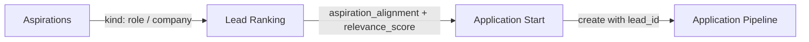

<!-- last-verified: 2026-04-16 -->

# Aspirations to Apply Flow

The **aspirations-to-apply** flow is the flagship product path that connects a user's career aspirations through ranked leads into the application pipeline. It is the primary connected workflow surface in the current developer-preview release.

## Flow Overview

## Backend Contract

### Aspirations CRUD

- **Model:** `Aspiration` with `kind` enum (`role`, `company`), `label`, `reason`, `notes`, `priority`, `extracted_attributes`.
- **Routes:** Standard CRUD at `/api/v1/aspirations` with pagination and kind filtering.
- **Unique constraint:** One aspiration per user per kind per label.

### Suggestion Generation

- **Route:** `POST /api/v1/aspirations/suggest`
- **Behavior:** LLM-based profile analysis generates `AspirationSuggestionDraft[]` with `kind`, `label`, `reason`, `notes`, and `priority`.
- **Error states:**
  - `400` with "no usable" detail → no profile signal
  - `429` → rate limited
  - `503` → AI service unavailable

### Aspiration-Aware Matching

- **Route:** `POST /api/v1/aspirations/match`
- **Input:** Array of lead summaries (`id`, `title`, `description`).
- **Output:** `RankedLeadEntry[]` with `lead_id`, `relevance_score` (0–10), `explanation`, and `aspiration_alignment` text.
- **Behavior:** RAG-backed matching uses the user's aspirations plus lead requirements to produce alignment scores.

### Application Creation

- **Route:** `POST /api/v1/applications`
- **Input:** `lead_id` and `stage` (`registered` or `applied`).
- **Duplicate guard:** `409` when an application already exists for the user + lead pair.

## Frontend Architecture

### Service Layer

- `aspirations.ts` provides typed CRUD, suggest, and adapter abstraction.
- Error categories (`no_signal`, `rate_limited`, `ai_disabled`, `duplicate`, `network`, `unknown`) are normalized at the service layer via `AspirationServiceError`.
- `leads.ts` provides ranking via `rankLeads()` which wraps the match endpoint.
- `applications.ts` provides application CRUD and duplicate lookup.

### Page Composition

| Moment | Route | Page | Key Components |
|--------|-------|------|----------------|
| Aspirations | `/me/aspirations/roles`, `/me/aspirations/companies` | `AspirationRolesPage`, `AspirationCompaniesPage` | `AspirationsCollection`, `SuggestionReviewPanel`, `AspirationCard`, `AspirationFormDialog` |
| Ranked Leads | `/leads` | `LeadsPage` | `LeadCard` (with S8 warning-tone ranking strip), `LeadSearchBar` (ranking controls), `LeadModal` |
| Apply Handoff | `/leads` (inline) | `LeadsPage` | `LeadCard` (with application handoff state), `ApplicationIntentButton` |

### Suggestion Review Flow

1. User clicks "Suggest from profile" → `adapter.suggest(kind)` called.
2. Drafts render as reviewable cards filtered to active tab kind.
3. Accept-one creates through existing CRUD route → 201 success removes draft, 409 removes draft as already-satisfied.
4. Accept-all processes sequentially per D9: stops on first retryable failure, leaves remaining drafts visible.
5. Discard removes from local draft list only.

### Ranking Flow

1. User clicks "Rank with aspirations" on leads page.
2. `rankLeads()` sends filtered leads to `/api/v1/aspirations/match`.
3. Response reorders leads by relevance and decorates cards with a score chip plus the S8 aspiration-alignment strip.
4. Ranking is aspiration-gated: users without aspirations see disabled state with guidance to add aspirations first.
5. Ranking clears on search/filter change to avoid stale results.

### Application Handoff

1. Leads page preloads all user applications once, derives a `lead_id → application` map.
2. Ranked leads without existing applications show "Ready to apply" with ranking-context copy.
3. Leads with existing applications show "Application exists" with stage/outcome label.
4. Duplicate guard remains as runtime backstop.
5. Successful create updates the local applications map immediately.

## Design System Integration

- `StatusChip` renders ranking score, stage, and application state.
- `InlineFeedback` renders error/warning/success states for suggestions and ranking.
- `CardShell` provides the consistent card container; ranked leads use the warning tone to make S8 ranking context visually explicit.
- `SuggestionReviewPanel` handles the full suggest→review→accept lifecycle.

## S8 Implementation Status

S8 ranking redesign is implemented in the frontend. `LeadCard` applies the ranked-card `CardShell` treatment, renders the ranking score, and exposes the aspiration-alignment strip for tests and route capture. The active redesign authority is `Baldin Product Redesign — Command Center` plus [Baldin Redesign Handoff](../reference/baldin-redesign-handoff.md). Historical ranked and unranked harness evidence remains available in the archived `Baldin-App-Screens` file at nodes `446:2` and `447:2`, while node `257:6090` remains the archived design-rationale frame.

## Harness Coverage

The `figma-wave1` browser harness provides offline reference captures:

| Screen | States |
|--------|--------|
| `aspirations-roles`, `aspirations-companies` | `empty`, `seeded`, `loading`, `suggested`, `no-signal`, `rate-limited` |
| `leads` | `unranked`, `ranked`, `disabled`, `error` |
| `apply` | `ready`, `already-applied` |
