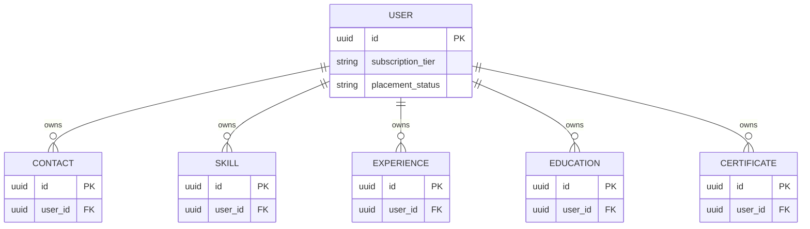
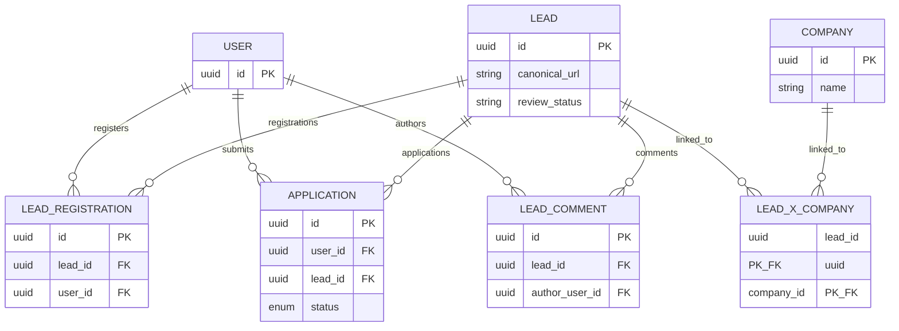
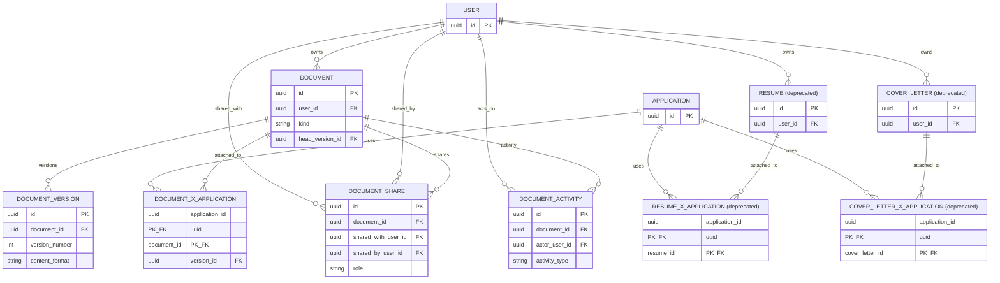
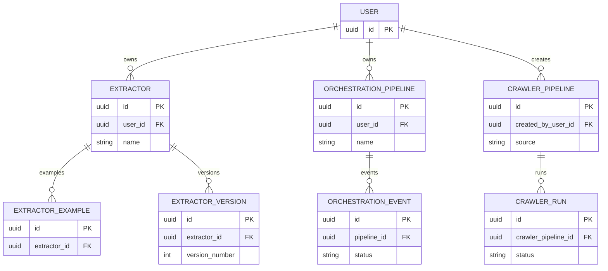
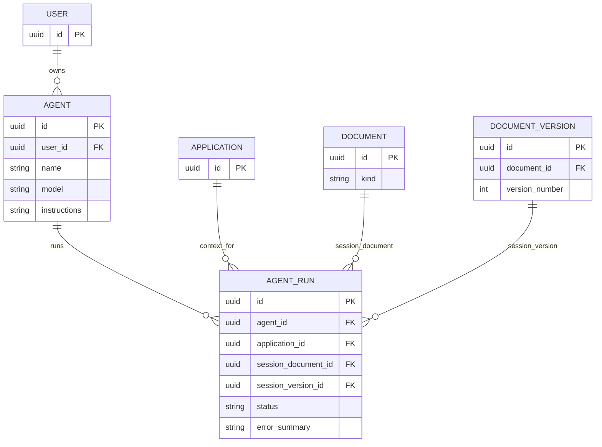
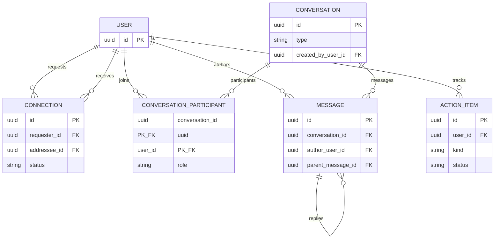

<!-- last-verified: 2026-04-06 -->

# Map The Data Model

Baldin's SQLAlchemy model layer is organized around a single authenticated `User` record and seven operational domains built on top of it: profile data, job-search state, versioned documents, automation, agents, networking, and user-facing work tracking.

Every entity inherits `id`, `created_at`, and `updated_at` from the shared `Base` model in `backend/app/models.py`. `User` also inherits the authentication fields from `SQLAlchemyBaseUserTableUUID`.

## Current Entity Map

The diagrams below are intentionally structural rather than field-complete. The seven domain diagrams that follow correspond directly to the Domain Breakdown section and show only the ownership links that matter when navigating the codebase.

### User Profile Entities

*Figure 1 — USER owns all profile sub-records (contacts, skills, experiences, education, certificates) through a direct foreign key.*

### Job Search Pipeline Entities

*Figure 2 — LEAD is the hub of the job-search pipeline. COMPANY and LEAD are linked through a many-to-many bridge. USER registers interest, comments, and submits applications against a LEAD.*

### Document and Attachment Entities

*Figure 3 — DOCUMENT is the live material model with versioning, sharing, and activity tracking. RESUME and COVER_LETTER exist only as deprecated bridges; new material flows use DOCUMENT filtered by `kind`.*

### Automation and Review Entities

*Figure 4 — Extraction, orchestration, and crawler automation entities. EXTRACTOR and ORCHESTRATION_PIPELINE are user-owned. CRAWLER_PIPELINE is superuser-managed.*

### Agent and Session Entities

*Figure 6 — AGENT is user-owned. Each AGENT_RUN records the execution context (application), the produced session document (a cell_doc DOCUMENT), and the specific version created by the run.*

### Networking and Messaging Entities

*Figure 5 — Networking and messaging entities. CONNECTION is a peer relationship. CONVERSATION holds both direct and group threads. ACTION_ITEM links tasks back to applications, leads, documents, or conversations.*

## Domain Breakdown

### User Profile

| Tables | Purpose |
| --- | --- |
| `users` | Authenticated user identity plus profile, discovery, subscription, and placement lifecycle fields |
| `contacts` | Recruiters, hiring managers, and other external contact records |
| `user_skills` | Skills and subskills with simple experience metadata |
| `user_experiences` | Work history entries |
| `user_education` | Education entries with activities and achievements JSON |
| `user_certificates` | Certifications with issuer and validity dates |

### Job Search Pipeline

| Tables | Purpose |
| --- | --- |
| `companies` | Company directory records |
| `leads` | Canonicalized job leads and review state |
| `leads_x_companies` | Many-to-many bridge between leads and companies |
| `lead_registrations` | Per-user registration or interest in a lead |
| `lead_comments` | Lead discussion thread with single-level replies |
| `applications` | User application state, notes, next steps, and status history |

### Documents and Attachments

| Tables | Purpose |
| --- | --- |
| `documents` | Versioned multi-kind document record with status, pinning, and persisted Yjs state. Supports `kind` values: resume, cover_letter, follow_up, reference_sheet, freeform. |
| `document_versions` | Immutable snapshots of document content |
| `documents_x_applications` | Application attachment bridge for versioned documents |
| `document_shares` | Per-user viewer/editor access grants |
| `document_activities` | Audit-style document events |

The unified `Document` model is the only remaining material model. Frontend document and application-material flows use the Document API exclusively, filtering by `kind` (resume, cover_letter, etc.) where needed, and bootstrap schema sync drops the removed legacy resume and cover-letter tables when present in older local databases.

### Automation and Review

| Tables | Purpose |
| --- | --- |
| `extractors` | User-owned extraction definitions |
| `extractor_examples` | Example input/output pairs used to tune extractors |
| `extractor_versions` | Immutable snapshots of extractor instruction/schema state |
| `orchestration_pipelines` | User-owned orchestration definitions |
| `orchestration_events` | Execution history for orchestration pipelines |
| `crawler_pipelines` | Superuser-managed crawler definitions and policies |
| `crawler_runs` | Individual crawler execution records |

### Agents

| Tables | Purpose |
| --- | --- |
| `agents` | User-owned reusable AI assistant definitions with model, instructions, and generation parameters |
| `agent_runs` | Execution history recording application context, session document, produced version, status, and error summary |

### Networking and Messaging

| Tables | Purpose |
| --- | --- |
| `connections` | Peer connection requests between users |
| `conversations` | Direct and group conversation containers |
| `conversation_participants` | Membership and role bridge for conversations |
| `messages` | Conversation messages, including threaded replies |

### Personal Work Tracking

| Tables | Purpose |
| --- | --- |
| `action_items` | User-facing tasks associated with applications, leads, documents, or conversations |

The activity feed shown in the frontend is not backed by a dedicated event-log table. It is assembled on demand from application status history, document versions, messages, connections, and completed action items.

## Model Conventions That Matter

- `documents.head_version_id` points at the current immutable `document_versions` row instead of mutating content in place.
- `documents.yjs_state` stores the authoritative collaboration snapshot once real-time editing has persisted changes.
- `users.subscription_tier` and `users.placement_status` drive several route-level guards in `backend/app/api/deps.py`.
- `applications.status` uses a Postgres-native enum (`ApplicationStatus`: applied, screening, interview, offer, rejected, withdrawn).
- `leads.review_status` uses a Postgres-native enum (`LeadReviewStatus`: pending_review, approved, rejected).
- `crawler_runs.status` uses a Postgres-native enum (`CrawlerRunStatus`: pending, running, success, failed, cancelled, paused, pending_review).
- `applications.status_history` is JSONB and doubles as an input to the activity feed.
- `action_items` uses nullable foreign keys to support multiple parent types without introducing one table per task context. A CHECK constraint (`ck_action_items_exactly_one_fk`) ensures exactly one FK is non-null.

## Schema Management

The repo uses Alembic migrations bootstrapped under `backend/alembic/`. Local startup runs `alembic upgrade head` by default, while `LEGACY_BOOTSTRAP=1` activates the older `create_all` path. Test fixtures still use `metadata.create_all` for speed.
