<!-- last-verified: 2026-04-06 -->

# Map The Data Model

Baldin's SQLAlchemy model layer is organized around a single authenticated `User` record and six operational domains built on top of it: profile data, job-search state, versioned documents, automation, networking, and user-facing work tracking.

Every entity inherits `id`, `created_at`, and `updated_at` from the shared `Base` model in `backend/app/models.py`. `User` also inherits the authentication fields from `SQLAlchemyBaseUserTableUUID`.

## Current Entity Map

The diagram below is intentionally structural rather than field-complete. It shows the entities and ownership links that matter when navigating the codebase.

```mermaid
erDiagram
	USER {
		uuid id PK
		string subscription_tier
		string placement_status
	}
	CONTACT {
		uuid id PK
		uuid user_id FK
	}
	SKILL {
		uuid id PK
		uuid user_id FK
	}
	EXPERIENCE {
		uuid id PK
		uuid user_id FK
	}
	EDUCATION {
		uuid id PK
		uuid user_id FK
	}
	CERTIFICATE {
		uuid id PK
		uuid user_id FK
	}
	COMPANY {
		uuid id PK
		string name
	}
	LEAD {
		uuid id PK
		string canonical_url
		string review_status
	}
	LEAD_X_COMPANY {
		uuid lead_id PK_FK
		uuid company_id PK_FK
	}
	LEAD_REGISTRATION {
		uuid id PK
		uuid lead_id FK
		uuid user_id FK
	}
	LEAD_COMMENT {
		uuid id PK
		uuid lead_id FK
		uuid author_user_id FK
	}
	APPLICATION {
		uuid id PK
		uuid user_id FK
		uuid lead_id FK
		enum status
	}
	RESUME["RESUME (deprecated)"] {
		uuid id PK
		uuid user_id FK
	}
	RESUME_X_APPLICATION["RESUME_X_APPLICATION (deprecated)"] {
		uuid application_id PK_FK
		uuid resume_id PK_FK
	}
	COVER_LETTER["COVER_LETTER (deprecated)"] {
		uuid id PK
		uuid user_id FK
	}
	COVER_LETTER_X_APPLICATION["COVER_LETTER_X_APPLICATION (deprecated)"] {
		uuid application_id PK_FK
		uuid cover_letter_id PK_FK
	}
	DOCUMENT {
		uuid id PK
		uuid user_id FK
		string kind
		uuid head_version_id FK
	}
	DOCUMENT_VERSION {
		uuid id PK
		uuid document_id FK
		int version_number
		string content_format
	}
	DOCUMENT_X_APPLICATION {
		uuid application_id PK_FK
		uuid document_id PK_FK
		uuid version_id FK
	}
	DOCUMENT_SHARE {
		uuid id PK
		uuid document_id FK
		uuid shared_with_user_id FK
		uuid shared_by_user_id FK
		string role
	}
	DOCUMENT_ACTIVITY {
		uuid id PK
		uuid document_id FK
		uuid actor_user_id FK
		string activity_type
	}
	EXTRACTOR {
		uuid id PK
		uuid user_id FK
		string name
	}
	EXTRACTOR_EXAMPLE {
		uuid id PK
		uuid extractor_id FK
	}
	EXTRACTOR_VERSION {
		uuid id PK
		uuid extractor_id FK
		int version_number
	}
	ORCHESTRATION_PIPELINE {
		uuid id PK
		uuid user_id FK
		string name
	}
	ORCHESTRATION_EVENT {
		uuid id PK
		uuid pipeline_id FK
		string status
	}
	CRAWLER_PIPELINE {
		uuid id PK
		uuid created_by_user_id FK
		string source
	}
	CRAWLER_RUN {
		uuid id PK
		uuid crawler_pipeline_id FK
		string status
	}
	ACTION_ITEM {
		uuid id PK
		uuid user_id FK
		string kind
		string status
	}
	CONNECTION {
		uuid id PK
		uuid requester_id FK
		uuid addressee_id FK
		string status
	}
	CONVERSATION {
		uuid id PK
		string type
		uuid created_by_user_id FK
	}
	CONVERSATION_PARTICIPANT {
		uuid conversation_id PK_FK
		uuid user_id PK_FK
		string role
	}
	MESSAGE {
		uuid id PK
		uuid conversation_id FK
		uuid author_user_id FK
		uuid parent_message_id FK
	}

	USER ||--o{ CONTACT : owns
	USER ||--o{ SKILL : owns
	USER ||--o{ EXPERIENCE : owns
	USER ||--o{ EDUCATION : owns
	USER ||--o{ CERTIFICATE : owns
	USER ||--o{ APPLICATION : submits
	USER ||--o{ RESUME : owns
	USER ||--o{ COVER_LETTER : owns
	USER ||--o{ DOCUMENT : owns
	USER ||--o{ EXTRACTOR : owns
	USER ||--o{ ORCHESTRATION_PIPELINE : owns
	USER ||--o{ CRAWLER_PIPELINE : creates
	USER ||--o{ ACTION_ITEM : tracks
	USER ||--o{ LEAD_REGISTRATION : registers
	USER ||--o{ LEAD_COMMENT : authors
	USER ||--o{ DOCUMENT_SHARE : shared_with
	USER ||--o{ DOCUMENT_SHARE : shared_by
	USER ||--o{ DOCUMENT_ACTIVITY : acts_on
	USER ||--o{ CONNECTION : requests
	USER ||--o{ CONNECTION : receives
	USER ||--o{ CONVERSATION_PARTICIPANT : joins
	USER ||--o{ MESSAGE : authors

	COMPANY ||--o{ LEAD_X_COMPANY : linked_to
	LEAD ||--o{ LEAD_X_COMPANY : linked_to
	LEAD ||--o{ LEAD_REGISTRATION : registrations
	LEAD ||--o{ LEAD_COMMENT : comments
	LEAD ||--o{ APPLICATION : applications

	APPLICATION ||--o{ RESUME_X_APPLICATION : uses
	APPLICATION ||--o{ COVER_LETTER_X_APPLICATION : uses
	APPLICATION ||--o{ DOCUMENT_X_APPLICATION : uses

	RESUME ||--o{ RESUME_X_APPLICATION : attached_to
	COVER_LETTER ||--o{ COVER_LETTER_X_APPLICATION : attached_to

	DOCUMENT ||--o{ DOCUMENT_VERSION : versions
	DOCUMENT ||--o{ DOCUMENT_X_APPLICATION : attached_to
	DOCUMENT ||--o{ DOCUMENT_SHARE : shares
	DOCUMENT ||--o{ DOCUMENT_ACTIVITY : activity

	EXTRACTOR ||--o{ EXTRACTOR_EXAMPLE : examples
	EXTRACTOR ||--o{ EXTRACTOR_VERSION : versions

	ORCHESTRATION_PIPELINE ||--o{ ORCHESTRATION_EVENT : events
	CRAWLER_PIPELINE ||--o{ CRAWLER_RUN : runs

	CONVERSATION ||--o{ CONVERSATION_PARTICIPANT : participants
	CONVERSATION ||--o{ MESSAGE : messages
	MESSAGE ||--o{ MESSAGE : replies
```

## Domain Breakdown

### User Profile

| Tables | Purpose |
| --- | --- |
| `users` | Authenticated user identity plus profile, discovery, subscription, and placement lifecycle fields |
| `contacts` | Recruiters, hiring managers, and other external contact records |
| `user_skills` | Skills and subskills with simple experience metadata |
| `user_experiences` | Work history entries |
| `user_education` | Education entries with activities and achievements JSON |
| `user_certificates` | Certifications with issuer and validity dates |

### Job Search Pipeline

| Tables | Purpose |
| --- | --- |
| `companies` | Company directory records |
| `leads` | Canonicalized job leads and review state |
| `leads_x_companies` | Many-to-many bridge between leads and companies |
| `lead_registrations` | Per-user registration or interest in a lead |
| `lead_comments` | Lead discussion thread with single-level replies |
| `applications` | User application state, notes, next steps, and status history |

### Documents and Attachments

| Tables | Purpose |
| --- | --- |
| `documents` | Versioned multi-kind document record with status, pinning, and persisted Yjs state. Supports `kind` values: resume, cover_letter, follow_up, reference_sheet, freeform. |
| `document_versions` | Immutable snapshots of document content |
| `documents_x_applications` | Application attachment bridge for versioned documents |
| `document_shares` | Per-user viewer/editor access grants |
| `document_activities` | Audit-style document events |
| `resumes`, `cover_letters` | **Deprecated.** Legacy flat document tables. Routes return `Deprecation: true` and `Sunset: 2026-06-01` headers. Frontend has migrated to the unified Document API. |
| `resumes_x_applications`, `cover_letters_x_applications` | **Deprecated.** Legacy attachment bridges. Use `documents_x_applications` instead. |

The unified `Document` model is the primary direction. All frontend code now uses the Document API exclusively, filtering by `kind` (resume, cover_letter, etc.) where needed. Legacy resume and cover-letter routes remain functional but are marked deprecated in OpenAPI and will be removed after the sunset date.

### Automation and Review

| Tables | Purpose |
| --- | --- |
| `extractors` | User-owned extraction definitions |
| `extractor_examples` | Example input/output pairs used to tune extractors |
| `extractor_versions` | Immutable snapshots of extractor instruction/schema state |
| `orchestration_pipelines` | User-owned orchestration definitions |
| `orchestration_events` | Execution history for orchestration pipelines |
| `crawler_pipelines` | Superuser-managed crawler definitions and policies |
| `crawler_runs` | Individual crawler execution records |

### Networking and Messaging

| Tables | Purpose |
| --- | --- |
| `connections` | Peer connection requests between users |
| `conversations` | Direct and group conversation containers |
| `conversation_participants` | Membership and role bridge for conversations |
| `messages` | Conversation messages, including threaded replies |

### Personal Work Tracking

| Tables | Purpose |
| --- | --- |
| `action_items` | User-facing tasks associated with applications, leads, documents, or conversations |

The activity feed shown in the frontend is not backed by a dedicated event-log table. It is assembled on demand from application status history, document versions, messages, connections, and completed action items.

## Model Conventions That Matter

- `documents.head_version_id` points at the current immutable `document_versions` row instead of mutating content in place.
- `documents.yjs_state` stores the authoritative collaboration snapshot once real-time editing has persisted changes.
- `users.subscription_tier` and `users.placement_status` drive several route-level guards in `backend/app/api/deps.py`.
- `applications.status` uses a Postgres-native enum (`ApplicationStatus`: applied, screening, interview, offer, rejected, withdrawn).
- `leads.review_status` uses a Postgres-native enum (`LeadReviewStatus`: pending_review, approved, rejected).
- `crawler_runs.status` uses a Postgres-native enum (`CrawlerRunStatus`: pending, running, success, failed, cancelled, paused, pending_review).
- `applications.status_history` is JSONB and doubles as an input to the activity feed.
- `action_items` uses nullable foreign keys to support multiple parent types without introducing one table per task context. A CHECK constraint (`ck_action_items_exactly_one_fk`) ensures exactly one FK is non-null.

## Schema Management

The repo does not currently use Alembic migrations. Local startup still relies on SQLAlchemy `create_all`, and `backend/app/core/db.py` also repairs additive schema drift by adding missing columns to existing local tables.

That bootstrap behavior is convenient for a persisted local Postgres volume, but it is also explicitly called out as a release blocker. See [Track Release Readiness](../engineering/release-roadmap.md) for the current migration and runtime-hardening work.
