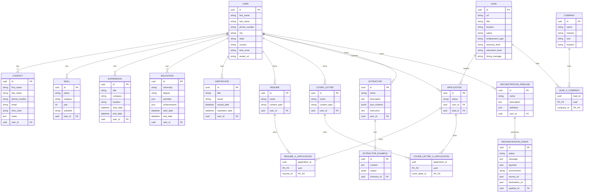

# Data Model

The API data model is centered on a `User` record and three related domains:

- **Candidate profile data:** contacts, skills, experience, education, resumes, and cover letters
- **Job search data:** companies, leads, applications, and their join tables
- **Automation data:** extractors, extractor examples, orchestration pipelines, and orchestration events

All entities inherit `id`, `created_at`, and `updated_at` from the shared `Base` model in `app/models.py`. The `User` table also inherits authentication fields from `SQLAlchemyBaseUserTableUUID`.

## Entity Relationship Diagram

## Domain Groupings

### Candidate Profile

User-owned records that represent the candidate's professional identity:

- **Contact** — external contacts (recruiters, hiring managers)
- **Skill** — named skills with category, years of experience, and optional subskills
- **Experience** — work history entries with title, company, location, and date range
- **Education** — university records with degree, activities, and achievements
- **Certificate** — professional certifications with issuer and dates
- **Resume / Cover Letter** — uploaded documents keyed by name and content type

### Job Search

Entities that track the job search pipeline:

- **Company** — company records with industry, size, and location
- **Lead** — job opportunities with URL, title, salary, employment type, and seniority
- **Application** — user applications linking a user to a lead with a status
- **Lead×Company** — many-to-many association between leads and companies
- **Resume×Application / CoverLetter×Application** — documents attached to applications

### Automation

Configurable extraction and orchestration:

- **Extractor** — named extraction configs with a JSON schema and instruction
- **ExtractorExample** — sample input/output pairs for few-shot extraction
- **OrchestrationPipeline** — named pipeline definitions
- **OrchestrationEvent** — execution events with status, payload, and source/destination URIs

## Schema Management

The repo does not currently use Alembic migrations. Schema changes rely on SQLAlchemy `create_all` during startup bootstrap. See [Deployment Status](../engineering/deployment-status.md) for the implications of this approach.
