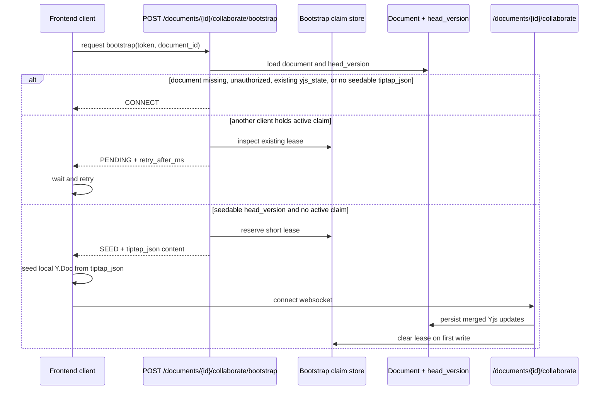

<!-- last-verified: 2026-04-06 -->

# Understand Document Collaboration

Baldin's rich-text document editor is built around a versioned backend `Document` model, TipTap on the frontend, and Yjs-backed real-time collaboration over WebSockets. The key design constraint is avoiding blank-room races when a document has saved TipTap JSON but no persisted Yjs state yet.

## Moving Parts

| Layer | File or module | Responsibility |
| --- | --- | --- |
| Backend model | `backend/app/models.py` | `Document`, `DocumentVersion`, `DocumentShare`, `DocumentActivity`, `DocumentXApplication` |
| Backend protocol | `backend/app/core/document_collaboration.py` | Bootstrap claim state machine and persisted Yjs store |
| Backend routes | `backend/app/api/routes/documents.py`, `backend/app/api/routes/collaboration.py` | CRUD, versioning, sharing, upload/download, bootstrap endpoint, WebSocket endpoint |
| Frontend hook | `frontend/src/component/use-collaborative-editor.ts` | Bootstrap polling, Yjs doc creation, websocket provider lifecycle, presence state |
| Frontend bootstrap helper | `frontend/src/component/collaboration-bootstrap.ts` | Retry timing and TipTap JSON -> Yjs seeding |
| Editor UI | `frontend/src/component/rich-text-editor.tsx` | TipTap editor shell bound to Yjs |

## Collaboration Bootstrap Protocol

The protocol exists because the source of truth changes over time:

- Before a document has persisted Yjs state, the saved head version may still only exist as TipTap JSON.
- After the first collaborative write, `documents.yjs_state` becomes authoritative.

The backend solves this with a short-lived bootstrap claim.

### Bootstrap states

| State | Meaning | Frontend behavior |
| --- | --- | --- |
| `connect` | Connect immediately. Either Yjs state already exists, the document is not seedable, or the caller is not allowed to seed. | Open the websocket without local seeding. |
| `seed` | The caller owns the bootstrap lease and should seed a local Y.Doc from the saved head-version TipTap JSON before connecting. | Seed locally, then open the websocket. |
| `pending` | Another client currently holds the seed lease. | Wait `retry_after_ms`, then request bootstrap again. |

The frontend helper clamps retry delays between 100 ms and 1000 ms and falls back to exponential backoff if the server omits a value.

## Access Model

- Owners always have editor access.
- Shared collaborators need a `document_shares.role` of `editor` to use the collaboration endpoints.
- View-only shares may read document metadata but cannot join the collaboration websocket.

## Versioning Model

| Table | Role |
| --- | --- |
| `documents` | Stable document identity, status, pinning, current head version, current Yjs state |
| `document_versions` | Immutable content snapshots; every save produces a new row |
| `documents_x_applications` | Associates documents with applications, optionally pinning a specific version |
| `document_activities` | Audit-style document events |
| `document_shares` | Viewer/editor grants to other users |

This is the document architecture that should keep evolving with the codebase. The older `resumes` and `cover_letters` tables still exist, but they are no longer the only document surface.

## Storage and Upload Safety

Original uploaded bytes are written under `PUBLIC_ASSETS_DIR/uploads` through `backend/app/core/document_storage.py`.

- Relative paths are generated by helper functions rather than assembled ad hoc.
- Path resolution is guarded so files cannot escape the uploads root.
- Delete helpers remove source files and clean up empty directories when versions disappear.

That storage layer is the durable file path contract for document uploads and extractor run source files.

## Frontend Responsibilities

- `useCollaborativeEditor()` owns bootstrap retry, provider lifecycle, connection state, and connected-user awareness.
- The hook does not connect until bootstrap has resolved to `connect` or `seed`.
- `buildCollaborationSocketConfig()` converts the configured API base URL to a websocket base URL.
- The editor keeps user presence metadata (`name`, `color`) in Yjs awareness state for collaborator badges and cursors.

## When To Touch Which Layer

- Change `document_collaboration.py` when the bootstrap or persistence protocol changes.
- Change `documents.py` when document metadata, versioning, sharing, or upload behavior changes.
- Change `use-collaborative-editor.ts` or `collaboration-bootstrap.ts` when the client connection lifecycle changes.
- Update this doc whenever a new bootstrap state, persistence rule, or share role is introduced.
