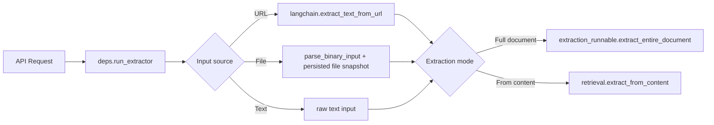

<!-- last-verified: 2026-04-06 -->

# Trace Extraction Flows

Baldin has two distinct code paths for getting data into the system: the **user-triggered extraction runtime** and the **ETL crawlers**. These are architecturally separate.

## User-Triggered Extraction

This is the runtime path exercised when a user triggers extraction through the API (e.g., extracting structured data from a URL or document).

The key modules in this path:

| Module | Location | Purpose |
|--------|----------|---------|
| `run_extractor` | `app/api/deps.py` | Entry point — resolves input source, records an orchestration event, and dispatches to the appropriate extractor |
| `extract_text_from_url` | `app/core/langchain.py` | Fetches and extracts text content from a URL after outbound URL safety checks |
| `extract_entire_document` | `app/extractor/extraction_runnable.py` | Runs structured extraction over the full document |
| `extract_from_content` | `app/extractor/retrieval.py` | Runs extraction against pre-loaded content |
| `extractor_retry.py` | `app/core/extractor_retry.py` | Persists enough source metadata to rehydrate and retry previous extractor runs |

User-triggered extraction now preserves enough source context to support retries:

- URL runs persist the original URL.
- File runs persist a guarded relative file path under the uploads root.
- Retry logic reconstructs a new `ExtractorRun` payload from the recorded orchestration event.

## ETL Crawlers

The ETL layer lives in `backend/etl/` and contains crawler scripts for platforms like LinkedIn and Glassdoor. These are **not** part of the user-triggered extraction runtime.

| Module | Location | Purpose |
|--------|----------|---------|
| `base.py` | `backend/etl/base.py` | Base crawler with Playwright stealth support |
| `linkedin.py` | `backend/etl/linkedin.py` | LinkedIn-specific crawling logic |
| `glassdoor.py` | `backend/etl/glassdoor.py` | Glassdoor-specific crawling logic |

The ETL crawlers use Playwright with stealth mode. The `_apply_stealth` wrapper in `etl/base.py` handles compatibility between different `playwright-stealth` package versions (legacy `stealth_async()` vs. modern `Stealth().apply_stealth_async()`).

## Why the Separation Matters

- **Extraction** is a user-facing feature that runs synchronously during API requests and uses LangChain/OpenAI for structured output.
- **ETL** is a background data-ingestion concern that runs crawlers with browser automation and is scheduled independently.
- Changes to extraction logic should not affect ETL crawlers, and vice versa.

If you are changing document uploads, retry semantics, or URL fetching rules, review this page together with [Understand Document Collaboration](./document-collaboration.md) and [Map The Data Model](./data-model.md).
