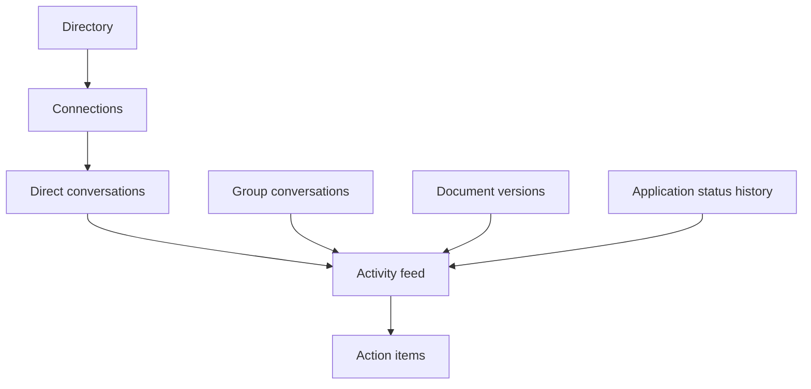

<!-- last-verified: 2026-04-06 -->

# Follow Network Flows

Baldin is not only a job-search tracker. The codebase also includes a lightweight user-network layer for discovery, connection requests, direct and group conversations, and a personal activity/task surface that ties those features back to the rest of the product.

## Feature Map

## Backend Surfaces

| Route family | Prefix | Primary purpose |
| --- | --- | --- |
| `directory` | `/directory` | Discoverable user directory and profile previews |
| `connections` | `/connections` | Connection request lifecycle |
| `messaging` | `/conversations` | Direct and group conversations, messages, unread counts |
| `activity-feed` | `/activity-feed` | Aggregated activity stream and dashboard summary |
| `action-items` | `/action-items` | User-facing tasks linked to applications, leads, documents, or conversations |

## Data Model

| Table | Role |
| --- | --- |
| `connections` | Requester/addressee relationship with `pending`, `accepted`, `declined`, or `blocked` status |
| `conversations` | Direct or group conversation container |
| `conversation_participants` | Membership, last-read timestamp, and participant role |
| `messages` | Message body, author, reply threading, edit timestamp |
| `action_items` | Per-user tasks with optional links to `applications`, `leads`, `documents`, or `conversations` |

The activity feed is assembled on demand rather than stored in a dedicated table. It pulls from application status history, messages, document versions, connection updates, and completed action items.

## Access and Tier Rules

- Sending a connection request requires at least the `starter` subscription tier.
- You cannot message a user directly until the connection is accepted in either direction.
- Group conversations require `pro`.
- Only participants can read or post within a conversation.
- Action items can only reference entities the current user owns or legitimately participates in.

Those rules matter because the UI can render the route, but the backend remains the enforcement layer.

## Conversation Lifecycle

1. A user finds another discoverable user through the directory.
2. They send a connection request.
3. The addressee accepts or declines.
4. Once accepted, the requester can open or reuse a direct conversation.
5. Group conversations can be created separately for eligible tiers.

`messages.py` also prevents duplicate direct-message conversations by reusing an existing two-person direct thread when one already exists.

## Frontend Surfaces

| Route | Page |
| --- | --- |
| `/network/directory` | `frontend/src/page/directory.tsx` |
| `/network/directory/:userId` | `frontend/src/page/user-profile.tsx` |
| `/network/connections` | `frontend/src/page/connections.tsx` |
| `/network/messages` | `frontend/src/page/messages/conversations-page.tsx` |
| `/network/messages/:conversationId` | `frontend/src/page/messages/conversation-detail-page.tsx` |

Supporting UI lives in the component layer:

- `new-conversation-dialog.tsx`
- `create-action-item-dialog.tsx`
- `tier-gate.tsx`

API client access lives in:

- `frontend/src/service/connections.tsx`
- `frontend/src/service/messages.tsx`
- `frontend/src/service/activity-feed.tsx`
- `frontend/src/service/action-items.tsx`
- `frontend/src/service/directory.tsx`

## Dashboard Coupling

The dashboard summary endpoint reuses networking and activity data to drive homepage counts. That means changes to connection semantics, conversation read tracking, or activity aggregation can affect the homepage even if the visible networking screens still seem correct.

## Maintenance Notes

- Update this doc when a new connection status, conversation type, or activity source is introduced.
- Keep the tier-gate rules in sync with the backend dependencies documented in [Browse API Routes](./api-surface.md).
- If the activity feed ever moves from derived queries to persisted events, this doc and [Map The Data Model](./data-model.md) should be updated together.
