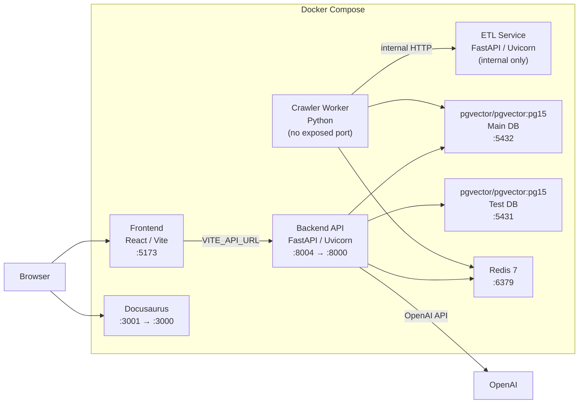

<!-- last-verified: 2026-04-13 -->

# See System Boundaries

Baldin is a full-stack local-first workspace for job-search automation. The system is developed primarily through `docker-compose up --build --watch`, with the frontend, backend, internal ETL service, main Postgres database, separate test database, Redis, a background crawler worker, and a Docusaurus docs site forming the local topology.

## Service Topology

## Services

| Service | Image / Build | Port | Purpose |
|---------|---------------|------|---------|
| `db` | `pgvector/pgvector:pg15` | 5432 | Main application database (with pgvector) |
| `test_db` | `pgvector/pgvector:pg15` | 5431 | Isolated test database |
| `redis` | `redis:7-alpine` | 6379 | Background job queue and crawler dispatch |
| `etl-service` | `backend/Dockerfile` (target: dev) | internal only | Internal crawler execution boundary |
| `web` | `backend/Dockerfile` (target: dev) | 8004→8000 | FastAPI backend with the Uvicorn dev server and Compose Watch sync |
| `crawler-worker` | `backend/Dockerfile` | — | Background crawler worker consuming Redis jobs |
| `frontend` | `frontend/Dockerfile` | 5173 | React/Vite dev server |
| `docs` | `docs/Dockerfile` | 3001→3000 | Docusaurus dev server |

## Technology Stack

### Backend
- **Framework:** FastAPI with Starlette
- **ORM:** SQLAlchemy 2.x with PostgreSQL 15 (pgvector extension)
- **Auth:** fastapi-users with JWT tokens
- **Admin:** Starlette Admin mounted at `/admin`
- **Extraction:** LangChain-powered text extraction and structured data extraction
- **Python:** 3.11, managed with pipenv

### Frontend
- **Framework:** React 19 with TypeScript
- **Build:** Vite 7
- **UI:** Material UI (MUI) 7
- **Routing:** React Router 7
- **Charts:** Recharts
- **Animation:** Motion (Framer Motion successor)
- **Rich text:** TipTap 3 with Yjs collaboration

### Contracts
- **API spec:** OpenAPI 3.1 — generated from FastAPI, stored as `openapi.json`
- **TypeScript types:** Generated from OpenAPI via `openapi-typescript`, stored as `frontend/src/schema.d.ts`

## Key Boundaries

- The **backend** owns all data access, authentication, extraction, and orchestration logic.
- The **frontend** is a pure client that talks to the backend through `VITE_API_URL`. It never accesses the database directly.
- The **contract** (`openapi.json` → `schema.d.ts`) is the formal interface between backend and frontend. Changes flow backend → contract → frontend, never the reverse.
- Normal **frontend/backend transport** is JSON over HTTP. Agent chat is the main exception: `POST /agents/chat/{session_id}/messages` accepts JSON input but can stream assistant replies back as `text/event-stream` SSE, with JSON fallback when the client explicitly requests `application/json`.
- **Document collaboration** remains a separate realtime transport boundary on `/documents/{id}/collaborate`, where the frontend uses Yjs over WebSocket after the bootstrap claim flow completes.
- The **ETL layer** is split between the reusable crawler code in `backend/etl/` and the internal `etl-service` runtime that executes crawler requests over an internal HTTP boundary. It is not part of the user-triggered extraction runtime path.

## Main Product Domains

- Profile and job-search records
- Versioned documents, collaboration, and agent-authored workspaces
- Extraction, orchestration, crawler automation, and agent execution
- Networking, messaging, conversational agent chat, activity, and action items

Those domains are documented in more detail in [Map The Data Model](./data-model.md), [Understand Document Collaboration](./document-collaboration.md), and [Follow Network Flows](./networking-and-messaging.md).
