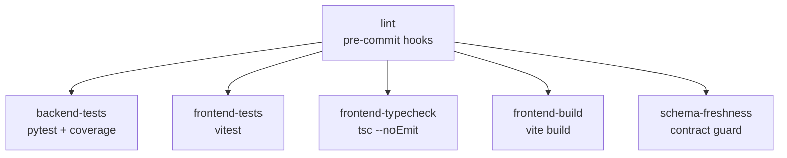

# CI Pipeline

Baldin uses two GitHub Actions workflows: **CI** (quality gates) and **Build** (artifact generation).

## CI Workflow (`.github/workflows/ci.yml`)

Triggers on push to `main` and pull requests. Ignores changes to `*.md`, `docs/**`, and config files.

### Jobs



| Job | What it does | Key details |
|-----|-------------|-------------|
| **lint** | Runs pre-commit hooks | `isort`, `black`, `flake8` — Python 3.11.2 |
| **backend-tests** | `pytest` with coverage gate | PostgreSQL 15 service, 40% minimum coverage on `app/` and `etl/` |
| **frontend-tests** | `npm run test` | Vitest suite |
| **frontend-typecheck** | `npx tsc --noEmit` | Strict TypeScript validation |
| **frontend-build** | `npm run build` | Production build with `VITE_API_URL=https://api.preview.invalid` |
| **schema-freshness** | Contract regeneration guard | Regenerates `openapi.json` and `schema.d.ts`, fails if output differs from committed |

All jobs depend on **lint** passing first.

### Concurrency

CI uses concurrency groups to cancel in-progress runs when a new push arrives on the same branch or PR:

```yaml
concurrency:
  group: ${{ github.workflow }}-${{ github.ref_type }}-${{ github.event.pull_request.number || github.sha }}
  cancel-in-progress: true
```

## Build Workflow (`.github/workflows/build.yml`)

Triggers on push to `main`, pull requests, and manual dispatch. Produces two artifacts:

| Artifact | Source | Output |
|----------|--------|--------|
| **Backend image** | `docker build -f backend/Dockerfile` | Image metadata JSON |
| **Frontend bundle** | `npm run build` in `frontend/` | `frontend/dist/` uploaded as artifact |

The frontend build uses `VITE_API_URL=https://api.preview.invalid` as a placeholder origin.

## Branch Protection

`main` is configured with branch protection rules:

- Requires at least 1 approving review.
- All required status checks must pass.
- No force pushes or deletions allowed.

Check names must match the CI job names exactly. See `.github/branch-protection.md` for the documented rules.
