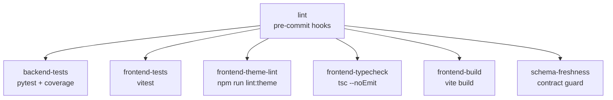

<!-- last-verified: 2026-04-12 -->

# See Merge Gates

Baldin uses two GitHub Actions workflows: **CI** for integration-quality gates and **Build Candidate Artifacts** for release inputs.

## CI Workflow (`.github/workflows/ci.yml`)

Triggers on push to `main` and pull requests. Ignores changes to `*.md`, `docs/**`, and config files.

### Jobs



| Job | What it does | Key details |
|-----|-------------|-------------|
| **lint** | Runs pre-commit hooks | `ruff check --fix`, `ruff format` — Python 3.11.2 |
| **backend-tests** | `pytest` with coverage gate | PostgreSQL 15 service, 60% minimum coverage on `app/` and `etl/` |
| **frontend-tests** | `npm run test` | Vitest suite |
| **frontend-theme-lint** | `npm run lint:theme` | Lightweight design-system drift guard for token/theme and legacy-folder rules |
| **frontend-typecheck** | `npx tsc --noEmit` | Strict TypeScript validation |
| **frontend-build** | `npm run build` | Production build with `VITE_API_URL=https://api.preview.invalid` |
| **schema-freshness** | Contract regeneration guard | Regenerates `openapi.json` and `schema.d.ts`, fails if output differs from committed |

All quality-gate jobs depend on **lint** passing first.

### Concurrency

CI uses concurrency groups to cancel in-progress runs when a new push arrives on the same branch or PR:

```yaml
concurrency:
  group: ${{ github.workflow }}-${{ github.ref_type }}-${{ github.event.pull_request.number || github.sha }}
  cancel-in-progress: true
```

## Build Workflow (`.github/workflows/build.yml`)

The build workflow is named **Build Candidate Artifacts**. It triggers on push to `main`, pull requests, and manual dispatch, and produces two candidate artifacts:

| Artifact | Source | Output |
|----------|--------|--------|
| **Backend image metadata** | `docker build -f backend/Dockerfile` | `build-artifacts/backend` |
| **Frontend static bundle** | `npm run build` in `frontend/` | `frontend/dist/` uploaded as artifact |

The frontend build uses `VITE_API_URL=https://api.preview.invalid` as a placeholder origin.

## Branch Protection

`main` should use the branch-protection baseline documented in `.github/branch-protection.md`, but those rules still have to be configured in GitHub because repository code cannot enforce them by itself.

- Requires at least 1 approving review.
- All seven CI jobs must pass, and branches should be up to date before merge.
- No force pushes or deletions allowed.

Check names must match the CI job names exactly. See `.github/branch-protection.md` for the documented rules.

## Why This Split Exists

- **CI** defines the repository-side checks that GitHub branch protection should enforce at merge time.
- **Build Candidate Artifacts** proves the branch can still produce the backend image and frontend bundle that later release automation would promote.

For release-path context, see [Track Release Readiness](./release-roadmap.md).

## Related Docs

- [Run The Right Checks](./testing.md)
- [Regenerate API Contracts](./contract-management.md)
- [Track Release Readiness](./release-roadmap.md)
