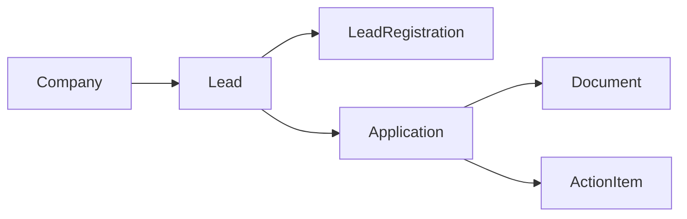

<!-- last-verified: 2026-04-06 -->

# Job Search Pipeline

Baldin's core job-search pipeline connects companies, leads, and applications into a single workflow that moves from discovery through to offer tracking.

## Companies

Companies represent employers. Each company record carries a name, website, and optional metadata. Companies link to leads through a many-to-many bridge (`LeadXCompany`), so a single lead can reference multiple companies and vice versa.

**Frontend:** `/leads/companies` — Company directory with search and detail views (`frontend/src/page/companies.tsx`)

**API:** `/companies` — Full CRUD plus association endpoints

## Leads

Leads represent job postings or opportunities. Each lead captures:

- Canonical URL, title, description, and location
- Salary range (min/max)
- Status and review classification
- Source metadata

Leads support per-user registration (`LeadRegistration`) to track which users are interested, and threaded comments (`LeadComment`) with single-level replies for discussion.

**Frontend:** `/leads` — Leads list with filters and detail views (`frontend/src/page/leads.tsx`)

**API:** `/leads` — CRUD, bulk operations, and lead comment endpoints

## Applications

Applications track a user's progress toward a specific opportunity. Each application maintains:

- A status field with full status history stored as JSONB
- A `next_step` field for tracking what comes next
- Links to attached documents through the `DocumentXApplication` bridge

The application board at `/applications/board` provides a Kanban-style view grouped by status.

**Frontend:**
- `/applications` — Application queue (`frontend/src/page/applications/`)
- `/applications/board` — Kanban board view

**API:** `/applications` — CRUD, status transitions, and document attachment endpoints

## Pipeline Flow

A typical path: discover a **Company** → find a **Lead** → register interest → create an **Application** → attach **Documents** (resume, cover letter) → track status through to completion.

## Related Docs

- [Map The Data Model](../architecture/data-model.md) — Full entity diagram with Lead, Application, and Company relationships
- [Browse API Routes](../architecture/api-surface.md) — Route groups for leads, companies, and applications
- [Document Workspace](./document-workspace.md) — Attaching documents to applications
- [Command Center](./command-center.md) — Action items linked to applications and leads
