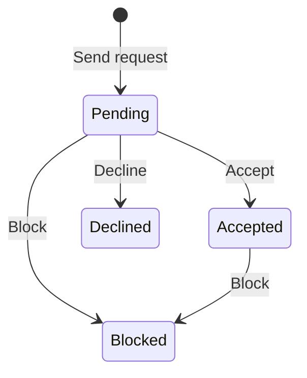

<!-- last-verified: 2026-04-09 -->

# Networking & Messaging

Baldin's network layer connects users through discoverable profiles, peer connections, and real-time messaging — all feeding into the activity feed and action items on the Dashboard.

## Directory

The directory at `/network/directory` surfaces discoverable user profiles. Visibility is governed by subscription tier:

| Tier | Directory Access |
|------|-----------------|
| Free | Limited visibility |
| Starter | Standard discovery |
| Pro | Full directory access |

Users can browse profiles and initiate connection requests from the directory.

**Frontend:** `/network/directory` — Directory (`frontend/src/page/directory.tsx`)

**API:** `/directory` — Search and profile discovery endpoints

## Connections

Connections are peer relationships between users. Each connection passes through a lifecycle:

Connected users can message each other and see each other's activity in the feed.

**Frontend:** `/network/connections` — Connection management (`frontend/src/page/connections.tsx`)

**API:** `/connections` — Request, accept, decline, block, and list endpoints

## Messaging

Messaging supports both direct and group conversations:

- **Conversations** — Containers with participant lists and roles
- **Messages** — Content with threading support and edit history
- **Participants** — Membership and role tracking per conversation

Messages support single-level threading for focused discussions within a conversation.

**Frontend:**
- `/network/messages` — Conversation list (`frontend/src/page/messages/`)
- `/network/messages/:conversationId` — Conversation detail with message thread

**API:** `/conversations` — Conversation CRUD, participant management, and message endpoints

## Activity Feed

The activity feed aggregates events from connections, conversations, applications, and documents into a single chronological stream. A summary endpoint groups counts by event type for quick-glance metrics on the Dashboard.

**API:** `/activity-feed` — Feed list and summary endpoints

## User Story Book

### Current UI State

- The Network area is organized around `/network/directory`, `/network/connections`, and `/network/messages`, with dedicated conversation list and detail routes plus unread-count badges.
- Directory cards surface connection eligibility before the user acts: eligible profiles show **Connect**, while starter-limited accounts see a disabled **Starter Required** chip.
- Accepted connections feed the new-message flow, so direct and group conversations build on the same network relationship model shown elsewhere in the UI.

### Coverage Note

No canonical checked-in backlog file currently maps to networking. The current story context for this page comes from the draft UX plan.

### Story Threads

**Draft UX context — connection tier gating**
Status: Implemented
The directory now shows the access gate before a user tries to connect. Starter-limited accounts see a disabled **Starter Required** chip instead of discovering the restriction after clicking.

**Draft UX context — network navigation clarity**
Status: Implemented
The current drawer and secondary navigation already use plain `Network`, `Directory`, `Connections`, and `Messages` labels, so this part of the draft is now delivered rather than open.

**Draft UX context — notifications beyond message badges**
Status: Open
Unread message counts exist in the conversation list and dashboard summary, but the app still lacks a broader notification center spanning conversations, connections, and other network events.

## Related Docs

- [Networking and Messaging Architecture](../architecture/networking-and-messaging.md) — Data model, access rules, and conversation lifecycle
- [Dashboard](./dashboard.md) — Activity feed and action items integration
- [Map The Data Model](../architecture/data-model.md) — Connection, Conversation, Message, and ActionItem entities
