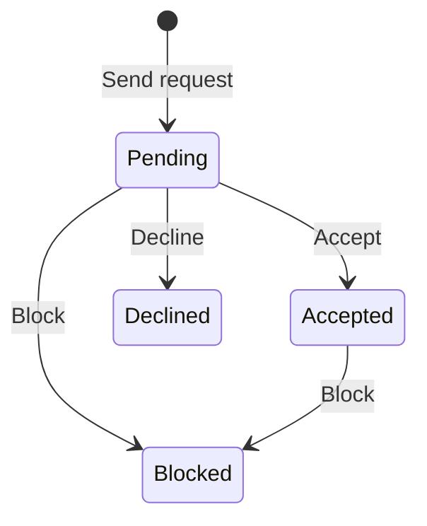

<!-- last-verified: 2026-04-10 -->

# Networking & Messaging

Baldin's network layer connects users through discoverable profiles, peer connections, and real-time messaging — all feeding into the activity feed and action items on the Dashboard.

## Discover

The Discover surface at `/network/discover` shows discoverable user profiles. Visibility is governed by subscription tier:

| Tier | Discover Access |
|------|-----------------|
| Free | Limited visibility |
| Starter | Standard discovery |
| Pro | Full directory access |

Users can browse profiles and initiate connection requests from Discover.

**Frontend:** `/network/discover` — Discover (`frontend/src/page/directory.tsx`)

**API:** `/directory` — Search and profile discovery endpoints

## Connections

Connections are peer relationships between users. Each connection passes through a lifecycle:

Connected users can message each other and see each other's activity in the feed.

**Frontend:** `/network/connections` — Connection management (`frontend/src/page/connections.tsx`)

**API:** `/connections` — Request, accept, decline, block, and list endpoints

## Messaging

Messaging supports both direct and group conversations:

- **Conversations** — Containers with participant lists and roles
- **Messages** — Content with threading support and edit history
- **Participants** — Membership and role tracking per conversation

Messages support single-level threading for focused discussions within a conversation.

**Frontend:**
- `/network/messages` — Conversation list (`frontend/src/page/messages/`)
- `/network/messages/:conversationId` — Conversation detail with message thread

**API:** `/conversations` — Conversation CRUD, participant management, and message endpoints

## Activity Feed

The activity feed aggregates events from connections, conversations, applications, and documents into a single chronological stream. A summary endpoint groups counts by event type for quick-glance metrics on the Dashboard.

**API:** `/activity-feed` — Feed list and summary endpoints

## Agents

The Agents surface at `/network/agents` lets users build reusable AI assistants that operate against tracked applications and produce cell-doc session documents.

Each agent is defined by a name, model, instructions, and optional temperature/top-p overrides. Running an agent against an application creates (or appends to) a cell-doc session, producing a new document version tied to the run.

**Frontend:**
- `/network/agents` — Agent list (`frontend/src/page/agents.tsx`)
- `/network/agents/:id` — Agent detail with run history and rerun controls (`frontend/src/page/agent-detail.tsx`)
- Rerun button on cell-doc editor footer (`frontend/src/component/rerun-agent-button.tsx`)

**API:** `/agents` — Agent CRUD, per-agent run history, cross-session run lookup, and execution

See [Map The Data Model](../architecture/data-model.md) for Agent and AgentRun entities.

## User Story Book

### Current UI State

- The Network area is organized around `/network/discover`, `/network/connections`, `/network/messages`, and `/network/agents`.
- Connections and conversations already use dedicated list and detail surfaces rather than a single combined hub.
- Unread message counts surface through badges and dashboard summaries instead of a dedicated notifications page.
- Agents support full CRUD, run history with pagination, and in-session rerun from both the agent detail page and the cell-doc editor.

### Planned Improvements

- The app still relies on unread badges and dashboard activity summaries rather than a broader notification center for network events.

## Related Docs

- [Networking and Messaging Architecture](../architecture/networking-and-messaging.md) — Data model, access rules, and conversation lifecycle
- [Dashboard](./dashboard.md) — Activity feed and action items integration
- [Map The Data Model](../architecture/data-model.md) — Connection, Conversation, Message, and ActionItem entities
