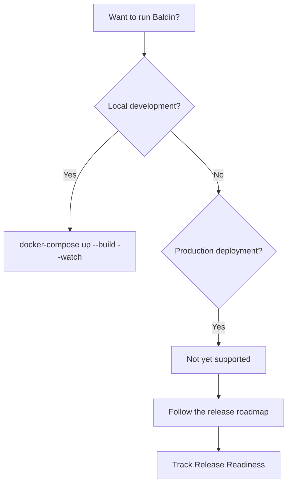

<!-- last-verified: 2026-04-17 -->

# Planned Deployment

Baldin is in developer preview. The only supported deployment path today is the local Docker Compose stack. Production deployment is being planned through a phased roadmap documented in [Track Release Readiness](../engineering/release-roadmap.md).

This page explains what works today, what is planned, and what constraints shape the deployment path.

## What Works Today

### Local Docker Compose

The local stack is the supported development surface. Compose Watch is the supported live-edit loop, and it runs nine services:

| Service | Image | Port | Purpose |
|---------|-------|------|---------|
| **db** | pgvector/pgvector:pg15 | 5432 | Main application database (with pgvector) |
| **test_db** | pgvector/pgvector:pg15 | 5431 | Isolated test database |
| **redis** | redis:7-alpine | 6379 | Background job queue and crawler dispatch |
| **etl-service** | `backend/Dockerfile` (target: dev) | 8010 (internal) | Internal crawler execution boundary |
| **web** | `backend/Dockerfile` (target: dev) | 8004 → 8000 | FastAPI/Uvicorn dev server with Compose Watch sync |
| **crawler-worker** | `backend/Dockerfile` | — | Background crawler worker consuming Redis jobs |
| **frontend** | `frontend/Dockerfile` | 5173 | React/Vite dev server |
| **operator-design** | `operator-design/Dockerfile` | 5174 | Standalone reference-only redesign app |
| **docs** | `docs/Dockerfile` | 3001 → 3000 | Docusaurus dev server |

Start the stack:

```bash
docker-compose up --build --watch
```

See [Boot The Stack](./quickstart.md) for full setup instructions.

### CI and Build Artifacts

GitHub Actions produces two candidate artifacts on every push to `main` and on pull requests:

| Artifact | Source | Output |
|----------|--------|--------|
| Backend image | `backend/Dockerfile` | `baldin-api-candidate:${sha}` |
| Frontend bundle | `frontend/scripts/build-static.mjs` | `frontend/dist/` |

The CI workflow validates lint, tests, typecheck, build, and API contract freshness before merge. See [See Merge Gates](../engineering/ci-pipeline.md) for details.

## What Is Planned

Production deployment follows the seven-phase roadmap. Phase 2 is in progress, and Phases 3–7 are not yet started:

| Phase | Title | What It Unlocks |
|-------|-------|-----------------|
| ~~1~~ | ~~Reset Baseline~~ | ~~Complete~~ |
| 2 | CI as Integration Gate | Required checks on `main`, meaningful coverage, and contract guards |
| 3 | Minimal Production Topology | One deployment shape chosen — likely containerized compute with managed Postgres |
| 4 | Deployment Automation | Protected staging and production workflows in this repository |
| 5 | Runtime Hardening | Database migrations (replacing `create_all`), secret management, startup safety |
| 6 | Safety Controls | Rate limiting, operator visibility, backup/restore, launch-readiness checklist |
| 7 | Staged Launch | Staging smoke tests, rollback verification, controlled first release |

## What Is Not Supported

### CDK Infrastructure (`cdk/`)

The `cdk/` directory contains partially restored AWS infrastructure code (VPC, ECS/Fargate, RDS, ECR, static hosting). It is **reference material only**:

- Do not assume CDK defaults are production-ready
- Do not treat `cdk/` as an operator runbook
- Safe use today is limited to `cdk ls` and `cdk synth` for review

### Legacy S3 Sync

`scripts/sync_frontend_to_s3.sh` is intentionally disabled. The legacy S3 deployment path was removed when deployment ownership was consolidated into this repository.

### Startup Readiness And Bootstrap

The backend now exposes `GET /health` for liveness and `GET /ready` for readiness. In worker mode, readiness requires database connectivity, Redis reachability, and ETL-service `/health`.

The startup bootstrap path now defaults to Alembic migrations. `LEGACY_BOOTSTRAP=1` remains a temporary DEV/PYTEST-only escape hatch for local recovery and is ignored outside those environments.

### Operator Visibility

Superusers can inspect crawler runtime health through `GET /api/v1/crawlers/runtime-status`.

- `redis.reachable=false` means worker-mode queue handoff is degraded and inline fallback may be taking over.
- `etl_service.reachable=false` means crawler execution cannot reach the internal ETL boundary.
- Non-zero `stale_run_count` or `stale_event_count` indicates scheduler/reaper follow-up is needed.
- `enqueue_failure_count` and `recent_enqueue_failures` summarize recent queue handoff failures captured in orchestration event history.

## Deployment Decision Tree



## Related Docs

- [Boot The Stack](./quickstart.md) — Local setup and first run
- [Track Release Readiness](../engineering/release-roadmap.md) — Full phase-by-phase roadmap
- [See Merge Gates](../engineering/ci-pipeline.md) — CI workflow and build artifact details
- [Look Up Settings](../reference/environment-variables.md) — Backend and frontend configuration
