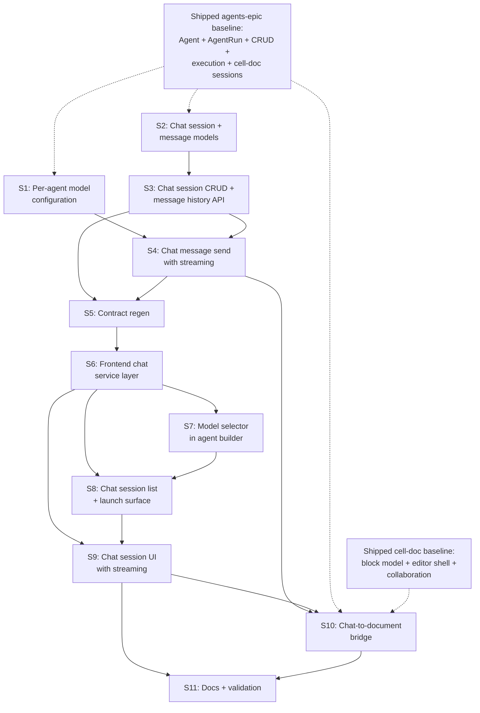

# Epic: Agents Session Chat

## 1. Epic Title

**Agents Session Chat — Conversational AI Interaction with Configurable LLMs**

## 2. Problem Statement

Baldin's agents today operate in a one-shot mode: the user clicks "Run Agent," the system produces a structured cell-doc session, and the user lands in a static workspace. There is no way to converse with an agent — to ask follow-up questions, refine a draft iteratively, request alternatives, or steer generation through natural-language dialogue. Users also cannot choose which LLM model powers their agent; every execution uses the same hardcoded `gpt-5.4-nano` regardless of task complexity.

This epic introduces a chat-based interaction layer for agents — similar to how developers use Copilot Chat or Codex — where users can open a session, send messages, receive streamed responses, and iterate with the agent in real time. Chat sessions are optionally anchored to application context and can produce cell-doc document artifacts as a side effect of the conversation. Model selection becomes a per-agent configuration, letting users choose between speed-optimized and quality-optimized models depending on the agent's purpose.

**Primary persona:** Job-seeker using Baldin's workspace who wants to draft, refine, and iterate on professional materials through guided AI conversation rather than one-shot generation.

**Job-to-be-done:** Open a chat session with a configured agent, describe what's needed in natural language, receive streamed responses, iterate through follow-up messages, and optionally save outputs to a versioned cell-doc workspace.

## 3. Current State Summary

### What exists today

| Surface | State | Key Details |
|---------|-------|-------------|
| **Agent model** | Live | `Agent` with `name`, `kind`, `instructions`, `configuration` (untyped JSONB), `is_enabled` |
| **Agent CRUD** | Live | Full CRUD + list with kind filter at `GET/POST/PATCH/DELETE /agents` |
| **Agent execution** | Live | `POST /agents/{id}/run` produces a cell-doc session synchronously; only `cover_letter` kind implemented |
| **AgentRun model** | Live | Tracks execution with `session_document_id`, `session_version_id`, `input_context`, `status`, `error_summary` |
| **Run history** | Live | `GET /agents/{id}/runs` and `GET /agents/runs?session_document_id=` |
| **Frontend agents page** | Live | Agent list with cards, kind filter, search, create/edit/delete, enable/disable toggle |
| **Agent detail page** | Live | Shows agent config, run history table with session links, rerun button |
| **RunAgentMenu** | Live | Dropdown on application detail to launch agents, navigates to cell-doc on success |
| **RerunAgentButton** | Live | Button on agent-created documents to rerun into the same session |
| **Cell-doc system** | Live | Block model, block CRUD/sync, version save with `block_snapshot`, editor shell with collaboration |
| **LLM integration** | Live | LangChain + OpenAI via `conf.openai.get_model(name?)`, two models available (`gpt-5.4-nano`, `gpt-5.4-mini`); `get_model()` already accepts optional model name but agents never use it |
| **Agent configuration field** | Live (unused) | `Agent.configuration` is JSONB `NOT NULL DEFAULT '{}'` — stored and returned in API but never read by execution logic and never rendered in the UI |
| **Conversation/messaging** | Live (user-to-user) | `Conversation`, `ConversationParticipant`, `Message` models with full CRUD routes and frontend pages — designed for peer-to-peer messaging, not agent interaction |
| **Streaming** | None | No SSE/streaming infrastructure exists beyond Yjs WebSocket collaboration |
| **Agent chat** | None | No conversational interaction model, no chat UI, no message history for agent sessions |

### What the agents-epic baseline provides

This epic builds on the shipped agents-epic foundation:

- Agent definitions with reusable workflow configuration
- Agent run tracking linked to exact cell-doc session versions
- Application-anchored execution with context assembly (profile, resume, lead, application)
- Cell-doc session creation and version-save through existing document flows
- Frontend management UI, launch surface, and run history
- Contract surface in `openapi.json` and `schema.d.ts` for all agent and run types

### What is net-new in this epic

- Per-agent model configuration (which LLM to use)
- Agent chat session persistence (conversation-style message history with roles)
- Streamed LLM response delivery (SSE from backend to frontend)
- Chat session CRUD API with message send/receive
- Chat-aware context assembly (conversation history + agent instructions + application context)
- Frontend chat session UI with streaming message display
- Optional bridge from chat session to cell-doc document artifact creation
- Chat sessions accessible from the agents UI and application context

### Why not reuse the existing Conversation/Message models

The existing messaging system (`Conversation`, `ConversationParticipant`, `Message`) is designed for peer-to-peer user communication: participants join/leave, messages are authored by users, read-tracking is per-participant, and the model assumes symmetric multi-party conversation.

Agent chat has fundamentally different semantics: messages have roles (`system`, `user`, `assistant`), context is injected programmatically, responses are LLM-generated and potentially streamed, sessions are single-user + single-agent, and metadata like token usage and model name per message are important. Attempting to shoehorn agent chat into the user messaging model would create semantic confusion, complicate queries, and force unnatural constraints on both surfaces.

## 4. System Boundaries Involved

| Boundary | Impact |
|----------|--------|
| **Backend models** | New `AgentChatSession` and `AgentChatMessage` models; minor addition to `Agent` configuration contract |
| **Backend API** | New chat session CRUD routes, SSE message endpoint, model listing endpoint |
| **Backend execution** | New chat-oriented LLM invocation path using conversation history (vs. current single-shot template chain) |
| **Frontend UI** | New chat session page, chat message thread component, model selector in agent form |
| **Frontend services** | New chat service layer with SSE consumption |
| **Contracts** | `openapi.json` and `schema.d.ts` gain chat session, chat message, and model configuration types |
| **Existing agent flows** | Unchanged — one-shot `POST /agents/{id}/run` continues to work alongside the new chat path |
| **Cell-doc system** | Reused as an output target when user requests document generation during chat |

### Constraints

- Chat is additive to the existing one-shot agent run flow. It does not replace or modify the current `POST /agents/{id}/run` execution path.
- Chat execution uses synchronous SSE streaming per message. No background task queue or WebSocket multiplexing is needed for the first cut.
- Model selection is bounded by the models available in `conf.openai.SUPPORTED_MODELS`. The system does not manage external API keys per user.
- Chat sessions are single-user, single-agent. Multi-user collaborative chat with agents is out of scope.
- The existing `Agent.configuration` JSONB field is the natural home for `model_name` — no new column is needed in Phase 1.
- Agent chat context assembly reuses the same profile/resume/application/lead loading that the one-shot run path already implements.

## 5. User Stories

### Story 1: Per-agent model configuration

**As a** user, **I want** to choose which LLM model powers my agent, **so that** I can pick a faster model for simple tasks and a more capable model for complex work.

**Acceptance criteria:**

- [ ] `Agent.configuration` contract documented: `model_name` key holds an optional string from the supported models set
- [ ] `GET /agents/models` returns the list of available model names from `conf.openai.SUPPORTED_MODELS` (public shape: `{ models: [{ name: str, label: str }] }`)
- [ ] Agent execution paths (`POST /agents/{id}/run` and the future chat send) read `agent.configuration.get("model_name")` and pass it to `conf.openai.get_model(name)`; `None` falls back to the global `COMPLETION_MODEL` default
- [ ] Existing `generate_cover_letter()` call in the one-shot run path accepts the resolved model instead of always using the default
- [ ] `langchain.generate_cover_letter()` and `langchain.ainvoke_structured_prompt()` accept an optional `model` parameter rather than always calling `get_model()` with no arguments
- [ ] Backend test covers: agent with explicit `model_name` in configuration uses that model; agent without `model_name` uses the default; invalid model name returns a clear error
- [ ] No schema migration needed — `configuration` JSONB already exists

**Surfaces:** backend
**Dependencies:** none
**Estimated complexity:** S
**Owner recommendation:** Baldin Backend Agent

---

### Story 2: Agent chat session and message models

**As a** developer, **I want** persistent chat session and message models, **so that** conversational agent interactions are stored with role-based message history and session metadata.

**Acceptance criteria:**

- [ ] `AgentChatSession` model with: `id`, `agent_id` FK (RESTRICT), `user_id` FK (CASCADE), `application_id` FK (SET NULL, nullable, indexed), `title` (Text, nullable — auto-generated from first user message if not provided), `model_name` (String, nullable — snapshot of the model used, copied from agent config at session creation), `status` (String, CHECK: `active`, `archived`), `message_count` (Integer, default 0, denormalized for list queries), `last_message_at` (DateTime, nullable), timestamps
- [ ] `AgentChatMessage` model with: `id`, `session_id` FK (CASCADE, indexed), `role` (String, CHECK: `system`, `user`, `assistant`), `content` (Text, required), `metadata` (JSONB, default `{}` — for token usage, model version, etc.), `created_at` (DateTime)
- [ ] Composite index `ix_agent_chat_messages_session_created` on `(session_id, created_at)` for efficient history loading
- [ ] Index `ix_agent_chat_sessions_user_updated` on `(user_id, updated_at)` for list queries
- [ ] Index `ix_agent_chat_sessions_agent` on `(agent_id)` for per-agent session listing
- [ ] Relationships: `AgentChatSession.messages`, `AgentChatSession.agent`, `AgentChatSession.application`, `Agent.chat_sessions`
- [ ] Pydantic schemas: `AgentChatSessionRead`, `AgentChatSessionSummaryRead`, `AgentChatSessionCreate`, `AgentChatMessageRead`, `AgentChatMessageCreate`
- [ ] `AgentChatSessionSummaryRead` includes: `id`, `agent_id`, `title`, `model_name`, `status`, `message_count`, `last_message_at`, `application_id`, timestamps
- [ ] `AgentChatMessageRead` includes: `id`, `role`, `content`, `metadata`, `created_at`
- [ ] Alembic migration follows schema-v2 conventions: string-backed enums with CHECK constraints, explicit `ondelete`, `DateTime(timezone=True)` timestamps

**Surfaces:** backend
**Dependencies:** none
**Estimated complexity:** M
**Owner recommendation:** Baldin Backend Agent

---

### Story 3: Chat session CRUD and message history API

**As a** developer, **I want** CRUD endpoints for chat sessions and a message history endpoint, **so that** the frontend can create, list, resume, and inspect agent chat conversations.

**Acceptance criteria:**

- [ ] `POST /agents/{id}/chat` creates a new chat session for the authenticated user, optionally anchored to `application_id`; inserts the system message derived from agent instructions and application context; returns `AgentChatSessionRead`
- [ ] `GET /agents/{id}/chat` lists the user's chat sessions for this agent with pagination, ordered by `last_message_at` DESC; returns `PaginatedResponse[AgentChatSessionSummaryRead]`
- [ ] `GET /agents/chat/{session_id}` returns `AgentChatSessionRead` with the most recent N messages (default 50, configurable via `limit` query param)
- [ ] `GET /agents/chat/{session_id}/messages` returns paginated `AgentChatMessageRead[]` ordered by `created_at` ASC, with cursor-based or offset pagination for loading earlier history
- [ ] `PATCH /agents/chat/{session_id}` allows updating `title` and `status` (archive a session)
- [ ] `DELETE /agents/chat/{session_id}` hard-deletes the session and cascaded messages
- [ ] All endpoints scoped to the authenticated user; cross-user access returns 403
- [ ] System message content assembles: agent name, agent instructions, application context summary (lead title, company, stage), user profile summary, and pinned resume summary when available
- [ ] Route tests cover: session creation with and without application_id, message history pagination, ownership enforcement, archive, delete

**Surfaces:** backend
**Dependencies:** Story 2
**Estimated complexity:** M
**Owner recommendation:** Baldin Backend Agent

---

### Story 4: Chat message send with streamed LLM response

**As a** user, **I want** to send a message to my agent and see the response stream in real time, **so that** the interaction feels responsive and conversational rather than waiting for a full generation.

**Acceptance criteria:**

- [ ] `POST /agents/chat/{session_id}/messages` accepts `{ content: str }` from the user
- [ ] Endpoint validates session ownership and active status
- [ ] Persists the user message as an `AgentChatMessage` with `role='user'`
- [ ] Loads the full conversation history (all messages in the session) as LangChain `BaseMessage` list (system → `SystemMessage`, user → `HumanMessage`, assistant → `AIMessage`)
- [ ] Invokes the LLM using the session's `model_name` (or agent's configured model, or global default) via `ChatOpenAI` with `streaming=True`
- [ ] Returns an SSE `StreamingResponse` (`text/event-stream`) that emits:
  - `event: delta` / `data: {"content": "...chunk..."}` for each token
  - `event: done` / `data: {"message": AgentChatMessageRead}` when complete, with the persisted assistant message including metadata (model name, token counts if available)
  - `event: error` / `data: {"detail": "..."}` on failure
- [ ] Persists the complete assistant response as an `AgentChatMessage` with `role='assistant'` and metadata after streaming finishes
- [ ] Updates `AgentChatSession.message_count`, `last_message_at`, and `updated_at`
- [ ] Context window management: if conversation history exceeds a reasonable token budget, truncate older messages (keep system message + last N messages) rather than failing
- [ ] Non-streaming fallback: If the client sends `Accept: application/json` instead of `text/event-stream`, return the completed `AgentChatMessageRead` synchronously (useful for testing)
- [ ] Backend tests cover: message send and assistant response persistence, SSE event format, session state updates, error handling, model routing from session config
- [ ] Does not depend on browser state or Yjs session

**Surfaces:** backend
**Dependencies:** Stories 1, 2, 3
**Estimated complexity:** L
**Owner recommendation:** Baldin Backend Agent

---

### Story 5: Contract regeneration for chat sessions

**As a** developer, **I want** the generated contract to reflect chat sessions, messages, model configuration, and streaming endpoints, **so that** frontend work consumes the same API shape the backend ships.

**Acceptance criteria:**

- [ ] `SCHEMA_UPDATE_FORCE=1 ./scripts/update_frontend_schemas.sh` succeeds
- [ ] `openapi.json` includes `/agents/{id}/chat`, `/agents/chat/{session_id}`, `/agents/chat/{session_id}/messages`, and `/agents/models`
- [ ] `openapi.json` and `schema.d.ts` include `AgentChatSessionRead`, `AgentChatSessionSummaryRead`, `AgentChatSessionCreate`, `AgentChatMessageRead`, `AgentChatMessageCreate`, and model listing types
- [ ] The streaming `POST /agents/chat/{session_id}/messages` endpoint appears in the contract; response schema documents the SSE event shapes even if OpenAPI cannot fully model SSE (a description annotation is acceptable)
- [ ] Frontend `tsc --noEmit` passes after regen

**Surfaces:** contracts
**Dependencies:** Stories 3, 4
**Estimated complexity:** S
**Owner recommendation:** Baldin Lead Full-Stack Architect

---

### Story 6: Frontend chat service layer

**As a** frontend developer, **I want** typed chat services for session CRUD, message history, and streaming message send, **so that** UI surfaces can interact with agent chat through the standard client pattern.

**Acceptance criteria:**

- [ ] `frontend/src/service/agent-chat.tsx` exports:
  - `createChatSession(token, agentId, payload: AgentChatSessionCreate)` → `Promise<AgentChatSessionRead>`
  - `getChatSessions(token, agentId, pagination?)` → `Promise<PaginatedResponse<AgentChatSessionSummaryRead>>`
  - `getChatSession(token, sessionId, limit?)` → `Promise<AgentChatSessionRead>`
  - `getChatMessages(token, sessionId, pagination?)` → `Promise<PaginatedResponse<AgentChatMessageRead>>`
  - `updateChatSession(token, sessionId, payload)` → `Promise<AgentChatSessionRead>`
  - `deleteChatSession(token, sessionId)` → `Promise<void>`
  - `sendChatMessage(token, sessionId, content: string, onDelta: (chunk: string) => void, onDone: (message: AgentChatMessageRead) => void, onError: (error: string) => void)` → `AbortController` (for cancellation)
  - `getAvailableModels(token)` → `Promise<{models: {name: string, label: string}[]}>`
- [ ] `sendChatMessage` uses `fetch` with `ReadableStream` to consume SSE events, calling `onDelta` for each chunk and `onDone` with the final persisted message
- [ ] Types re-exported from generated schema types
- [ ] Uses existing `createApiClient(token)` and `unwrap()` conventions for non-streaming calls
- [ ] `sendChatMessage` returns an `AbortController` so the UI can cancel in-flight streaming

**Surfaces:** frontend
**Dependencies:** Story 5
**Estimated complexity:** S
**Owner recommendation:** Baldin Frontend Agent

---

### Story 7: Model selector in agent builder

**As a** user, **I want** to select the AI model for my agent when creating or editing it, **so that** I can balance speed and quality for different agent purposes.

**Acceptance criteria:**

- [ ] `AgentFormDialog` gains a "Model" select field populated from `getAvailableModels()`
- [ ] Field shows human-readable labels (e.g., "GPT-5.4 Nano (Fast)" / "GPT-5.4 Mini (Balanced)") with the default clearly indicated
- [ ] Selected model stored in `configuration.model_name` on create/update
- [ ] When editing an existing agent, the select shows the currently configured model
- [ ] When no model is selected (or the agent has no `model_name` in configuration), the field defaults to "Default" with helper text explaining the system default
- [ ] Agent detail page displays the configured model name (or "Default") in the agent configuration section

**Surfaces:** frontend
**Dependencies:** Story 6
**Estimated complexity:** S
**Owner recommendation:** Baldin Frontend Agent

---

### Story 8: Chat session list and launch surface

**As a** user, **I want** to see my chat sessions with an agent and start new ones, **so that** I can manage my conversational history and launch new interactions from the agents UI.

**Acceptance criteria:**

- [ ] Agent detail page gains a "Chat Sessions" section (tab or separate list below run history)
- [ ] Section shows chat sessions ordered by most recent, with: title (or auto-generated), message count, last active timestamp, status badge, application link when anchored
- [ ] Empty state: "Start a conversation with this agent" with a clear call-to-action
- [ ] "New Chat" button opens the chat session UI (Story 9) after creating a session via `createChatSession()`
- [ ] Optional: "New Chat" accepts an application context selector or is pre-populated when launched from application detail
- [ ] Clicking an existing session navigates to the chat session UI to resume the conversation
- [ ] Archive action marks a session as archived (removed from default list, accessible via filter)
- [ ] Delete action with confirmation removes the session permanently
- [ ] Route: `/automation/agents/:agentId/chat/:sessionId` for the chat session page
- [ ] Application detail page gains a "Chat with Agent" action alongside the existing "Run Agent" menu, allowing users to start a chat session anchored to the current application

**Surfaces:** frontend
**Dependencies:** Stories 6, 7
**Estimated complexity:** M
**Owner recommendation:** Baldin Frontend Agent

---

### Story 9: Chat session UI with streaming

**As a** user, **I want** a full chat interface where I can converse with my agent and see responses stream in real time, **so that** interacting with the agent feels as natural as using Copilot Chat or ChatGPT.

**Acceptance criteria:**

- [ ] Page at `/automation/agents/:agentId/chat/:sessionId` renders the chat session
- [ ] Header shows: agent name, model name, session title (editable inline), application context link when anchored, back navigation to agent detail
- [ ] Message thread displays all messages in chronological order with visual role distinction:
  - System messages: muted, collapsible context block at the top
  - User messages: right-aligned, primary-colored bubble
  - Assistant messages: left-aligned, surface-colored bubble with avatar/icon
- [ ] Message input: multiline text field at the bottom, send on Enter (Shift+Enter for newline), send button, disabled while streaming
- [ ] Streaming display: assistant message bubble appears immediately when send is triggered, content populates incrementally as `onDelta` chunks arrive, typing indicator or cursor animation during streaming
- [ ] Cancel button appears during streaming to abort via `AbortController`
- [ ] Auto-scroll to latest message, with scroll-to-bottom button when user scrolls up
- [ ] Assistant messages render Markdown content (headings, bold, italic, code blocks, lists, links) using a lightweight Markdown renderer
- [ ] Loading state on initial page load while conversation history loads
- [ ] Error state shown inline if message send fails (with retry action)
- [ ] Empty conversation state after session creation (only system message visible, input focused)
- [ ] Mobile-responsive layout (stacks naturally, input stays at bottom)

**Surfaces:** frontend
**Dependencies:** Stories 6, 8
**Estimated complexity:** L
**Owner recommendation:** Baldin Frontend Agent

---

### Story 10: Chat-to-document bridge

**As a** user, **I want** to save an agent's chat output into a versioned cell-doc, **so that** useful generated content becomes a persistent workspace artifact rather than living only in chat history.

**Acceptance criteria:**

- [ ] `POST /agents/chat/{session_id}/save-to-document` accepts `{ title?: str, application_id?: UUID }` and:
  - Assembles TipTap JSON from the conversation: heading with session title, conversation content as structured blocks (user messages as blockquotes, assistant messages as body text, code blocks preserved)
  - Creates a new `Document` with `kind='cell_doc'` through the existing cell-doc create flow
  - Creates an `AgentRun` record linking the chat session to the produced document for audit continuity
  - If `application_id` provided, attaches the document to the application via `DocumentXApplication`
  - Returns `{ document_id, version_id }` so the frontend can navigate to the cell-doc editor
- [ ] Frontend: "Save as Document" action in the chat session header or as a message action
- [ ] On save, UI shows success notification with a "Open Document" link that navigates to the cell-doc editor
- [ ] Existing cell-doc infrastructure handles all persistence — no new document creation path
- [ ] Backend test covers: save from chat with messages → valid cell-doc created with block_snapshot and synced blocks

**Surfaces:** backend | frontend
**Dependencies:** Stories 4, 9, and the shipped cell-doc backend foundation
**Estimated complexity:** M
**Owner recommendation:** Baldin Lead Full-Stack Architect

---

### Story 11: Documentation and validation

**As a** developer, **I want** docs and validation to reflect the chat interaction model, **so that** the repo describes agents as conversational collaborators with configurable models.

**Acceptance criteria:**

- [x] Agent/networking docs describe the chat session interaction alongside one-shot execution
- [x] System overview or architecture docs note the SSE streaming boundary
- [x] Product language for agents describes both interaction modes: one-shot workspace generation and conversational chat
- [x] `cd docs && npm run build` passes if docs source is updated
- [ ] `cd frontend && VITE_API_URL=https://api.example.com npm run build` passes
- [ ] Full backend test suite passes: `cd backend && python -m pytest`

**Surfaces:** docs | frontend | backend
**Dependencies:** Stories 9, 10
**Estimated complexity:** S
**Owner recommendation:** Baldin Lead Full-Stack Architect

## 6. Dependency Graph

**Critical path:** S2 → S3 → S4 → S5 → S6 → S9 → S11

S1 (model config) is independent and can land in parallel with S2/S3, but must be complete before S4 (which uses the configured model for chat responses).

## 7. Phased Delivery Plan

### Phase 1 — Backend Chat Foundation (Stories 1, 2, 3, 4, 5)

**Goal:** Chat session persistence, CRUD API, and streamed message execution exist end to end at the API layer. Model configuration is wired through to all LLM calls.

**Sequence:** S1 + S2 (parallel) → S3 → S4 → S5

**Phase exit criteria:**

- A backend-only test can: configure a model on an agent, create a chat session anchored to an application, send a user message, receive a streamed assistant response with correct SSE event format, load message history, and verify the configured model was used.
- Contract regeneration includes all chat types and endpoints.
- Existing one-shot `POST /agents/{id}/run` continues to work and respects the configured model.

**Owner:** Baldin Backend Agent for S1–S4, Baldin Lead Full-Stack Architect for S5.

---

### Phase 2 — Frontend Chat Experience (Stories 6, 7, 8, 9)

**Goal:** Users can select a model for their agent, open chat sessions from the agent detail page or application context, and converse with streaming responses.

**Sequence:** S6 → S7 + S8 (parallel overlapping) → S9

**Phase exit criteria:**

- User can edit an agent's model selection in the builder dialog.
- User can create a new chat session from the agent detail page, see the session list, and navigate to the chat UI.
- User can send messages and see streamed responses in real time.
- User can cancel in-flight streaming, scroll through history, and resume sessions.

**Owner:** Baldin Frontend Agent for S6–S9.

---

### Phase 3 — Integration and Polish (Stories 10, 11)

**Goal:** Chat outputs can be saved as cell-doc artifacts, and docs describe the shipped interaction model.

**Sequence:** S10 → S11

**Phase exit criteria:**

- User can save a chat conversation as a cell-doc document.
- The full agent workflow — configure model → open chat → converse → save to document — works end to end.
- Docs describe both interaction modes.

**Owner:** Baldin Lead Full-Stack Architect for S10–S11.

## 8. Risk Register

| # | Risk | Likelihood | Impact | Mitigation |
|---|------|-----------|--------|------------|
| 1 | **SSE streaming complexity.** FastAPI `StreamingResponse` with async generators is well-supported but has edge cases around client disconnection, timeout handling, and error recovery mid-stream. | Medium | Medium | Start with the simplest SSE generator pattern. Use LangChain's `astream()` directly inside the generator. Test client disconnect handling explicitly. Keep the non-streaming JSON fallback as a testing escape hatch. |
| 2 | **Context window overflow.** Long conversations will exceed model context limits, causing failures or truncated context. | High | Medium | Implement a simple token-budget truncation in Story 4: keep the system message + last N messages that fit within a configurable budget (e.g., 80% of model context window). Log when truncation occurs. More sophisticated summarization-based compression is a follow-on. |
| 3 | **Frontend SSE consumption reliability.** `fetch` + `ReadableStream` for SSE is well-supported but `EventSource` API does not support POST requests or custom headers, requiring manual stream parsing. | Low-Medium | Medium | Use `fetch` with the `getReader()` pattern rather than `EventSource`. Parse `text/event-stream` format manually (well-documented pattern). Test with network throttling and reconnection scenarios. |
| 4 | **Model availability drift.** The `SUPPORTED_MODELS` list is environment-derived. If models are removed from the environment, agents configured with those models will fail. | Low | Medium | The `get_model(name)` call already raises `ValueError` for unknown models. The chat execution should catch this and fall back to the default model with a warning in the response metadata rather than failing the entire session. |
| 5 | **Chat message volume.** Long sessions could accumulate hundreds of messages, making history loading slow and LLM context assembly expensive. | Medium | Low | Paginate message history endpoints. Use cursor-based pagination for chat messages. Truncate LLM context to recent messages (Story 4 AC). Defer message archival/cleanup to a follow-on if volume becomes a real problem. |
| 6 | **Feature perception: chat vs. one-shot confusion.** Two interaction modes (one-shot run → cell-doc, chat → conversation) may confuse users about when to use which. | Medium | Medium | Clear UI labeling: "Run Agent" for one-shot document generation, "Chat with Agent" for conversational interaction. Agent detail page shows both surfaces with distinct sections. Product copy explains the difference. Longer term, chat could subsume one-shot as a "single-turn conversation." |
| 7 | **Scope creep toward multi-turn tool use.** Once chat works, the temptation to add function-calling, tool use, RAG retrieval, and agent chains inside chat will be strong. | High | Medium | Keep Phase 1 chat as pure conversational LLM interaction. Document tool-use and RAG integration as explicit follow-on stories. The `metadata` JSONB on messages provides the extensibility hook without schema churn. |
| 8 | **LangChain streaming compatibility.** `ChatOpenAI.astream()` behavior may differ across LangChain versions or model providers. | Low | Medium | Pin LangChain version. Test streaming with the specific models in `SUPPORTED_MODELS`. The non-streaming fallback provides a working path if streaming breaks for a specific model. |

## 9. Out of Scope

- **Multi-turn tool use / function calling** — agents as pure conversational LLM interaction first; structured tool invocation is a follow-on
- **RAG / retrieval-augmented chat** — the agent does not search documents or external sources during chat in this epic
- **Multi-agent chat** — sessions are single-agent; orchestrating multiple agents in conversation is future work
- **Collaborative chat sessions** — sessions are single-user; no shared chat with multiple participants
- **Chat session branching / forking** — no conversation tree; messages are strictly linear and chronological
- **Voice or audio input** — text-only interaction
- **Image or file attachment in chat messages** — text content only
- **Autonomous agent loops** — the agent responds to user messages; it does not initiate conversation or take actions independently
- **Real-time push notifications for chat** — no WebSocket push for new messages; the UI manages state locally during active sessions
- **Custom system prompt editing per chat session** — the system message is derived from agent instructions; per-session override is a follow-on
- **Token usage billing or quota management** — metadata tracks token counts for observability but no enforcement or billing in this epic
- **Replacing the one-shot agent run flow** — chat is additive; both interaction modes coexist
- **Mobile-first chat experience** — responsive layout is expected, but mobile-specific optimizations are deferred

## 10. Validation Plan by Phase

| Phase | Check | Command / Method | Pass Criteria |
|-------|-------|------------------|---------------|
| **1** | DB migration | `cd backend && alembic upgrade head` | Chat session and message tables created with all CHECK constraints and indexes |
| **1** | Model config wiring | Backend test: create agent with `configuration.model_name`, run agent → verify model used | Configured model passed to LLM call |
| **1** | Chat CRUD | Backend test: create session, send message, load history, archive, delete | Full lifecycle works with ownership enforcement |
| **1** | SSE streaming | Backend test: send message → parse SSE events → verify delta + done events + persisted message | Correct event format, complete response persisted |
| **1** | One-shot regression | `cd backend && python -m pytest -k agent` | Existing agent run tests still pass |
| **1** | Contract regen | `SCHEMA_UPDATE_FORCE=1 ./scripts/update_frontend_schemas.sh` | `openapi.json` and `schema.d.ts` include chat types and endpoints |
| **2** | TypeScript | `cd frontend && npx tsc --noEmit` | Zero errors on chat surfaces |
| **2** | Model selector | Manual: edit agent → select model → save → verify config persisted | Model appears in form and persists correctly |
| **2** | Chat session list | Manual: agent detail → chat sessions section → create/list/navigate | Sessions listed and navigable |
| **2** | Streaming UI | Manual: send message → observe streaming response → cancel mid-stream | Response streams visibly, cancel works, history loads on resume |
| **2** | Frontend build | `cd frontend && VITE_API_URL=https://api.example.com npm run build` | Clean production build |
| **3** | Save to document | Manual: chat → "Save as Document" → navigate to cell-doc | Cell-doc created with conversation content as structured blocks |
| **3** | End-to-end smoke | Configure model → open chat → converse → save to document → view cell-doc | Full workflow completes without errors |
| **3** | Docs build | `cd docs && npm run build` | Clean docs build if source docs changed |
| **3** | Full backend suite | `cd backend && python -m pytest` | All tests pass including new chat tests |

## 11. Open Questions

1. **Chat session title auto-generation** — Should the title be derived from the first user message (truncated), from the agent name + timestamp, or from an LLM-generated summary of the first exchange? **Recommendation:** Start with "first user message truncated to 80 chars" for simplicity. LLM-generated titles are a polish follow-on.

2. **Context window budget** — What is the right default token budget for conversation history? The models support different context sizes. **Recommendation:** Default to 80% of the model's reported context window. Use a simple message-count heuristic (last 50 messages or last 16k tokens, whichever is fewer) and refine based on real usage.

3. **Markdown rendering library** — The chat UI needs to render Markdown in assistant responses. Options include `react-markdown`, `marked` + `DOMPurify`, or a lightweight custom renderer. **Recommendation:** `react-markdown` with `remark-gfm` for GFM support; it's well-maintained and handles code blocks, lists, and tables. Security: use `rehype-sanitize` to prevent XSS from model outputs.

4. **Chat session routing** — Should chat sessions live at `/automation/agents/:agentId/chat/:sessionId` or at a top-level `/chat/:sessionId`? **Recommendation:** Agent-scoped route (`/automation/agents/:agentId/chat/:sessionId`) for Phase 1 to keep the feature anchored to the agents UI. A top-level `/chat` surface aggregating sessions across agents is a natural follow-on.

5. **Concurrent session limit** — Should there be a limit on active chat sessions per agent or per user? **Recommendation:** No enforced limit in Phase 1. If storage or performance becomes a real concern, add soft limits later. The `status: archived` flag provides the manual cleanup mechanism.

6. **Chat message edit/delete** — Should users be able to edit or delete their messages after sending? This would require re-generating the assistant's response from the modified history. **Recommendation:** Defer to a follow-on. Message history is append-only in Phase 1 to keep the persistence model simple and the conversation history trustworthy.

---

**Story count:** 11 (4S + 4M + 2L + 1S) → 4S + 4M + 2L = 10 weighted units

**Natural epic split point:** Phase 1 (Stories 1–5, backend chat foundation) vs. Phase 2–3 (Stories 6–11, frontend chat experience + integration). Phase 1 delivers a complete, tested backend API surface. Phase 2 delivers the user-facing chat experience. Phase 3 bridges chat to the cell-doc system.

**Recommended starting point:** Dispatch S1 to Baldin Backend Agent (small, independent, immediate value for existing one-shot runs). Dispatch S2 to Baldin Backend Agent in parallel (model + migration work, no dependency on S1).
