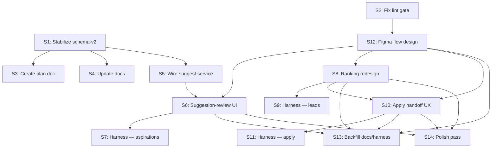

# Quarter Roadmap: Historical Aspirations-to-Apply Flagship

> Archived plan kept for historical context after the `v2.1` hard fork.
> Do not use this file as the active implementation contract. Start from `docs/docs/reference/v2-1-hard-fork.md` and `plans/v2.1/*`.
> Historical working branch at the time: `schema-v2`.
> Prior art: [plans/aspirations.md](./aspirations.md) — original 6-phase slice plan for the aspirations backend.

## Problem Statement

Baldin's job-search automation flow was fragmented when this roadmap was written: aspirations lived under a profile CRUD shell, lead ranking exposed aspiration-alignment data that was not visually prominent, and the transition from a ranked lead into an application happened through a small menu button without contextual guidance. The backend already supported suggestion generation, aspiration-aware ranking, and structured matching, but the frontend did not yet surface these capabilities as a connected workflow. This archived roadmap tracked the end-to-end **aspirations → ranked leads → application start** flagship flow before the `v2.1` hard fork moved active implementation to the code-first design-system contract.

## Current State (schema-v2 baseline)

### Backend — complete

| Surface | Status |
|---------|--------|
| `Aspiration` model + migration (0008) | Complete — CRUD, unique constraint, kind enum |
| CRUD routes (GET/POST/PATCH/DELETE `/api/v1/aspirations`) | Complete — 16 tests |
| `POST /api/v1/aspirations/suggest` | Complete — LLM-based, rate-limited, dedup, empty-profile 400 |
| `POST /api/v1/aspirations/match` | Complete — RAG-backed, lead-requirement extraction, 20+ tests |
| Aspiration-aware lead ranking | Complete — `aspiration_alignment` on `RankedLeadEntry` |

### Frontend — flagship connected flow landed

| Surface | Status |
|---------|--------|
| Aspirations pages (Roles, Companies tabs) | Complete — cards, form dialog, search |
| Aspirations service adapter | Complete — CRUD, typed suggest seam (`getAspirationSuggestions(token)`, `AspirationAdapter.suggest(kind)`), and explicit error-category normalization (D8) with `AspirationServiceError` |
| Generated types for suggest + match | Complete in `schema.d.ts` |
| Leads ranking | Complete — redesigned ranking trigger, aspiration-fit copy, ranked state treatment, and aspiration gate behavior all ship in the real page |
| Application creation | Complete — intent button, duplicate-safe preload, inline already-applied state, and ranking-context ready-state copy ship in the real leads page |

### Design System & Harness

| Surface | Status |
|---------|--------|
| Token inventory + primitives + Figma metadata | Complete — 8 `.figma.ts` mappings aligned to `Baldin-Library`; shared `primary` status tone for `StatusChip`; workspace Code Connect reads remain seat-blocked and non-gating |
| `lint:theme` gate | Complete — green as of 2026-04-13 |
| Browser harness | Complete — canonical `figma-wave1` supports aspirations `empty|loading|suggested|no-signal|rate-limited`, leads `unranked|ranked|disabled|error`, and apply `ready|already-applied` |
| Figma workspace | Historical context only — `Baldin-Library`, `Baldin Product Redesign — Command Center`, and `Baldin-App-Screens` remain archived design references after the `v2.1` hard fork |

### Docs

| Surface | Status |
|---------|--------|
| Aspirations in architecture docs | Complete — flagship flow, frontend boundaries, and service ownership are documented |
| API surface docs listing aspirations | Complete — CRUD, suggest, and match routes are listed with their contract intent |

## Progress Snapshot (2026-04-14)

| Story | Status | Notes |
|-------|--------|-------|
| S1 — Stabilize schema-v2 as the flagship branch | Complete | Aspirations + matcher pytest slices green, contract regeneration rerun, regenerated frontend `tsc --noEmit` and production build green, and `schema-v2` remains the declared flagship branch |
| S2 — Fix design-system lint gate | Complete | `lint:theme` green; `chat-markdown` and `StatusChip.figma.ts` fixed; shared `primary` status tone added |
| S3 — Create the quarter plan document | Partial | Plan file is tracked, listed in `plans/README.md`, and cross-referenced to `plans/aspirations.md`; the remaining unchecked criterion is commit-level closeout |
| S4 — Update docs to reflect aspirations as a real surface | Complete | Architecture, API, frontend-boundary docs, and docs sidebar all reflect aspirations as a shipped surface; docs build green |
| S5 — Wire suggest service method into the frontend | Complete | Suggest seam, error-category normalization (D8), and full service test coverage landed |
| S6 — Build suggestion-review UI on aspirations pages | Complete | `SuggestionReviewPanel` with accept-one, accept-all (D9), discard, error-category UX (D8), wired into roles and companies pages via `showSuggestions`; component tests cover all acceptance criteria |
| S7 — Expand browser harness for aspirations captures | Complete | `figma-wave1` now covers aspirations `empty|loading|suggested|no-signal|rate-limited` across the supported roles and companies screens |
| S8 — Redesign leads ranking presentation | Complete | CardShell tone shifts to `warning` for ranked leads; ranking context strip groups score chip + alignment text (D3); component tests cover ranked/unranked states and alignment rendering |
| S9 — Expand browser harness for leads ranking captures | Complete | `figma-wave1` supports `unranked|ranked|disabled|error` leads captures |
| S10 — Strengthen application-start handoff from leads | Complete | Preloaded applications map, duplicate-safe inline state, fallback backstop, post-create map update, and ranking-context-aware ready-state handoff copy (`buildReadyHandoff` with score-tiered messages) |
| S11 — Expand browser harness for application-start captures | Complete | `figma-wave1` supports `ready|already-applied` apply captures |
| S12 — Design three linked Figma flow moments | Complete | `Baldin Product Redesign — Command Center` now has a dedicated `Flagship Flow Screens` page for aspirations, ranked leads, and apply-handoff state inventory; older captures remain isolated in the `Baldin-App-Screens` behavioral archive |
| S13 — Backfill docs, harness, and Figma references | Complete | Architecture, API, harness, access-model, and mapping-inventory references are all tracked in repo docs; docs build green |
| S14 — Polish pass on flagship connected surfaces | Complete | All 7 lint:theme violations fixed; 377 tests pass; `tsc --noEmit` clean; production build green; no regressions |

## Decisions Log

| # | Decision | Date |
|---|----------|------|
| D1 | `schema-v2` continues as the flagship working branch; merge to `main` deferred until flagship is shippable | 2026-04-13 |
| D2 | Suggestion-review UI supports bulk "accept all" per-tab (all suggestions of the active kind), not just post-filter visible | 2026-04-13 |
| D3 | `aspiration_alignment` text renders alongside the relevance score as a secondary line, not as a tooltip replacement | 2026-04-13 |
| D4 | Figma library access confirmed: https://www.figma.com/design/MbJ133Gwnp1OlkFLrjBLEh/Baldin-Library | 2026-04-13 |
| D5 | `plans/business-model.md` is a separate artifact; not part of this roadmap's active plan inventory | 2026-04-13 |
| D6 | Code Connect publish or workspace-read automation is not a quarter gate. The current Professional-plan expert seat cannot use Developer-seat workspace reads, so harness + MCP or web inspection is the supported workflow | 2026-04-13 |
| D7 | No new backend endpoints, models, or migrations this quarter; existing contract is sufficient | 2026-04-13 |
| D8 | Suggestion fetch and accept flows use explicit frontend error categories: `no_signal` (400), `duplicate` (409 on create), `rate_limited` (429), `ai_disabled` (503), `network`, and `unknown`; UI copy and retry behavior are keyed off those categories | 2026-04-13 |
| D9 | "Accept all" runs sequential creates for the active tab kind only. Successes are persisted and removed from drafts, `409` duplicates are treated as non-fatal already-satisfied items and removed from drafts, and the batch stops on the first retryable failure (`429`, `503`, `network`, or unknown 5xx) with untouched remaining drafts left visible for retry | 2026-04-13 |
| D10 | Story 10 inline already-applied state is powered by the existing `/api/v1/applications/` list surface. Leads page loads applications once, derives a `lead_id -> application` map locally, passes that state into lead cards, and updates the map after successful application creation; no backend contract changes | 2026-04-13 |
| D11 | Ranking remains aspiration-gated this quarter. Users without aspirations do not get generic relevance-only ranking; they continue to see the disabled state with clearer guidance to add aspirations first | 2026-04-13 |
| D12 | Before the `v2.1` hard fork, this roadmap treated Figma as upstream for flow and layout decisions after the lint baseline was fixed. That dependency is now historical only | 2026-04-13 |
| D13 | Validation commands in this epic use repo-aligned working-directory forms. Host-side backend pytest must set `TEST_DATABASE_HOSTNAME=127.0.0.1` and `TEST_DATABASE_PORT=5431` explicitly to avoid the tracked `backend/.env` Compose hostname mismatch | 2026-04-13 |
| D14 | Frontend stabilization slice landed on 2026-04-13: `lint:theme` is green, `StatusChip` has a shared `primary` tone, the leads page preloads applications for duplicate-safe inline state, and `figma-wave1` now covers aspirations/leads/apply capture routes | 2026-04-13 |
| D15 | The shipped suggest seam is `getAspirationSuggestions(token)` plus `AspirationAdapter.suggest(kind)` returning draft suggestions filtered client-side by active kind. Explicit error-category normalization remains part of the UI implementation slice, not the stabilization slice | 2026-04-13 |
| D16 | Before the `v2.1` hard fork, `Baldin-Library` was treated as the main reusable-component file and `Baldin Product Redesign — Command Center` as the active working file. Those files are now archived references only | 2026-04-13 |
| D17 | The `Baldin-App-Screens` archive keeps older capture evidence separate from the `Flagship Flow Screens` page in `Baldin Product Redesign — Command Center` so archive references remain available without implying active-source status | 2026-04-13 |
| D18 | Full Figma version-history review depends on browser or web access. MCP remains the supported path for structure, screenshots, and component inspection without a Developer seat | 2026-04-13 |
| D19 | The authoritative Make review (`App.tsx`, `theme.css`, `button.tsx`, `card.tsx`, `badge.tsx`, and `Guidelines.md`) found an empty app shell, stock guidelines, and generic Tailwind or shadcn scaffolding, so no Make-derived primitive or token surface is approved for direct migration | 2026-04-13 |

## User Stories

### Story 1: Stabilize schema-v2 as the flagship branch
**As a** developer, **I want** the schema-v2 branch validated and declared as the active flagship working branch, **so that** all downstream work builds on a stable, reviewed foundation.

**Acceptance criteria:**
- [x] Backend pytest aspirations + matcher slices green
- [x] `openapi.json` and `schema.d.ts` fresh via `SCHEMA_UPDATE_FORCE=1 ./scripts/update_frontend_schemas.sh`
- [x] `tsc --noEmit` and `npm run build` pass against regenerated types
- [x] Branch declared as the flagship working branch (merge to `main` deferred)

**Surfaces:** backend, contracts, frontend (type check only)
**Dependencies:** none
**Complexity:** S
**Owner:** Lead Architect

---

### Story 2: Fix design-system lint gate
**As a** frontend developer, **I want** `npm run lint:theme` green, **so that** new design work starts from a clean baseline.

**Acceptance criteria:**
- [x] `chat-markdown.tsx` uses the shared mono typography token instead of raw `'monospace'`
- [x] `StatusChip.figma.ts` replaces `'#0891b2'` with the semantic `primary` tone backed by the theme palette
- [x] `npm run lint:theme` exits 0

**Surfaces:** frontend
**Dependencies:** none
**Complexity:** S
**Owner:** Frontend Agent

---

### Story 3: Create the quarter plan document
**As a** project coordinator, **I want** a durable plan doc for the flagship quarter roadmap, **so that** agents, prompts, and humans share one source of truth.

**Acceptance criteria:**
- [ ] `plans/flagship-aspirations-to-apply.md` committed (this file)
- [x] `plans/README.md` updated to list it as active
- [x] `plans/aspirations.md` cross-referenced as prior art

**Surfaces:** plans
**Dependencies:** Story 1 (confirms baseline)
**Complexity:** S
**Owner:** Lead Architect

---

### Story 4: Update docs to reflect aspirations as a real surface
**As a** developer or agent, **I want** architecture and API docs that describe aspirations CRUD, suggest, match, and ranking integration.

**Acceptance criteria:**
- [x] New or expanded architecture doc under `docs/docs/` describes aspirations model, endpoints, and ranking integration
- [x] `docs/sidebars.ts` surfaces the new page
- [x] Frontend architecture doc expands beyond routing-table mention
- [x] `docs build` passes

**Surfaces:** docs
**Dependencies:** Story 1
**Complexity:** M
**Owner:** Lead Architect

---

### Story 5: Wire suggest service method into the frontend
**As a** job seeker, **I want** the frontend to be able to call the suggest endpoint, **so that** the suggestion-review UI has a typed service layer.

**Acceptance criteria:**
- [x] `getAspirationSuggestions(token)` added to `aspirations.ts` returning `AspirationSuggestionDraft[]`
- [x] `AspirationAdapter.suggest(kind)` added and filters drafts client-side to the active kind
- [x] Service layer normalizes suggest failures into explicit frontend categories per D8: `no_signal`, `rate_limited`, `ai_disabled`, `network`, `unknown`
- [x] `400` from `/aspirations/suggest` maps to `no_signal` only when the backend detail is the existing no-usable-profile message; other `400` responses fall back to `unknown`
- [x] Service tests cover success with drafts, in-memory default empty suggestions, and adapter kind filtering
- [x] Service tests cover `400` no-signal, `429`, `503`, and network failure
- [x] No UI wiring — service layer only

**Surfaces:** frontend
**Dependencies:** Story 1
**Complexity:** S
**Owner:** Frontend Agent

---

### Story 6: Build suggestion-review UI on aspirations pages
**As a** job seeker on the aspirations tab, **I want** to trigger profile-based suggestions, review them, and accept or discard each one.

**Acceptance criteria:**
- [x] "Suggest from profile" button; fetch is user-triggered, not automatic
- [x] Drafts render as reviewable cards filtered to active tab kind
- [x] "Accept all" accepts all suggestions of the active kind (per-tab bulk accept — D2)
- [x] Accept-one persists through the existing create-aspiration route
- [x] Discarded suggestions removed from local draft list only
- [x] No-signal response shows actionable guidance to improve profile data
- [x] Loading state visible during suggestion fetch
- [x] Fetch error handling is explicit and stable:
  - `400 no_signal` clears any stale draft list for the active kind and renders inline profile-improvement guidance
  - `429 rate_limited` keeps existing drafts intact, renders retryable inline feedback, and does not start any create calls
  - `503 ai_disabled` keeps existing drafts intact and renders "AI suggestions unavailable" guidance without implying profile edits will help
  - `network` and `unknown` errors keep existing drafts intact and render a generic retryable failure state
- [x] Accept-one semantics are explicit:
  - `201` removes the accepted draft and refreshes persisted aspirations
  - `409 duplicate` removes the draft as already satisfied, refreshes persisted aspirations, and shows non-destructive feedback
  - `429`, `503`, `network`, and unknown errors keep the draft in place and show retryable feedback
- [x] Accept-all semantics follow D9 exactly:
  - process active-kind drafts sequentially in rendered order
  - remove successes and `409` duplicates from the draft list as they complete
  - stop on the first retryable failure and leave the failed draft plus all remaining active-kind drafts visible and unchanged
  - show a completion summary with counts for created, already-existing, and remaining drafts
- [x] Component tests: accept-one success, accept-one duplicate, accept-all all-success, accept-all partial failure stop, discard, no-signal, rate-limited, AI-disabled, loading

**Surfaces:** frontend
**Dependencies:** Story 5
**Complexity:** M
**Owner:** Frontend Agent

---

### Story 7: Expand browser harness for aspirations captures
**As a** designer, **I want** harness-rendered aspirations screens for Figma review without a live backend.

**Acceptance criteria:**
- [x] Canonical `figma-wave1` harness supports `screen=aspirations-roles|aspirations-companies` with mock data and `state=empty|seeded`
- [x] Additional aspirations capture states landed: loading suggestions, suggestions returned per kind, no-usable-signal guidance, and rate-limited feedback
- [x] Both theme modes visually verified in harness-generated capture references
- [x] No network dependency

**Surfaces:** frontend (browser-harness)
**Dependencies:** Stories 6, 12
**Complexity:** M
**Owner:** Frontend Agent

---

### Story 8: Redesign leads ranking presentation for aspiration fit
**As a** job seeker on the leads page, **I want** ranking results to surface aspiration-alignment as first-class context.

**Acceptance criteria:**
- [x] Ranking action is an explicit trigger (clear button/control)
- [x] Ranked state visually distinct from unranked on lead cards
- [x] `aspiration_alignment` displayed alongside relevance score as a secondary line (D3)
- [x] Relevance score and aspiration fit presented together coherently
- [x] Current aspiration gate remains in place per D11: users without aspirations still see the disabled ranking state and a clearer prompt to add aspirations first
- [x] Ranking redesign does not introduce generic relevance-only ranking for non-aspirated users this quarter
- [x] Component tests: ranked/unranked states, alignment rendering

**Surfaces:** frontend
**Dependencies:** Stories 1, 12
**Complexity:** M
**Owner:** Frontend Agent

---

### Story 9: Expand browser harness for leads ranking captures
**As a** designer, **I want** harness screens for the leads ranking redesign.

**Acceptance criteria:**
- [x] Harness entry with mock ranked + unranked lead data
- [x] States: unranked, ranked with aspiration alignment, ranking disabled, ranking unavailable/error
- [x] Existing `mode=dark|light` query path supported by the canonical harness

**Surfaces:** frontend (browser-harness)
**Dependencies:** Stories 8, 12
**Complexity:** S
**Owner:** Frontend Agent

---

### Story 10: Strengthen application-start handoff from leads
**As a** job seeker looking at a ranked lead, **I want** the apply action to feel like a natural continuation of ranking context.

**Acceptance criteria:**
- [x] Leads page loads the existing application list once through the current frontend applications service, derives a local `lead_id -> application` map, and passes that derived state into lead cards (D10)
- [x] Intent button preserved (register/apply distinction)
- [x] Inline already-applied state is computed from the derived applications map, not from a new backend field
- [x] Existing duplicate guard remains as a runtime backstop on click; the preloaded map is the primary render path and is refreshed or updated after successful application creation
- [x] Inline state shows the existing application stage/outcome label for matching leads and disables the creation CTA when an application already exists
- [x] Handoff copy references ranking context (e.g., "High aspiration fit — ready to apply?") in the real leads page
- [x] No application route contract changes (backend untouched)
- [x] Component tests: inline existing-application state from preloaded map, duplicate guard UX, and post-create map update

**Surfaces:** frontend
**Dependencies:** Stories 8, 12
**Complexity:** S
**Owner:** Frontend Agent

---

### Story 11: Expand browser harness for application-start captures
**As a** designer, **I want** harness screens for the application-start handoff.

**Acceptance criteria:**
- [x] Harness entry with mock lead + ranking + application state
- [x] States: ready to apply (with ranking context), already-applied / duplicate-guard
- [x] Existing `mode=dark|light` query path supported by the canonical harness

**Surfaces:** frontend (browser-harness)
**Dependencies:** Stories 10, 12
**Complexity:** S
**Owner:** Frontend Agent

---

### Story 12: Design three linked Figma flow moments
**As a** designer, **I want** a connected Figma flow showing aspirations → ranked leads → apply.

**Acceptance criteria:**
- [x] `Baldin Product Redesign — Command Center` now has a dedicated `Flagship Flow Screens` page covering aspirations with suggest, ranked leads, and apply handoff
- [x] At the time of this archived plan, Figma drove flagship flow ordering, layout grouping, and state inventory; the harness acted as a downstream capture and verification artifact
- [x] The flagship page captures these states:
  - aspirations: empty, loading, suggestions returned, no-signal, and rate-limited
  - leads: unranked, ranked with aspiration alignment, ranking disabled because no aspirations, and ranking unavailable or error
  - apply handoff: ready to apply and already-applied inline state
- [x] The archived `Baldin-App-Screens` file keeps older messages, profile, and applications captures on a separate `Baseline Captured Screens` page
- [x] Uses the existing Baldin library as the reusable-component source; no new shared abstractions were introduced for this workflow pass
- [x] Figma inspection is available through MCP plus browser or web review; Code Connect publish and workspace reads remain non-gating because of the current seat constraints (D6, D18)

**Surfaces:** Figma (external), frontend (harness reference)
**Dependencies:** Story 2
**Complexity:** M
**Owner:** Frontend Agent + designer

---

### Story 13: Backfill docs, harness, and Figma references
**As a** maintainer, **I want** docs and harness backfilled for the shipped flow.

**Acceptance criteria:**
- [x] Architecture docs updated for the full flagship flow
- [x] Design-system docs updated only where flagship changed the shared inventory
- [x] Harness query states documented in `local-development.md` and covered in browser verification smoke tests
- [x] Repo docs record the current Figma access model, including the browser-history-review requirement and Code Connect seat limits
- [x] Mapping inventory recorded in repo docs as the seat-safe fallback for library-to-code verification
- [x] `docs build` passes
- [x] Figma file references linked from this plan doc

**Surfaces:** docs, frontend (browser-harness), plans
**Dependencies:** Stories 6, 8, 10, 12
**Complexity:** M
**Owner:** Lead Architect

---

### Story 14: Polish pass on flagship connected surfaces
**As a** user, **I want** the three flow moments to feel polished and cohesive.

**Acceptance criteria:**
- [x] Visual consistency (spacing, typography, chips, empty states)
- [x] Responsive behavior at common breakpoints
- [x] All gates green: `lint:theme`, `test`, `tsc --noEmit`, `build`
- [x] No regressions in non-flagship pages

**Surfaces:** frontend
**Dependencies:** Stories 6, 8, 10
**Complexity:** M
**Owner:** Frontend Agent

## Dependency Graph

**Critical path:** S2 → S12 → S5 → S6 → S7 → S13

**Parallel lanes after S12:**
- Suggestions: S5 → S6 → S7
- Ranking + apply: S8 → S9, S8 → S10 → S11
- Docs/foundation: S3, S4

S1 remains the branch-validation foundation; S2 is the design-entry gate.

## Phased Delivery Plan

### Phase 1 — Foundations (Week 1–2)

| Story | Title | Complexity |
|-------|-------|------------|
| 1 | Stabilize schema-v2 | S |
| 2 | Fix lint gate | S |
| 3 | Create plan doc | S |
| 4 | Update docs | M |

**Exit criteria:** schema-v2 validated, `lint:theme` green, plan tracked, aspirations documented.

### Phase 2 — Flagship UX (Week 2–8)

| Story | Title | Complexity |
|-------|-------|------------|
| 5 | Wire suggest service | S |
| 6 | Suggestion-review UI | M |
| 7 | Harness — aspirations | M |
| 8 | Ranking redesign | M |
| 9 | Harness — leads | S |
| 10 | Apply handoff UX | S |
| 11 | Harness — apply | S |
| 12 | Figma flow design | M |

**Exit criteria:** all three flow moments functional, harness states render in both themes, Figma artboards capture the connected flow.

### Phase 3 — Harden & Close (Week 8–12)

| Story | Title | Complexity |
|-------|-------|------------|
| 13 | Backfill docs/harness | M |
| 14 | Polish pass | M |

**Exit criteria:** all repo gates green, no regressions, plan updated with final status.

## Risk Register

| # | Risk | Likelihood | Impact | Mitigation |
|---|------|-----------|--------|------------|
| R1 | schema-v2 diverges from main over the quarter | Medium | High | Periodic rebase; merge to main when flagship is shippable |
| R2 | Suggest endpoint responses too generic for UX | Medium | Medium | Accept LLM quality for POC; add "AI suggestions" framing; defer prompt tuning |
| R3 | Figma Code Connect workspace reads or publish blocked by seat | Known | Low | Harness + MCP or web inspection workflow plus local mapping inventory is sufficient (D6, D18) |
| R4 | Ranking redesign scope creeps into lead-card refactor | Medium | Medium | Scope to ranking-visible surfaces only |
| R5 | Harness mock data diverges from real API shape | Low | Medium | Generate mocks from schema.d.ts types |

## Out of Scope

- Dashboard migration
- Workspace/editor migration
- Repo-wide design-system extraction (only extract if reused ≥2 flow moments)
- Production topology and deployment automation
- Full aspiration match UI (match badges, matched-leads panel on aspiration cards)
- New backend endpoints, models, or migrations
- Code Connect publish automation
- Broad CI gate expansion

## Validation Plan

### Phase 1
- `cd backend && TEST_DATABASE_HOSTNAME=127.0.0.1 TEST_DATABASE_PORT=5431 pipenv run pytest app/tests/test_aspirations.py app/tests/test_aspiration_matcher.py`
- `SCHEMA_UPDATE_FORCE=1 ./scripts/update_frontend_schemas.sh`
- `cd frontend && ./node_modules/.bin/tsc --noEmit`
- `cd frontend && npm run build`
- `cd frontend && npm run lint:theme`
- `npm --prefix docs run build`

### Phase 2
- `cd frontend && npm run test -- --run test/service/aspirations.test.ts test/component/aspirations-collection.test.tsx test/page/leads.test.tsx`
- `cd frontend && ./node_modules/.bin/tsc --noEmit`
- `cd frontend && npm run build`
- `cd frontend && npm run lint:theme`
- Harness manual verification in both theme modes for aspirations, ranked leads, and apply-handoff screens
- Integration smoke, run against the warm local stack:
  `cd backend && TEST_DATABASE_HOSTNAME=127.0.0.1 TEST_DATABASE_PORT=5431 pipenv run pytest app/tests/test_aspirations.py -k "suggest_aspirations"`
  then manually verify `aspirations -> suggest -> accept -> rank leads -> start application` in the frontend
- After any backend schema or contract change during this phase, rerun `SCHEMA_UPDATE_FORCE=1 ./scripts/update_frontend_schemas.sh` before frontend validation

### Phase 3
- `cd frontend && npm run lint:theme`
- `cd frontend && npm run test`
- `cd frontend && ./node_modules/.bin/tsc --noEmit`
- `cd frontend && npm run build`
- `npm --prefix docs run build`
- Non-flagship page regression spot-check on companies, applications queue, and profile

## Execution Defaults

| Role | Default owner |
|------|---------------|
| Sequencing and coordination | Baldin Project Manager |
| Contracts, docs, gates, cross-stack | Baldin Lead Full-Stack Architect |
| Historical flagship UX and archived design comparison | Baldin Design Lead Agent |
| Backend (only if contract proves insufficient) | Baldin Backend Agent |
